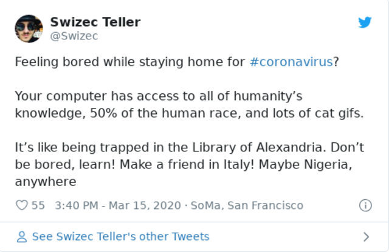

Friend, I hope you're doing your part and staying home. [It really does help](https://reactfordataviz.com/articles/corona-simulation/). The global camaraderie – everyone pitching in, doing their best, being the helpers – it warms my little heart ❤️

Now what?

You're stuck at home with no commute, no restaurant date nights, no gym, no concerts, no hanging out with friends, no nothing. If you're like my girlfriend, it's driving you batty. All this extra free time and energy and no-where to put it.

You could waste it all on mindless fun entertainment.

No shame. I've imgur'd and twitter'd so much the last few days I'm getting sick of it. How do you think I found that meme? 😛

## OR you can learn!

There's another path you can take my friend – learn! Improve your skills! Start that side project!

Set aside an hour every day, or just 30 minutes, and learn something new. Deepen your understanding of something old.

## Resources to advance your career – 17min/day

For quick bursts of learning, I recommend reading articles. Aggregators are great because the community filters stuff for you.

Read the [r/reactjs](https://www.reddit.com/r/reactjs) frontpage once a day for React learnings. Filter by [Resource](https://www.reddit.com/r/reactjs/?f=flair_name%3A%22Resource%22) or [Featured](https://www.reddit.com/r/reactjs/?f=flair_name%3A%22Featured%22) for best results.

[r/javascript](https://www.reddit.com/r/javascript/) is a great option for general JavaScript learnings. No flair filters thought.

And I've always loved [r/programming](https://www.reddit.com/r/programming/) for general programming articles. You'll often find more in-depth topics here.

The problem with these is the amount of content you won't care about. You'll spend lots of time scrolling before you click something and read it.

A 2 phase approach can help:

1.  Spend 5min browsing and saving links to [Pocket](https://app.getpocket.com/)
2.  Spend the other 12min reading articles in Pocket

You'll save more than you read. Now you have your own frontpage full of high quality content. Congratz, you can spend tomorrow's 17min just reading :)

For a more curated approach, I recommend [FreeCodeCamp](https://www.freecodecamp.org/). They have great structured curriculums 👌

And a quick win you can apply right now 👉 [Text processing in the shell](https://blog.balthazar-rouberol.com/text-processing-in-the-shell)

## Resources to advance your career – 32min/day

If you have more time, I recommend books. Sit down, have a cup of tea, dig through a chapter. Or just a few pages.

Books are better than articles because authors put in more thought and create a guided path through a topic. You learn in sequence, understand better, and learn from an expert who spent the past decade thinking about this topic.

Here's some technical books I've enjoyed 👇

[The Pragmatic Programmer](https://pragprog.com/book/tpp20/the-pragmatic-programmer-20th-anniversary-edition) – a great book on software engineering philosophy. How to approach solving problems and thinking about code rather than just how to code. Reading it right now, it's amazing.

[Clean Code](https://www.amazon.com/Clean-Code-Handbook-Software-Craftsmanship/dp/0132350882) – one of my earliest reads outside college textbooks. A little outdated by now, using lots of Java examples, and with plenty of great advice. Don't be too dogmatic about it.

[Modern Operating Systems](https://www.amazon.com/Modern-Operating-Systems-Andrew-Tanenbaum/dp/013359162X) by Andrew Tanenbaum. _The_ textbook on how operating systems work. We had a whole class on it in college and it's one of the most impactful classes I ever took. Yes even if you're just coding for the web.

[A Mathematical Theory of Communication](http://people.math.harvard.edu/~ctm/home/text/others/shannon/entropy/entropy.pdf) by Claude Shannon. A 55 page paper that invented information theory, defined entropy in computer systems, and will absolutely change how you think about sending data from your server to your webapp.

[Phoenix Project](https://itrevolution.com/book/the-phoenix-project/) and [Unicorn Project](https://itrevolution.com/the-unicorn-project/) – 2 novels on devops, team structure, and keeping software engineering teams running smoothly. Maybe more on the engineering managery side, but I enjoyed them both. Gained lots of insight.

[Learn You a Haskell for Great Good](http://learnyouahaskell.com/) is a book on Haskell that I really enjoyed. Haskell is a great language to exercise your thinking and expand how you approach programming. Not as useful in the real world as I'd like though.

Fun fact: the author was my high school classmate.

[@kranjski](https://twitter.com/kranjski) recommended [Writing an Interpreter in Go](https://interpreterbook.com/) and [Writing a Compiler in Go](https://compilerbook.com/). I haven't read them yet, but creating an interpreter or compiler is a _fantastic_ way to learn more about how your JavaScript translates into working software. I built a PHP interpreter for a made-up language back in high school and learned lots.

Also, [Cambridge released 700 textbooks online](https://www.cambridge.org/core/what-we-publish/textbooks/listing?aggs%5BproductSubject%5D%5Bfilters%5D=A57E10708F64FB69CE78C81A5C2A6555#). You should check them out, I know I will.

And I'm basically required to recommend my [Serverless Handbook](https://serverlesshandbook.dev), if you want to transfer your frontend skills to the backend 😇

## Resources to advance your career, if you're serious

Now if you really want to dig deep, spend a chunk of time, and learn in great detail, I have just 1 recommendation.

**_Build something_**

Pick an idea you've always had, that itch you wanted to scratch, and build it. Start from scratch, start from a framework, start with a video course, whatever it takes, just **_build something_**.

Building is the best way to learn.

You can get my [ServerlessReact.Dev](https://serverlessreact.dev) and [ReactForDataViz](https://gumroad.com/l/KDLxE/37off) at 37% off while The Situation lasts, if you'd like. That's how far the markets dropped and I figured you might be worried so I wanna help. ❤️

Now go build those extra skills and fear not, you got dis. 💪

Remember to enjoy the little things

Cheers,  
~Swizec

PS: Reactathon is moving all workshops online – March 30th, you can join from anywhere now. [Use the `ONLINE20` code at checkout](https://www.reactathon.com/workshops/) for a 20% discount. I'd love it if you came to mine, the rest are fab too.

PPS: this is also a great opportunity to spend more time with the kids

