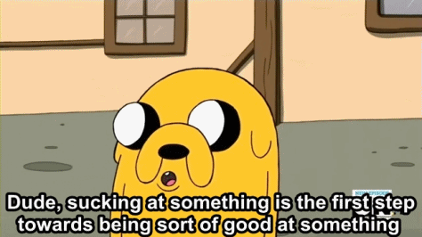

You ever feel like you have no idea what you're doing?

Like, how the heck does your team rely on you when you barely understand a fraction of the codebase, google for answers all the time, spend hours chasing bugs that are typos, and constantly look up basic syntax like `for ... of` vs. `for ... in`??

Everyone feels that way Friend. Sometimes more, sometimes less.

My sister is a personal trainer and group class instructor. She called me this weekend.

_"Swiz, they're closing gyms again for corona. 2 weeks at least. This is ridiculous, I made more in 4 months last year than all of 2020 combined ☹️"_

_"Okay so what you gonna do about it?"_

_"I don't know everything sucks, I suck, this is stupid"_

_"Sure that's fine but what you gonna do about it?_

_"I was thinking of recording a Barre class and selling it online"_

_"Fantastic! Sounds like a plan 👏"_

_"Ugh but what if I'm not good enough? I don't know how to do this, I hate making videos, I don't have good gear, I can't edit, everything I do is shit, how would I even sell it, why would someone buy from me I'm just a nobody ... ugh"_

_"You're not a nobody to your clients. Email them, ask how you can help now that gyms are closed"_

_"Yeah but they're the gym's clients I can't contact them"_

_"Cmon I know you have your own clients. Don't any of them follow you on instagram? Send a message"_

_"Yeah but those came by accident. They showed up organically or they know somebody who worked with me in the past"_

_"Fantastic! Your clients refer other clients AND they stay"_

_"They're just staying because they don't know any better. I suck at this, why would they buy my course"_

_"At worst, you're good enough that clients are too lazy to find someone else. If you don't wanna make a course, offer private Zoom classes. That's a great way to experiment"_

_"Ugh but I hate Zoom it's hard to make a good class that way"_

_"Okay then make a course. You said Barre is a fantastic home workout and nobody offers recorded Barre classes yet. What's the problem?"_

_"I don't know I'm not good enough"_

Sound familiar?

## The not good enough trap

You can't be good enough until you try. Start.

Zen Pencils has a fantastic comic, [Ira Glass: Advice to Beginners](https://www.zenpencils.com/comic/90-ira-glass-advice-for-beginners/). It's about the delta between your taste and your skill.

You get into a field because you have good taste. You appreciate a good app, you love a great website, you see good design, you understand good code.

But you can't do that yet. You try and it's crap.

And that's okay. That's how you start. Sucking at something is the first step to being good at something.

You need a volume of work. Write code, build apps, create websites, draw. If you want to be good at something, _you have to practice_.

**Sit your ass down and do the work.**

[https://twitter.com/Swizec/status/1312047852512661504](https://twitter.com/Swizec/status/1312047852512661504)

## Don't be afraid to start

Wanna laugh your ass off?

Here's my first ever ride on my brand new motorcycle. A 900cc beast of pure retro beautifulness. Watch with sound.

[https://twitter.com/Swizec/status/1052408869773668352](https://twitter.com/Swizec/status/1052408869773668352)

Made it a whole 30cm before I fell over 😂

What happens next is important 👉 picked the bike up, did a few laps in the garage. Ventured to the outdoors parking lot, soon the street.

This summer I went on a [1000mi road trip to Death Valley and back](https://www.youtube.com/watch?v=1-b2OLi0e78). 2 days of riding, 500mi each. Loved it to bits.

Yeah I fell on my first try and yeah the bike's got many scratches since then. Some dumb, some sketchy, some kinda dangerous.

But that's life. That's how you learn. How you get good.

Accept that your first few tries are going to suck. Your first code will be terrible, your first feature will fail, your first app will die in obscurity, your first anything always sucks.

And that's okay. It's part of the process.

## Mistakes matter

Every good engineer has caused a production bug, deleted data by accident, screwed up an important demo, and lost their company thousands of dollars through one bug or another.

And every good engineer got up afterwards, dusted themselves off, and fixed the issue. You gotta.

You make the mess, you fix the mess.

But if you never make a mess, you never get better. You're stuck in the junior dungeon killing level 1 rats. Grinding away with no progress.

All because you're afraid of looking dumb or making mistakes?? 🤔

The fastest way to train a junior engineer is to watch them make a mistake, know it's coming, and say nothing. _They_ have to experience it. _You_ have to let them.

Experience is what we call it when things don't go the way you planned. You want experienced engineers on the team don't you?

## Don't get cozy

Challenge yourself my friend.

Want to avoid the _"1 year of experience 10 times"_ trap? Find or create a job that makes you feel like an impostor.

Then figure it out on the go. I know you can ❤️

Cheers, 
~Swizec

PS: don't forget to [be a beginner every few months or years](https://swizec.com/blog/the-joy-of-being-a-beginner), it's refreshing
