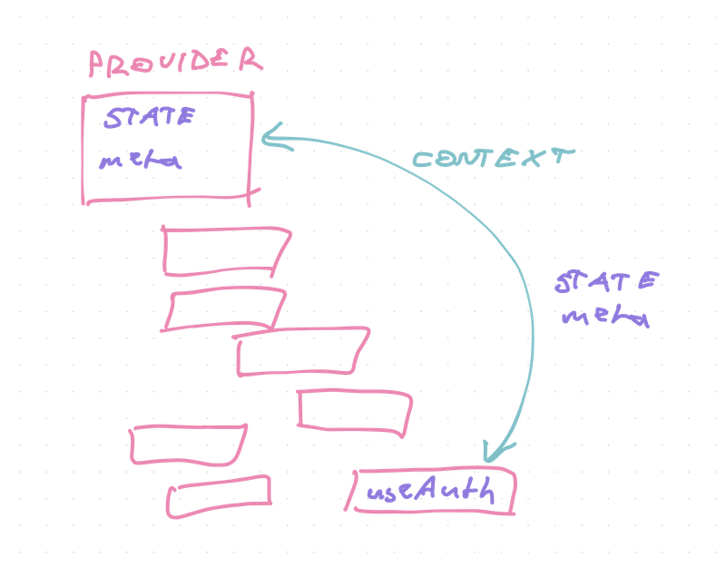
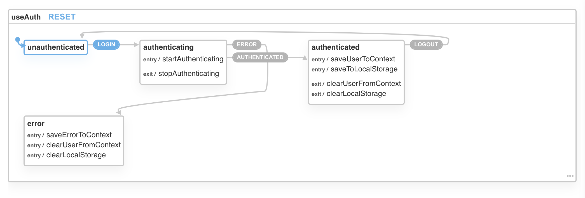

In [Refactoring a useReducer to XState, pt1](https://swizec.com/blog/refactoring-a-usereducer-to-xstate-pt1-codewithswiz-11) we talked about a 5 step process to turn a reducer into an [XState state machine](https://xstate.js.org/). Today answers _"Ok now what?"_

_CodeWithSwiz is a twice-a-week live show. Like a podcast with video and fun hacking. Focused on experiments. [Join live Wednesdays and Sundays](https://youtube.com/swizecteller)_

[https://www.youtube.com/watch?v=J_ssczSeei4](https://www.youtube.com/watch?v=J_ssczSeei4)

[useAuth](https://github.com/Swizec/useAuth) relies on the [Wormhole state management](https://swizec.com/blog/wormhole-state-management) principle. Heck, that's where I first figured it out!

This has made lots of people very confused. Me included. Come back 6 months later trying to fix a bug and why is there a `dispatch({ type: 'startAuthenticating' })` in 5 different places wtf??


_"Don't invent new state management schemes, got it"_ right? No. Don't make your core state messy and confusing 😉

## A primer on how useAuth makes wormholes

Wormhole state management gives you global state without the overhead. You add `useAuth` to your component and magic happens.

[https://twitter.com/Swizec/status/1159865098556432384](https://twitter.com/Swizec/status/1159865098556432384)

Internally `useAuth` connects to a react context holding your authentication state. Info about the user, their current state, faux cookies, and returns helper methods.



That happens in a couple steps:

```typescript
// src/AuthProvider.tsx

export const AuthContext = createContext<AuthContextState>({
  state: getDefaultState(),
  dispatch: () => {},
  auth0: null,
  callback_domain: "http://localhost:8000",
  customPropertyNamespace: "http://localhost:8000",
  navigate: (path: string) => {},
})
```

This creates a new context with default values. `state` is the application state we're managing, `dispatch` is the changer method, the rest is meta data and configuration. Values we need everywhere that don't change.

```typescript
// src/AuthReducer.tsx

// Holds authentication state
const [state, dispatch] = useReducer<React.Reducer<AuthState, AuthAction>>(
  authReducer,
  getDefaultState()
)

const [contextValue, setContextValue] = useState<AuthContextState>({
  state,
  dispatch,
  auth0,
  callback_domain: callbackDomain,
  customPropertyNamespace,
  navigate,
})

// Update context value and trigger re-render
// This patterns avoids unnecessary deep renders
// https://reactjs.org/docs/context.html#caveats
useEffect(() => {
  setContextValue((contextValue: AuthContextState) => ({
    ...contextValue,
    state,
  }))
}, [state])
```

The provider instantiates a new reducer and gets access to current `state` and a `dispatch` method. These and the config metadata are shoved into a new `useState`.

We use an effect to update the context value when reducer `state` changes. This ensures re-renders happen only when the reducer makes a change.

`useAuth` wormholes into this state with a `useContext`.

```typescript
// src/useAuth

export const useAuth: useAuthInterface = () => {
    const {
        state,
        dispatch,
        auth0,
        callback_domain,
        navigate,
        customPropertyNamespace
    } = useContext(AuthContext);
```

Anything inside `useAuth` now has access to these values. Helper methods can check `state`, `dispatch` reducer actions, and look at the meta values.

Works great.

## How XState helps us improve

Wormhole state worked great but the reducer was problematic. Convoluted to understand and difficult to use.

`startAuthenticating` fires twice in the code, so does `stopAuthenticating`. Why? Both where it doesn't make sense.

An XState state machine makes the flow clearer 👇



You start as `unauthenticated` and trigger `LOGIN`. That moves you to `authenticating`. From there you can get an `ERROR`, which puts you in the `error` state. Or you get `AUTHENTICATED` and move into the `authenticated` state.

`LOGOUT` moves you back to `unauthenticated`.

Makes sense eh?

[While refactoring](https://swizec.com/blog/refactoring-a-usereducer-to-xstate-pt1-codewithswiz-11), we made the state machine closely follow the reducer implementation.

Means we can do a swap!

Change `useReducer` to `useMachine` from XState

```typescript
// src/AuthProvider.tsx

// Holds authentication state
const [state, dispatch] = useReducer<React.Reducer<AuthState, AuthAction>>(
    authReducer,
    getDefaultState()
);

👇

// Holds authentication state
const [state, send] = useMachine(authMachine);
```

Change what goes into context:

```typescript
const [contextValue, setContextValue] = useState<AuthContextState>({
    state,
    dispatch,

👇

const [contextValue, setContextValue] = useState<AuthContextState>({
    state: state.context,
    send,
```

Dispatch becomes send and state becomes the XState context. Yes we're overloading terms and that's unfortunate. State machine context is where we keep our application state.

Make the same `state` fix in the effect:

```typescript
useEffect(() => {
    setContextValue((contextValue: AuthContextState) => ({
        ...contextValue,
        state
    }));
}, [state]);

👇

useEffect(() => {
    setContextValue((contextValue: AuthContextState) => ({
        ...contextValue,
        state: state.context
    }));
}, [state]);
```

And then it's a schlep to go around the codebase and change every `dispatch({ type: X })` to `send(X)`.

We went from 9 `dispatch()` calls to 9 `send()` calls, which doesn't sound like an improvement. 🤔

But it's because state machines are strict and we used 2 sends to hydrate from local storage. `useReducer` let us fake that part.

😅

## Next step

[David](https://twitter.com/davidkpiano), the creator of XState, says we can stop using a context provider. And that's what we're gonna try next.

Cheers,<br/>
~Swizec

PS: continue reading with part 4 👉 [React context without context, using XState](https://swizec.com/blog/react-context-without-context-using-xstate-codewithswiz-14-15/)
