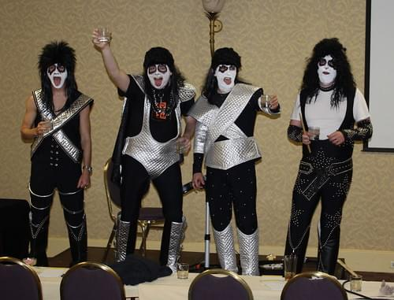

 One of my clients demanded I do a recent project in [PHP](http://www.php.net "PHP"). Alarm bells all 'round, but hey, I used to do a lot of things in PHP before I got fed up with the inconsistent API and I hear many people still use it. It's clearly a viable technology for ... things. Sure thing mr. Client, I'll do this in PHP for you. What could possibly go wrong? Everything, obviously.

## Modern PHP world

> [Symfony](http://symfony.com/ "Symfony") is an Open Source distributed PHP framework. Of course, when you know how to develop in PHP, you don't need a framework. However, it is very nice to have one!

Get it? Read it again. It's horrible because PHP developers are people who still need to be _convinced_ that letting somebody else worry about the boring stuff is better. Of _course_ they can make everything themselves! Are you questioning their manhood by suggesting a framework? Undeterred, I decided to make my \_"Accept some data from the browser. Calculate three things. Send an email" \_in Symfony. Using Django this would take one afternoon.

## Symfony

\*\*\*\*****

## :/

All in all, PHP is still a horrible place to be. Symfony makes it a dash more palatable, it's far from perfect, far from really _really_ useful, but the best I could find. My heart goes to all the programmers stuck in this madness, stay strong! PS: for anyone wondering, I was/am using Symfony 2.1

###### Related articles

- [JSter - JavaScript Frontend Libraries in One Place](http://www.nixtu.info/2012/10/jster-javascript-frontend-libraries-in.html)
- [Why Symfony?](http://fabien.potencier.org/article/65/why-symfony)
- [PhpStorm 5.0 released: more robust PHP editor, new Symfony2 MVC view, better SQL support](http://blog.jetbrains.com/webide/2012/09/phpstorm-5-0-released-more-robust-php-editor-new-symfony2-mvc-view-better-sql-support/)
- [New release process announced for Symfony](http://www.h-online.com/open/news/item/New-release-process-announced-for-Symfony-1726061.html)
- [Symfony Live San Francisco 2012 : the 2nd SensioLabs "US rendez-vous"](http://www.virtual-strategy.com/2012/09/15/symfony-live-san-francisco-2012-2nd-sensiolabs-us-rendez-vous)

