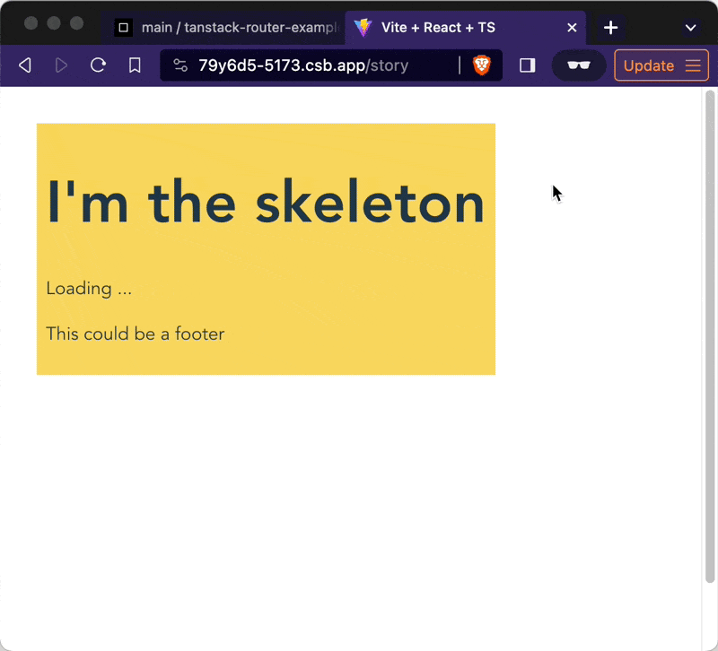

_This article originally appeared on 2023-12-02 talking about a beta version of TanStack Router. It has been updated to reflect v1.1.12 as of 2024-01-09. You can [see the diff here](https://github.com/Swizec/swizec.com/commit/220ba793ee79c1cc68f9f8bc80b2a60d3f9a7347)_

A few years ago [Tanner](https://twitter.com/tannerlinsley) created React Query with a simple pitch: GraphQL for the rest of us. All the affordances of Apollo GraphQL on top of your goode olde REST API. Everybody loved it. Now I think he's done it again with his TanStack Router.

[TanStack Router](https://tanstack.com/router/v1) takes inspiration from Remix, NextJS, TRPC, and Chicane (first I heard of this one), combines the best parts and gives us:

- **type safe routing**, you'll get squiggly lines when linking to a path that doesn't exist
- **router coordinated data loading**, you show 1 loading spinner for everything
- **suspense-first design**, no more `{isLoading ? ...}` in your UI components
- optional **file-based routing**, your code structure can follow your app structure
- **nested routes**, your URLs can control specific portions of the UI

All this put together makes it possible to build next-gen apps with little effort and only a bit of rewiring how you think. No server-side rendering required 🤘

[](https://swizec.com/blog/tanstack-router-modern-react-for-the-rest-of-us/)

## Why router-driven everything

TanStack Router puts the router in control of your app's state and UI. Because the router knows best what's going on. I think Ryan Florence was first to start beating this drum with [Remix](https://remix.run).

Here's why that matters:

Imagine if every significant UI change was tied to a new URL. Open details from a list? New URL. Open a modal? New URL. Start editing? New URL. Page through a table? New URL. Filter a list? New URL.

Copy that URL into a new tab and the page reconstructs itself to look exactly like the original. 😍

This unlocks great multitasking capabilities that matter to people using your app to get work done. If you've ever used Trello, you'll know what I mean. And cry over how poorly every other webapp does this.

Plus the router can _preload_ your data on navigation intent (like when a user hovers the link before clicking), which makes your app feel faster.

## The anatomy of a TanStack Route

Here's what a typical route in your app might look like:

```jsx
// src/pages/hello/reader.tsx

export const Route = new FileRoute("/hello/reader").createRoute({
  component: SayHello,
  loader: async () => fetchSomeData,
  pendingComponent: LoadingState,
  errorComponent: ErrorMessage,
})
```

This assumes you're using [file-based routing](https://tanstack.com/router/v1/docs/examples/react/quickstart-file-based) via the [router-cli utility](https://tanstack.com/router/v1/docs/api/router-cli). I've found that every React project eventually adapts a file structure similar to its URL structure. Might as well make it official.

The `component` renders when everything's okay and your data's ready. This is your core UI.

The `loader` loads data and returns a promise. Use any data loading machinery you like. I'm using React Query.

The `pendingComponent` renders while the `loader`'s promise is pending. This is like the fallback prop on a Suspense boundary.

The `errorComponent` renders when there's an error. Like an ErrorBoundary. This means you can throw errors instead of going `{isError ? ...}` by hand every time.

## Nested routes are chef's kiss

Every route renders inside its parent route. That means it controls _an area_ of your UI. Loading and error states included.

You control how that works with the `<Outlet />` component.

```jsx
// src/pages/__root.tsx

const RootComponent = () => {
  return (
    <Container>
      <Header />
      <Sidebar>
        <Outlet />
      </Sidebar>
      <Footer />
    </Container>
  )
}

export const Route = rootRoute({
  component: RootComponent,
})
```

The root component renders your app skeleton. `<Outlet />` is the part your subroutes control.

This route supports all the same loaders and pending states as other routes. You can then progressively nest routes to control smaller and smaller sections of your UI.

## A smol example

Here's a small example so you can see what I'm talking about. Using timeouts instead of API calls to keep it simple.

https://codesandbox.io/p/github/Swizec/tanstack-router-example/main

TanStack Router [provides basic caching](https://tanstack.com/router/v1/docs/guide/data-loading#to-router-cache-or-not-to-router-cache) out of the box, but you'll want to use a real caching layer like React Query for serious apps. The extra control you get over cache invalidation is worth the effort.

You can see how it all works in this video:

[](https://swizec.com/blog/tanstack-router-modern-react-for-the-rest-of-us/)

On first load, we wait for the index route’s loading state. Click on a story and you see the nested loading state. No loading state on subsequent navigation thanks to built-in caching. Now reload the page on the new URL and the loaders should coordinate to show 1 top-level loading state. But maybe not 🤔

Colors show how nested routes create a layout for each other.

- `yellow` for root
- `blue` for index
- `red` for story/$id

## Sharp edges

I've been using TanStack Router for a few months now and it's been good. The pace of development during beta was hard to keep up with, but jumping from `beta.282` to `v1.1.12` was effortless. No changes required 💪

https://twitter.com/Swizec/status/1744441614192562408

Documentation has improved lots in recent weeks. I'd start with the intro articles to get a sense of what Tanner is going for then diving into the [wealth of examples](https://tanstack.com/router/v1/docs/examples/react/quickstart) for the details.

My biggest gripe right now is that Router CLI's prettier and VSCode's prettier get into fights around formatting long filenames. I should make a pull request.

## Should you use Tanner's Router?

Overall I'm happy with this choice. We shipped the initial project on time and showed that the URL-based approach will solve the problems we were hoping to solve.

The next few weeks/months will show how this scales to multiple engineers of varying skill running around the project. 🤞

Cheers,<br />
\~Swizec
