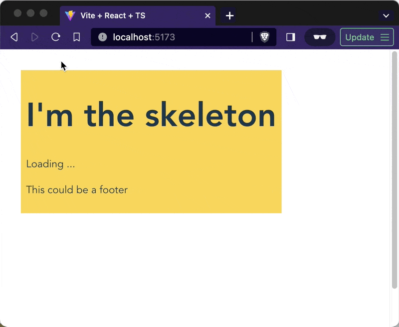

A few years ago Tanner created React Query with a simple pitch: GraphQL for the rest of us. All the affordances of Apollo GraphQL on top of your goode olde REST API. Everybody loved it. Now I think he's done it again with his TanStack Router.

[TanStack Router](https://tanstack.com/router/v1) takes inspiration from Remix, NextJS, TRPC, and Chicane (first I heard of this one), combines the best parts and gives us:

- **type safe routing**, you'll get squiggly lines when linking to a path that doesn't exist
- **router coordinated data loading**, you show 1 loading spinner for everything
- **suspense-first design**, no more `{isLoading ? ...}` in your UI components
- optional **file-based routing**, your code structure can follow your app structure
- **nested routes**, your URLs can control specific portions of the UI

All this put together makes it possible to build next-gen apps with little effort and only a bit of rewiring how you think. No server-side rendering required 🤘

\[])(https://codesandbox.io/p/github/Swizec/tanstack-router-example/main?workspaceId=cfc721bc-f3ce-416f-8432-1e394cc3231b\&file=%2Fsrc%2Fpages%2Fstory%2F%24id.tsx)

## Why router-driven everything

TanStack Router puts the router in control of your app's state and UI. Because the router knows best what's going on. I think Ryan Florence was first to start beating this drum with [Remix](https://remix.run).

Here's why that matters:

Imagine if every significant UI change was tied to a new URL. Open details from a list? New URL. Open a modal? New URL. Start editing? New URL. Page through a table? New URL. Filter a list? New URL.

Copy that URL into a new tab and the page reconstructs itself to look exactly like the original. 😍

This unlocks great multitasking capabilities that matter to people using your app to get work done. If you've ever used Trello, you'll know what I mean. And cry over how poorly every other webapp does this.

Plus the router can _preload_ your data on navigation intent (like when a user hovers the link before clicking), which makes your app feel faster.

## The anatomy of a TanStack Route

Here's what a typical route in your app might look like:

```jsx
// src/pages/hello/reader.tsx

export const route = new FileRoute("/hello/reader").createRoute({
  component: SayHello,
  loader: async () => fetchSomeData,
  pendingComponent: LoadingState,
  errorComponent: ErrorMessage,
})
```

This assumes you're using [file-based routing](https://tanstack.com/router/v1/docs/examples/react/file-based-routes) via the [router-cli utility](https://tanstack.com/router/v1/docs/api/router-cli). I've found that every React project eventually adapts a file structure similar to its URL structure. Might as well make it official.

The `component` renders when everything's okay and your data's ready. This is your core UI.

The `loader` loads data and returns a promise. Use any data loading machinery you like. I'm using React Query.

The `pendingComponent` renders while the `loader`'s promise is pending. This is like the fallback prop on a Suspense boundary.

The `errorComponent` renders when there's an error. Like an ErrorBoundary. This means you can throw errors instead of going `{isError ? ...}` by hand every time.

## Nested routes are chef's kiss

Every route renders inside its parent route. That means it controls _an area_ of your UI. Loading and error states included.

You control how that works with the `<Outlet />` component.

```jsx
// src/pages/__root.tsx

export const route = rootRoute({
  component: () => {
    return (
      <Container>
        <Header />
        <Sidebar>
          <Outlet />
        </Sidebar>
        <Footer />
      </Container>
    )
  },
})
```

The root component renders your app skeleton. `<Outlet />` is the part your subroutes control.

This route supports all the same loaders and pending states as other routes. You can then progressively nest routes to control smaller and smaller sections of your UI.

## A smol example

Here's a small example so you can see what I'm talking about. Using timeouts instead of API calls to keep it simple.

https://codesandbox.io/p/github/Swizec/tanstack-router-example/main?workspaceId=cfc721bc-f3ce-416f-8432-1e394cc3231b\&file=%2Fsrc%2Fpages%2Fstory%2F%24id.tsx

In practice you’d wrap those slow API calls with a caching layer like React Query. And unlike my example, you’d actually use the data returned from your loaders. The official docs [have a good example for that](https://tanstack.com/router/v1/docs/examples/react/deferred-data?file=src%2Fmain.tsx)

You can see how it all works in this video:


On first load, we wait for the index route’s loading state. Click on a story and you see the nested loading state. Now reload the page on this new URL and both loaders coordinate to show 1 top-level loading state.

Colors show how nested routes create a layout for each other.

- `yellow` for root
- `blue` for index
- `red` for story/$id

## Sharp edges

TanStack Router is beta software and under _very_ active development. Little details keep changing and the docs aren't done yet.

For example I had to manually change the auto-generated route tree in `routeTree.gen.ts` to show you nested routes. The CLI wires them up wrong. And I had to [report a bug](https://github.com/TanStack/router/issues/831) about the nested suspense boundaries because the example above works in beta.205 from last week, but not in beta.225 from today.

Tanner ships 🤘

For now I’ve found the best source of knowledge is to skim the base docs then reverse engineering [the wealth of examples](https://tanstack.com/router/v1/docs/examples/react/quickstart). And try things! See what works for you.

For me, I like where TanStack Router is going and have started using it for a greenfield app that fits this approach perfectly.

Cheers,<br />
\~Swizec
