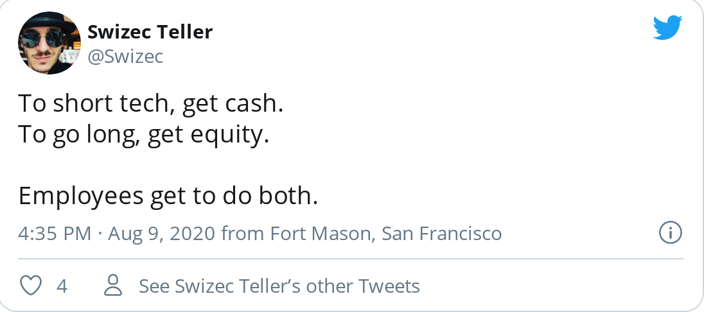
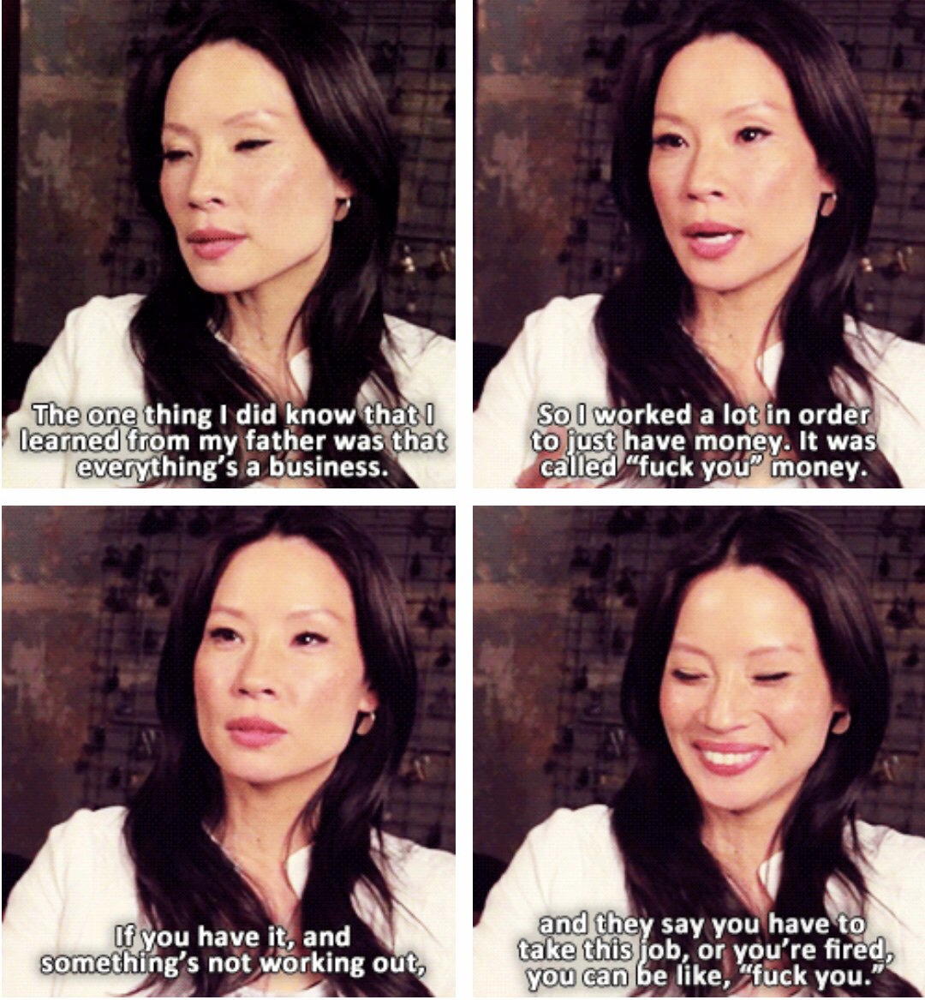

My girlfriend's dad is a VC and on Sunday we talked for 4 hours. Most he's ever said to me before was 3 words. Here's what I learned.

"Daddeh", as my girl jokingly calls him, is an old school Silicon Valley guy.

Moved here in the early 1990's, saw the first AI revolution (2 masters in AI 🎓), witnessed the dotcom bubble, saw the 2008 collapse, and lived through the rise of mobile and social. Dude's been around so many blocks he lost count.

Now he works as a VC for a large conglomerate and has his own office+staff on Sandhill Road. You've never heard of him, but he does all right.

We talked about corona, the financial crisis, why stock markets are up despite the economy being down, and what all this means for tech. What should we expect in 2021?

## Here's the good shit that stuck

1.  Large companies are truly astoundingly mind-boggling. The one that backs his fund makes $10,000,000 per hour. 24hrs per day, 7 days a week, 365 days per year 🤯
2.  Many if not most startups are going to run out of money in December or early next year. Few keep more than 1 year of cash before needing the next round of financing and even fewer are profitable
3.  Investing rounds aren't happening right now because of all the uncertainty. When markets were down, cash was on pause. Now markets are up and VCs wait to see how economy is doing
4.  There is a 30% "corona discount" on new rounds
5.  Next year is going to be tough in tech. And we might not see a new wave of fresh startups because nobody made money in the last period (2008 to now)
6.  Last year's IPOs are underwater and the beneficiaries didn't have time to sell before things got bad due to lockup periods
7.  Money is a terrible reason to start a startup, get a job in BigTech
8.  There are currently no exciting leaps in software innovation on the horizon
9.  Current AI will not scale

### 🤔

Reading between the lines, it sounds like we're in for another dotcom boom. At least a 2008-style drought.

If you work for a VC-backed company or created one ... well I hope you raised a good round recently and can wait this out :)

Or that he's wrong. 🤞

I agree with him on AI.

We've pushed the deep neural network approach very far.The silly amounts of data we've gathered help us make good inferences.

But the AI doesn't _understand_ anything. And nobody understands it. You can't debug a blackbox.

The core problem is that modern AI is based on inference and induction. Predicting future data out of past data.

But as Nelson Goodman wrote in his paper, [A Query on Confirmation](https://swizec.com/blog/week-6-a-query-on-confirmation/), inductive reasoning doesn't work. It creates no new knowledge.

We're going to need a fundamentally new approach to AI, if we want to make it work for realzies. Throwing more data and more compute at the problem won't do.

You know how self-driving cars are just around the corner, any moment now?

I remember reading magazines from the 1970's saying the same thing.

## Will tech crash?

I don't know. He doesn't either. We can guess.

Life for VC-backed startups is gonna be tough the next year or 2. There's less money sloshing around and less excitement about big leaps.

BigTech will be fine. Profitable post-IPO companies ... pure money.

MicroTech, I think, will flourish. Folks who don't need nor want VC money.

Folks like you and I who can build a thing and make $1000/month, or even $10,000/month. Hell, even $100,000/month if you strike gold.

_That_'s the future of tech. Mom & pop micro-SaaS shops.

You don't need VC money for those. And they wouldn't give it to you even if you asked. VCs need big exits. Sustainable businesses built on solid principles need not apply.

## What can you do?

Make cash and save. Negotiate more salary and less equity. More of both if you can.

The goal is a balanced [barbell investment strategy](https://en.wikipedia.org/wiki/Barbell_strategy).

Cash is safe. You do the work, get the cash, keep the cash. This is your safety net. A runway.

How long can you live without income? The more you make and the less you spend (within reason, enjoy life), the longer your fuck you fund when things go wrong.

Equity gives you high upside. If your startup/employer makes it big, you get some too.

You won't become a billionaire with this approach, but you won't become homeless either. I'll take that bet 😇

Happy Friday, how's your fuck-you fund?

Cheers,  
~Swizec
