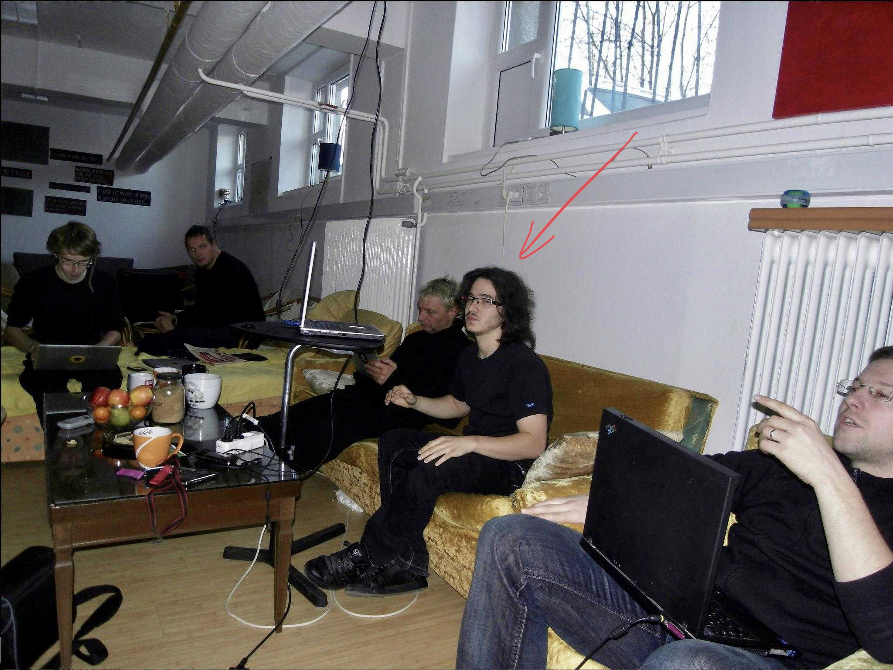
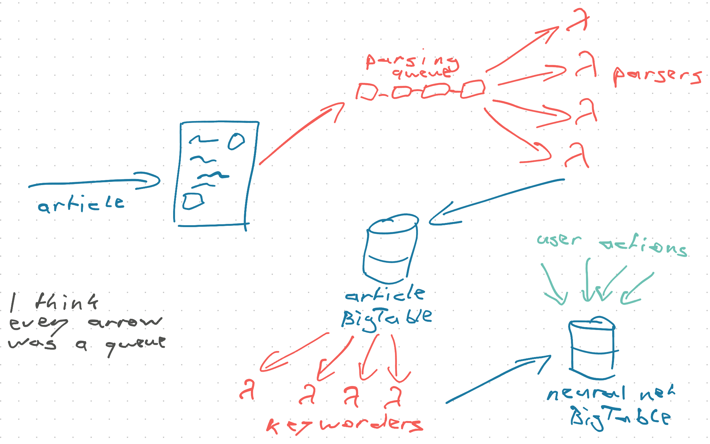

import { ContentUpgrades } from "@swizec/gatsby-theme-course-platform";

Friend, we talked about how cheap serverless can be. But you _can_ get it wrong 😅

A fun story from ye olden days of 2010:

Act 1 of the hero's journey. Young kid with big dreams chases his idea with all the piss and vinegar he can muster, gathers a motley crew, and conquers the world. At the moment of triumph, the hero trips and breaks his nose.

Crowd laughs.

That's me pitching my first startup back in college. I'm not stoned, I just didn't sleep a lot those days. 😴

Youth – when you can work until 3am, watch 2 episodes of True Blood before bed, and get up at 9am to do it all over again.

Good times!

## A grand idea

Like any big-to-be startup, ours started with a grand idea.

_"There sure is lots of data on these newfangled social medias. Would be nice if it was easier to follow 🤔"_

Back then social media was the future. Everything in public, citizen journalism, changing the world! Transparency and empowerment for all! 💪

Keeping up was a full-time job.

What if you could observe a user's behavior – replies, favs, clicks, long pauses – feed that into an algorithm, and create a _personalized feed_. Like a personal newspaper.

<ContentUpgrades.Serverless />

## But tech is hard

I read lots of Wikipedia about machine learning and AI and got to work. Soon there was a prototype.

No pictures survive but it was wonderful.

A [reinforcement-learning](https://en.wikipedia.org/wiki/Reinforcement_learning) approach that interpreted user actions on the fly. You could _see the code learn_. Point at your RSS feeds, read as normal, see your homepage change.

😍

Now how do you scale this?

When it runs on the server in your bedroom it's a cool toy for you and your friends. A slow flaky toy.

Can you make it internet scale? A popular buzzword back then. Everyone's the next Google! We need _internet scale_ right meow!!!

## 2010 was a dash early for serverless 😬

Using Django, a neural net implemented in SQL, and running on a traditional server wasn't working. Scaled to about half a user.

Lesson learned: Don't implement neural networks as foreign keys in a database. At least use a graph db ... those weren't well-known yet.

We ate the hype and used internet scale serverless technologies. Called "managed cloud" or "platform as a service" back then. Depends who you ask ... it was new.

[Google App Engine](https://en.wikipedia.org/wiki/Google_App_Engine) was all the rage and _definitely_ the future. [Bigtable](https://en.wikipedia.org/wiki/Bigtable) was the hot new database offering with infinite scale.

Getting it all to work was ... rough. So fricken complicated!

When everything's asynchronous, you have _zero_ relational support, foreign keys are a joke, all your data are a slow search away, and you're 23 with no guidance or direction building big things for the first time ... yeah ...

But we got it working!

Articles came in through a queue that checked your RSS. Each went into a parsing queue that called a traditional server running NodeJS to extract article text.

App Engine didn't have NodeJS support and the library we needed was in JavaScript 🙃

Those servers fed back into a queue that fed into a BigTable that fed into a queue that fed into tokenizers that fed keywords into another BigTable that held `(user, keyword, weight)` vectors.

You could take an article, look at its keywords, query vectors in the database, and assign a _"How much will user like this?"_ score.

## 🔥

For 3 users, Google App Engine was free. Straining under the load of our very brilliant architecture and massive use of compute, but free.

Then we released the iPad app. Back when if you built it they did come.

10 downloads
20 downloads
100 downloads
500 downloads
1000 ...

We were backed up for days. The queue filled up with thousands of articles. You clicked a button, we imported 500 feeds, 3000 articles, and died. Trying to build _your_ neural net.

No deduping between users. No guarantee you'll come back. Just an endless grind of computing power doing nothing useful.

The startup ran out of money and died before we ever finished that first batch of articles. 💸

How about you, any fun lessons to share?

Cheers, 
~Swizec

PS: a decade later serverless is much nicer, I promise :)
