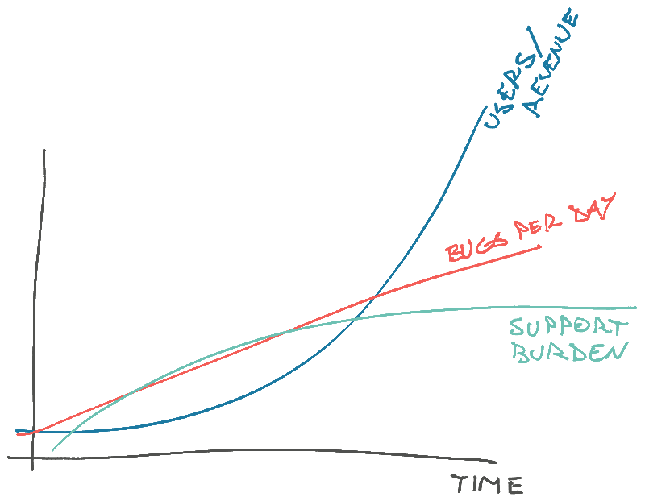

Engineers make big money by building scalable long-term assets. But what does that even mean?

Your job is all about these 3 curves that make a scalable business.

You want users and revenue to grow exponentially. Bugs per day to grow linearly. Support work to grow logarithmically. Your goal is to make this happen.

That's why [engineers are worth so much](https://swizec.com/blog/why-engineers-are-worth-so-much/), we don't just do the work today, we build an asset that keeps doing the work forever. Or at least for a while.

Here's how it works:

## exponential

Users and revenue come for the features and [stay for the service](https://swizec.com/blog/the-future-of-software-engineering-is-sre/). The more people love your service, the more friends they bring. Retention creates growth.

If you can, always [work in a department that values retention](https://swizec.com/blog/the-3-budgets/). Less dopamine, more reward.

## linear

Bugs scale with usage. The more users you have, the more edge cases and weird situations they'll find. Things that used to happen once a month become daily fires and frustrations. Exceptions become common.

Your code quality _really_ begins to matter. All that annoying process stuff holding you back, chasing down 1 in 1000 edge cases? Just making sure you get to sleep at night.

https://x.com/Swizec/status/2018750989445263600

Reality, at scale, is one big pile of exceptions. That's why modeling with state machines never seems to work 😥

## logarithmic

Support burden scales with bugs and exceptions. The more daily issues you have, the more folks you need dealing with those.

The job here is to build tools (and fix bugs) so the number of people _running_ the business scales logarithmically with the number of users. Automate, reduce clicks, let robots do more.

Also true for engineering!

Use linters and static types to catch basic mistakes. Automate your deploys. Make it easy to test things. Write documentation and standard operating procedures. Remove steps from your processes.

None of this is easy or a given. Lots of startups collapse because they can't scale to match demand. Product goes to shit, people stop coming.

Building cool features is easy, keeping them running is hard.

Cheers, 
~Swizec
