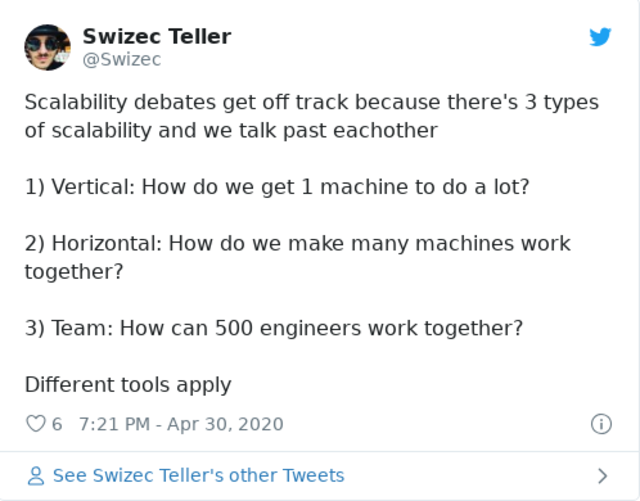

You ask a room full of engineers _"So how's this gonna scale?"_ and step out for a glass of water. When you're back, all hell has broken loose.

Bob is choking Harry. Lucy screams obscenities at John. Jane is furiously scribbling binary trees on the whiteboard, Stuart rocks crying in the corner, and Kevin the office plant is on fire.

What the heck happened?

You committed one of 3 classic blunders:

1.  Never get involved in a land war in Asia
2.  Never challenge a Sicilian in a battle of wits
3.  Never mention scalability in a room full of engineers

## Scalability means different things to different people

You see my friend, when you say "scalable", _you_ know exactly what you mean. And everyone around you hears something else.

A piece of code or architecture can be scalable in many ways.

The 3 biggest dimensions are:

1.  Vertical scalability
2.  Horizontal scalability
3.  Team scalability

They're independent and the cause of many a heated debate.

Let me explain:

**1. vertical scalability**

[Vertical scalability](https://en.wikipedia.org/wiki/Scalability#Vertical_or_Scale_Up) is how much you can get out of a single machine. Primary considerations here are algorithmic complexity, programming language choice, execution environment, and machine beefiness.

When you buy a new iPhone coz the old one got slow, that's vertical scalability.

When you bicker about JavaScript "not scaling", that's vertical scalability.

When you chat about Quicksort, Bubble Sort, and Hash Tables, that's vertical scalability.

_How much work can we get out of the machine?_

**2. horizontal scalability**

[Horizontal scalability](https://en.wikipedia.org/wiki/Scalability#Horizontal_or_Scale_Out) is how much you can get out of multiple machines. Primary considerations here are developer experience, managing servers, coordinating tasks, communication between nodes, and cost.

When you split large payloads into small tasks, that's horizontal scalability.

When you bicker about AWS Lambda vs. Docker VMs, that's horizontal scalability.

When you think about coordinating 5 servers, 10 load balancers, 3 queues, and 8 kuberneteses, that's horizontal scalability.

_How much work can we get out of many machines working together?_

**3. team scalability**

Team scalability is how much you can get out of multiple engineers. Primary concerns here are developer experience, communication, avoiding common mistakes, pull requests, tools over processes, and common guidelines.

When you add automatic deploys to your workflow, that's team scalability.

When you start using TypeScript to lower mental overhead, that's team scalability.

When you build a library everyone can use, that's team scalability.

When you split a monolith into microservices, that's team scalability. No really 😉

_How can we get all these engineers to work together without ~~stepping on each other's toes~~ killing each other?_

So my friend, which of these do _you_ spend most effort on? Hit reply.

Happy Friday ❤️

Cheers,  
~Swizec
