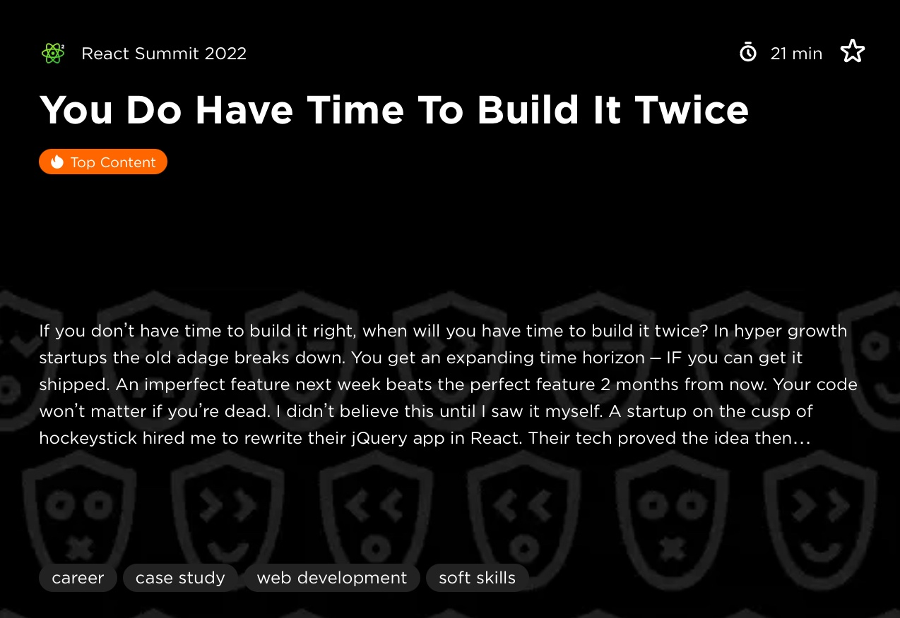
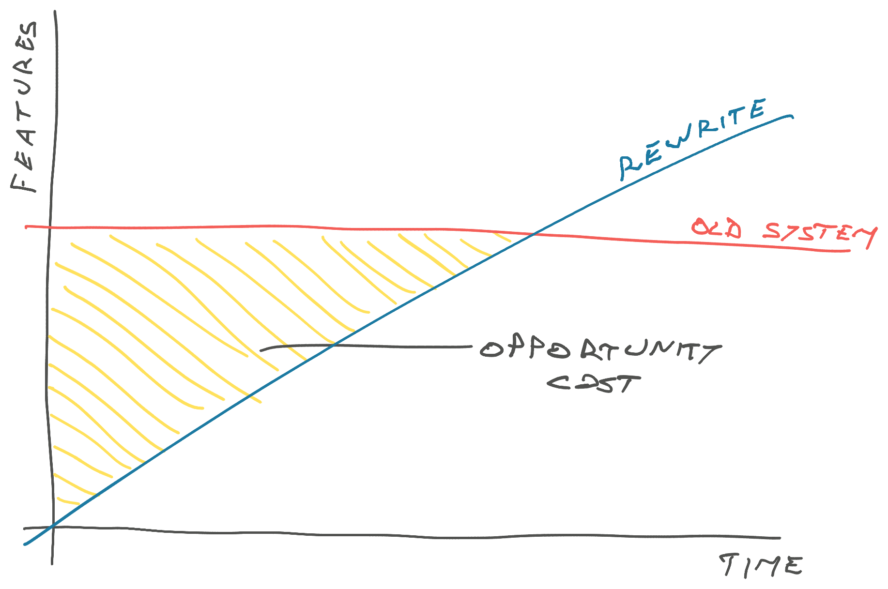
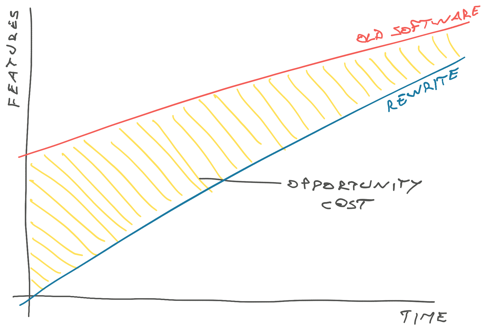

A coworker asked how React Islands work and I realized it's a technique I've been using to modernize monolithic web codebases for years, but never wrote down how it works.

## What is a React Island

The React Island is a way to inject React components, even whole apps, into an otherwise statically rendered web project. It's a great [way to start a strangler pattern rewrite](https://swizec.com/blog/how-to-rewrite-your-app-while-growing-to-a-dollar100000000-series-b/), or it can be a long-term solution for when you need a highly interactive portion of your site, but want to keep everything else working the old way.

Back at React Summit 2022, [I talked about this](https://swizec.com/blog/the-audience-loved-my-talk-but-i-didnt/) as the bottom-up approach to rewriting an app.

[](https://gitnation.com/contents/you-do-have-time-to-build-it-twice)

The core idea works like this:

1. Render a bunch of HTML however you like
2. Set up a root div to render your React into
3. Call a function
4. Render a small React app into that div

React then takes over rendering and interactivity inside that area. Any additional data gets loaded with API requests made from JavaScript in the browser. To save data you also make API requests or fake form submissions.

## Why not just write all your code in React?

Because [full rewrites never work](https://swizec.com/blog/you-can-t-stop-the-business-or-why-rewrites-fail/). You'll end up in one of these situations:

A stagnating old system waiting for the overdue new system.

[](https://swizec.com/blog/you-can-t-stop-the-business-or-why-rewrites-fail/)

Or a new system that keeps chasing the old system and never quite has all the features you need.

[](https://swizec.com/blog/you-can-t-stop-the-business-or-why-rewrites-fail/)

You _have to_ go piece by piece, ship continuously, and make sure you always keep software in a working state your users can play with. I promise you'll keep finding features you didn't know were there.

Why isn't all your code in 2024 already in React? Oh you'd be surprised how many successful businesses are out there built on duct tape and chewing gum from 2005. [jQuery is still the world's most used javascript framework](https://trends.builtwith.com/javascript/jQuery).

## How a React Island works

There's a few parts:

- react components
- declaring islands
- building the code
- calling islands

### React components

You build a React component as usual. Self-contained, takes care of fetching its own data, brings its own styling, all the good stuff.

```javascript
function AmazingNewFeature({ prop1, prop2 }) {
	const data = useQuery(...)
	return <ReactStuff />
}
```

You can run this code however you like. It's a standard React component. Doesn't know anything about being an island. You can use TypeScript because once compiled it's Just Javascript.

Then you make a `reactIslands.tsx` file that will declare your React islands. This file will become a separate build target.

### Declaring islands

```javascript
// All islands should share the query client
const queryClient = new QueryClient();

// App sets up all your global context providers
function App({ children }: PropsWithChildren) {
    return (
        <CssVarsProvider>
            <QueryClientProvider client={queryClient}>
                {children}
            </QueryClientProvider>
        </CssVarsProvider>
    );
}

function App({ children }: PropsWithChildren) {
    return (
        <CssVarsProvider>
            <QueryClientProvider client={queryClient}>
                {children}
            </QueryClientProvider>
        </CssVarsProvider>
    );
}

const ReactIslands = {
    amazingNewFeature: function amazingNewFeature(
        element: HTMLDivElement,
        props: AmazingNewFeatureProps
    ) {
        createRoot(element).render(
            <App>
                <AmazingNewFeature {...props} />
            </App>
        );
    },
};

declare global {
    interface Window {
        ReactIslands: typeof ReactIslands;
        mixpanel?: Mixpanel;
    }
}
window.ReactIslands = ReactIslands;
```

You make an `<App>` component that defines all your global providers. Styling, query cache, modals, etc. I always accumulate a bunch of these over time.

The important part is that any caching behavior (like React Query) is shared between all the islands. This will make your app feel faster and avoids losing context between islands. Makes it easy to share data, if you put multiple islands on the same page.

### Building the code

These days I like to use [Vite](https://vite.dev) to build my JavaScript projects. Comes with good defaults, works fast, and means I never have to worry about the details.

You'll want to configure `reactIslands.tsx` as its own build target so you have a clean file to include in your page. This file is going to pull in any other dependencies you declare through the usual `import ...` approach.

```javascript
    build: {
        rollupOptions: {
            input: {
                main: "./src/main.tsx",
                reactIslands: "./src/reactIslands.tsx",
            },
            output: {
                entryFileNames: "[name].js",
                manualChunks(id) {
                    // Split vendor code into separate package
                    if (id.includes("node_modules")) {
                        return "vendor";
                    }
                },
            },
        },
        outDir: "dist",
    },
```

I like to split vendor code into a separate package so the build artefacts are more stable and you don't need to bust cache as much.

You'll get a file called `dist/reactIslands.js`. This is the one you include in your HTML.

### Calling islands

Vite uses [JavaScript modules](https://developer.mozilla.org/en-US/docs/Web/JavaScript/Guide/Modules), which means you don't need to worry about importing all of your JavaScript. Just the one entry file.

```html
<script
  type="module"
  src="{{ url_for('static', filename='reactIslands.js') }}"
></script>
<script>
  $(document).ready(function () {
  	window.ReactIslands.amazingNewFeature(
  		document.getElementById('amazing-new-feature'),
  		{
          prop1: {{ value_from_server | tojson }},
          prop2: {{ value_from_server | tojson }},
      })
  })
</script>
<div id="amazing-new-feature"></div>
```

Yes that's jQuery inside a Jinja template. The same approach will work with any server-side stack you use.

The key here is that we import the entry javascript file, which then pulls in the rest, and declare an area for React to render into. Then we call the island function and pass-in values from the server.

It's best to pass critical data into your island via props then fetch additional data inside the component itself. Where you make that distinction depends on your app.

## So is this an MPA or an SPA?

Yes. This is both a Multi Page App _and_ a Single Page App.

You get the MPA part from your existing infrastructure and the SPA part from the new React code. I've even put routers inside the React Island so we could make it jump to the right page regardless of where navigation happened.

And if you're wondering why not stick with "the simple approach that works" or even "bah humbug when did web development get so complicated" ... react islands are for when that stops working ❤️

Cheers,<br />
\~Swizec
