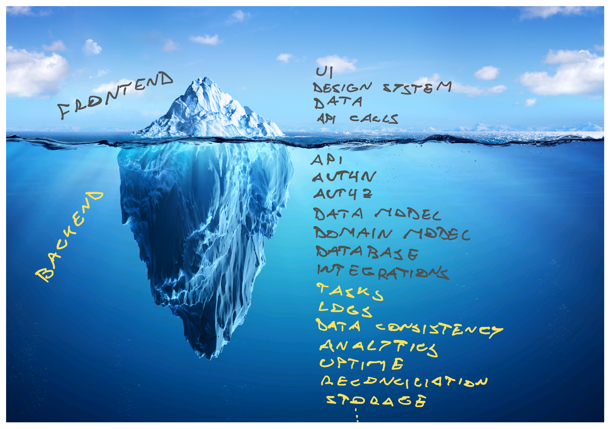

There is a depth to software that you don't appreciate until it stares you in the face. We focus on our tiny little part and see a vast sea of complexity, but in the grand scheme of things ...

We're like [the PhD student laboring at the edge of knowledge](https://matt.might.net/articles/phd-school-in-pictures/). Our world looks like this:

Red is your focus. The world of frontend or backend or JavaScript or React or whatever it is that you do. The bump is your contribution. New knowledge _you_ created. Wow 🤩

Here's what everyone else sees:

## _My_ thing is hard

I see this a lot when talking with engineers of all sorts. We think _our_ thing is hard and complex and full of nuance, but that other thing? Oh that's easy, you just ...

You understand the broad strokes and think _"How hard can it be?"_. It's just a bit of HTML and JavaScript right? Or it's just a few Docker containers, just a few 1's and 0's, just a network call or two, just API calls glued together, just a few database tables, just a CRUD app, just some rectangles on a screen, just a ...

This is the illusion of explanatory depth. [You don't understand the problem until you try to solve it](https://swizec.com/blog/coding-forces-you-to-understand-the-problem/). At least explain in great detail. Step by step. With no handwavey motions.

Those times when you want to say _"And then you just ..."_, that's your clue that you've reached the limit of your understanding. A rhetorical trick that makes you look smart at the pub, but flops in an interview.

A good interviewer will follow that up with an _"Okay, but how do you do that? What do I do first?"_. At this point it's paramount that you say _"I don't know"_, if you don't.

## The backend iceberg

Why am I telling you this? Because I've had a picture in my head for a while.

The backend iceberg comes to mind when people say NextJS and friends are full-stack frameworks. Just because it runs on the server, doesn't make it backend.

And it comes to mind when someone goes _"Wait what?"_ after I mention that our React app has about 30,000 lines of code. But it's powered by about 1,000,000 lines of backend code.

A lot happens in the backend.

NextJS et al can make a decent [Backend for Frontend](https://samnewman.io/patterns/architectural/bff/) – focused on finding data for the UI of a specific app. Not quite "full-stack", if you ask me.

Here's what the full backend needs to do:

- serve static files
- store static files
- serve data
- store data
- maintain data consistency
- enable business analytics
- enable longitudinal data insights
- user metrics
- product metrics
- insights for engineers (logs)
- run asynchronous processes
- run periodic tasks
- retry policies for failures
- ingest data from external systems
- send data to external systems
- reconcile data between systems
- authentication
- authorization
- keep itself running
- alert when there's a problem
- keep your domain model
- _evolve_ your domain model
- work with clients across versions
- work with users across versions
- assign/maintain feature flags

It takes an ecosystem my friend.

Cheers, 
~Swizec

PS: I'm probably forgetting a bunch of things, hit reply

PPS: [that's not how icebergs float](https://news.climate.columbia.edu/2021/03/12/iceberg-really-float/), I know
