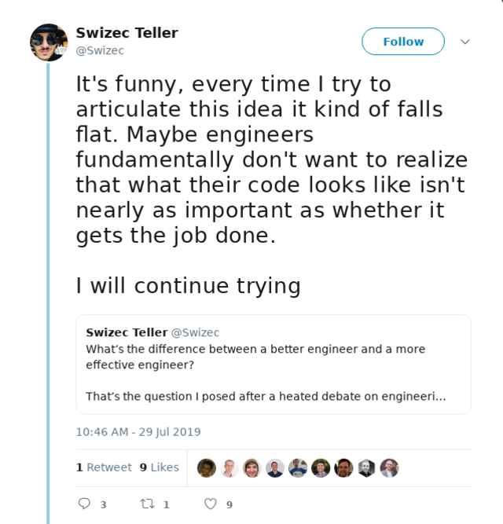
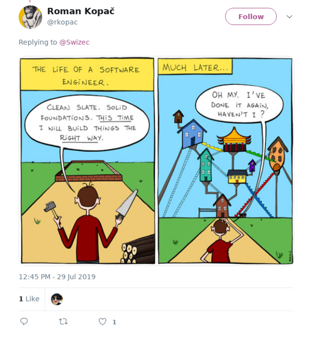

Telling engineers that what code their does is more important than what it looks like is a lot like saying dark mode is cancer. I feel it in my gut to be true, but expressing it just right eludes me forever.

👆 me when I say either of those things

Dark mode is like pointing a bright spotlight at your face, thinking _&quot;Oh gosh that&#x27;s too bright&quot;_, and putting sunglasses on it. You know, instead of _using the damn brightness setting_.

Ok that was easy 😛

Explaining why it&#x27;s most important for your code to achieve business objectives is harder. I&#x27;ve had many conversations with friends and internet strangers over the past 3 days.

Here&#x27;s a recap

Maybe engineers fundamentally don&#x27;t want to realize that what their code looks like isn&#x27;t nearly as important as whether it gets the job done.

The usual argument goes something like, and I quote straight from a reply to my email,

> I don&#x27;t want to maintain any code that was reasoned to win few races, while the one reasoning was still interested about the project before moving on to some other &quot;race&quot;. Stupid analogy that&#x27;ll appeal to the lazy-minded, and is way too often used as an excuse for subpar Architecture. Don&#x27;t win a race, win a marathon!

Dude&#x27;s right. Maintaining bad code sucks.

But I think something a lot of folks fail to realize is that it is a luxury to have a product with a codebase so bad it makes you pull your hair out.

The product survived!

Yes it’s a big hairy mess now, but it _lives_

You now have the ability to fix it. You know where the design went wrong, you know where the traps are, you know what you want

**that is _wonderful_**

Most terrible architectures, in my experience, aren’t terrible because the code is bad or the engineers sucked.

They’re terrible because the whole product was still trying to figure out what it even wants to be and do.

It’s easy to look back and say _&quot;that is bad&quot;_

It is impossible to look forward and say _&quot;that will be bad&quot;_.

Here&#x27;s an old programming maxim

> Make it work, make it right, make it fast

Your code has a job to do. It needs to work first. Then if it works well enough, you might get time to make it beautiful and fast. _Iff_ that is important to the business.

Sometimes it isn&#x27;t and that&#x27;s okay.

Another analogy we came up with in a Slack group is that of a commercial kitchen. High pressure environment with tight deadlines where everything has to go just right to produce that perfect meal.

A lot like an engineering org.

First thing Gordon Ramsey does when saving a failing restaurant 👉 make the kitchen run smooth. If your kitchen is dirty, disorganized, and a huge mess, your restaurant will fail.

If your engineering is dirty, disorganized, and a huge mess, your company will fail. No doubt.

But your code is not your engineering org. Your code is the product.

An engineer worrying too much about perfect code is like a chef placing peas one by one on a plate of bangers and mash to make sure it looks perfect.

That&#x27;s not a chef, that&#x27;s a food photographer. Takes them 5 hours to make a burger for 1 photo shoot.

Would you wait 5 hours for the perfect burger at your local pub?

Of course not. That&#x27;s ridiculous.

My main point is this 👉 **the code is not the goal. Solving the problem is the goal.**

Peace ✌️  
~Swizec
