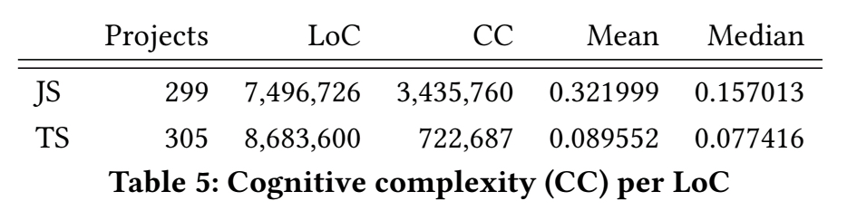

TypeScript is great! But is it really? Two studies take a deeper look.

Anecdotally, TypeScript has been the best thing that's ever happened to my code and my team. Makes our code easier to navigate, helps us better communicate intent, and prevents common bugs that creep into large codebases with many engineers.

## TypeScript, anecdotally

I like to say that TypeScript, used diligently, does 80% of what you'd write unit tests for:

- can't call functions that don't exist
- can't use the wrong parameters
- catch typos
- find semantic regressions

TypeScript can't catch logic regressions. You need unit or integration tests for that.

A semantic regression happens when you change the arguments in a function or move things around and forget to update a file. A logic regression happens when you change the logic and something relies on the old logic. This is often a sign of [architectural complexity](https://swizec.com/blog/why-taming-architectural-complexity-is-paramount/) or [too much DRY with too little separation of concerns](https://swizec.com/blog/dry-vs-soc-a-difficult-choice/).

This distinction is important. TypeScript can lull you into a false sense of security.

## TypeScript, in research

Software engineering researchers have been conflicted about static typing since the 1960's. Is it worth the effort? Does it even help?

Somewhat famously, Hanenberg performed [a controlled experiment about static and dynamic type systems](https://ics.uci.edu/~jajones/INF102-S18/readings/23_hanenberg.pdf) at UC Irvine in 2010. The experiment found that students using the statically typed version of his language were _slower_ at writing code than students using the dynamic version. And the code wasn't much better or less error prone.

But maybe that's students. What does real world data look like for the languages we care about?

### To type or not to type, take 1

In 2017, Gao et al. published [To Type or Not to Type: Quantifying Detectable Bugs in JavaScript](https://swizec.com/pdfs/typestudy.pdf) where they scraped GitHub for public JavaScript projects with bug fixes. For each fix, they manually added type annotations in Flow and TypeScript, and tried to see if static typing would've prevented that bug.

That is to say: If you had static typing, would you have shipped this bug to production?

After analyzing 400 bugs across 389 projects, Gao et al found that **static types would've prevented 15% of shipped bugs**. They found no significant differences between Flow and TypeScript, but Flow annotations were quicker to add.

### To type or not to type, take 2

2017 was a long time ago and TypeScript has improved. Plus we now have a whole ecosystem of fully typed projects and dependencies. Surely that helps?

In 2022, Bogner and Merkel published [To Type or Not to Type: A Systematic Comparison of the Software Quality of JavaScript and TypeScript Applications on GitHub](https://swizec.com/pdfs/typescript-quality.pdf).

They used SonarQube to look at 299 JavaScript and 305 TypeScript projects. All webapps with at least 5 GitHub stars and a decent amount of activity. No frameworks or libraries because they wanted real-world complex project data.

Two questions:

1. Do TypeScript applications exhibit better software quality?
2. Do TypeScript applications that avoid `any` exhibit better software quality?

Sort of!

TypeScript leads to 2x fewer code smells and 5x lower cognitive complexity per line of code. We were right!

**BUT!** TypeScript does not lead to fewer bugs _or_ makes them faster to resolve. Even worse – TypeScript projects have _60% more bugfix commits_. Implying they shipped more bugs and had to fix them later.

Those bugs also took longer to resolve. I think that's because TypeScript prevents easy semantic bugs and all you are left with are the harder-to-fix logic bugs.

And for us anti-any aficionados: No conclusive results. Once you're in TypeScript and use it diligently, the `any` type has no significant measurable impact on quality. My gut says there's a tipping point for this and most TypeScript projects don't reach it.

## Conclusion

Use types, mostly descriptive, don't hope for magic.

Static types nudge you towards writing cleaner code, make your code easier to read, and prevent easy bugs. You'll be left with the hard bugs.

Cheers, 
\~Swizec
