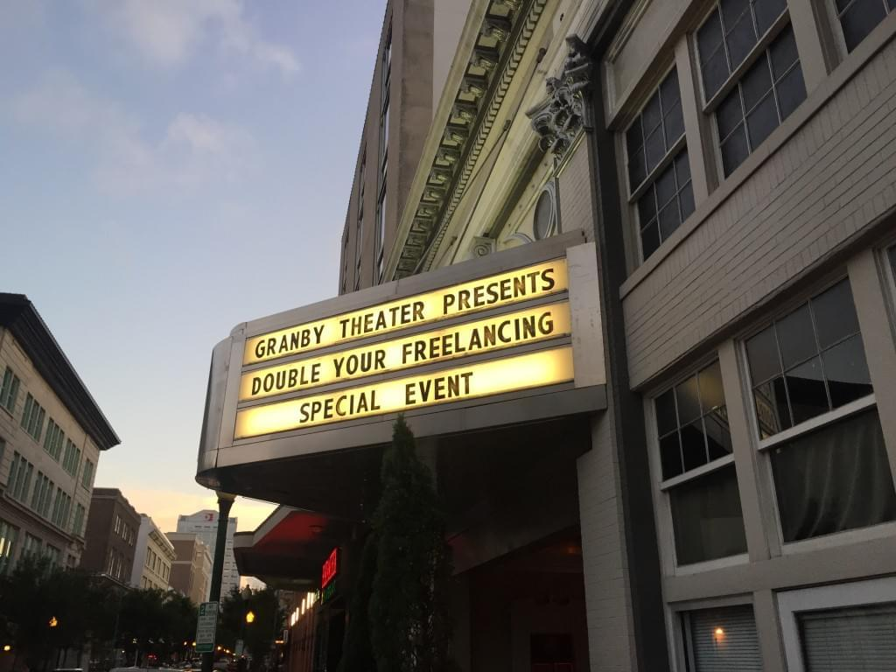

\[caption id=&quot;attachment_6736&quot; align=&quot;alignnone&quot; width=&quot;580&quot;] Double your Freelancing conference\[/caption] First, you are a skilled something. Programmer, editor, writer, designer, artist. Something. Then you quit your job, or you&#x27;re fired, or you get &quot;downsized&quot;. Fired and downsized are most common. Then you say _&quot;Fuck this&quot;_, and you become a freelancer. Sometimes, the transition happens gradually while you freelance alongside your job job. Six months later, you think _&quot;Holy shit, I&#x27;m making, like, so much money!&quot;_, because you&#x27;re making, like, so much money. This is when you are most likely to write blog posts about the lessons you&#x27;ve learned. This is when you tell your friends that they, too, should follow the _one true path_ of freelancing. Then you realize that freelancing doesn&#x27;t scale. You&#x27;ve got ten bosses instead of one; you&#x27;re stuck on the treadmill of looking for work, doing the work, marketing yourself, doing the work, looking for work, and answering emails. But you&#x27;re making, like, so much money.

## Step 1.5

So you become a consultant, learn some business speak, and raise your rates. Then you realize that consulting doesn&#x27;t scale. You&#x27;re doing value-based pricing, and you&#x27;re making, like, so _so_ much money. And you&#x27;re delivering, like, _so_ much value. But a day has only got 24 hours and you have to eat and sleep and shit. Maybe play with your kids. Possibly talk to your spouse. (Notice: It&#x27;s no longer play with your cat and talk to your girlfriend; you&#x27;re older, bro.) But, like, _so_ much money. You&#x27;re making $100k, maybe $200k a year. That&#x27;s a guess I&#x27;m making from the lifestyle references people made at [DYFConf](http://doubleyourfreelancing.com/conf/). Only the speakers gave any real numbers and even them only when they had something to sell. You know, the whole _&quot;This bloke took our course and made, like, $30k in a day!&quot;_. But there&#x27;s no mention of how much that bloke made in a year. So, you&#x27;re four or five years into your freelancing career, and you realize that neither freelancing nor consulting scale. The glass ceiling lies somewhere around the top salaries of software engineers in modern-day startups. And they get equity, too. Bastards. There&#x27;s only so much value one person can deliver.

## Step 2A

You&#x27;re left with a choice: build an agency or make products. Building an agency is not as hard as it sounds. Most people start one by accident. You get a sexy project, but it&#x27;s a bit too big. So you hire a freelancer to help you out. Now you&#x27;ve got this freelancer whom you already like working with... might as well make sure the next project is a big one, too. The more freelancers you add, the bigger projects you can take on, and the more projects you can do in parallel. Every new person adds a predictable number to the bottom line. Neat. Suddenly, it&#x27;s a few years later, and you&#x27;ve built yourself a _job_. You no longer have time to practice your craft. Your job is to feed the monster that you&#x27;ve built and make sure none of your five, ten, or more freelancers go hungry this month. Maybe you realized what you were building and made sure to systematically take yourself out of all the processes. The agency can run on its own, and what you&#x27;ve built is a genuine asset. You can either let it run on autopilot and make some passive income on razor-thin margins, or you can sell the agency and retire. Either way, you can go back to working on Cool Stuff ™. But it&#x27;s more likely that you fell down the rabbit hole with your eyes closed. Without you, the engine grinds to a halt, freelancers go hungry, and the agency dies. You are stuck in a 9-to-5 job of your own making, and the only way to escape is to &quot;downsize&quot; five, ten, or more people who rely on you to feed their families. Yikes.

## Step 2B

The only other way to scale beyond that &quot;number of hours in a day&quot; limit is to build products. Something that makes money without your direct involvement. Many freelancers build products that solve a problem they&#x27;ve had. Every freelancer I&#x27;ve ever known has said something like _&quot;I should build a marketplace for freelancers. Like, a good one for once.&quot;_ We&#x27;re still waiting for a solution (hint: It&#x27;s \[probably] a people problem, not a technology problem). Go ask Rob Williams of [Workshop](http://letsworkshop.com/); he&#x27;ll tell you. Some of those products achieve wild success. Many dominate entire niches, and some even compete with traditional Silicon Valley startups. Some even get funding and **become** traditional startups. Most of those products turn into legitimate businesses in the micropreneur and solopreneur universe. Their creators build a SaaS with a few thousand happy users, use a combination of elbow grease and automated processes, and if they&#x27;re careful enough to meticulously take themselves out of all of the processes, they&#x27;ll have a sellable asset in five years. A business running on autopilot at the least. If they&#x27;re not careful, they build themselves a 9-to-5 management job just like the agency example. Both versions of the _&quot;We&#x27;ve built a SaaS&quot;_ people I&#x27;ve talked to sounded happier than any person who&#x27;s built an agency. I don&#x27;t know why. Another approach to productizing that many freelancers use is the so-called productized consulting model. Or &quot;consultingized product&quot;, as [Amy Hoy](http://www.slash7.com/ "Amy Hoy") calls it. You teach people how to do your job. You focus on teaching them how to use what you do to make more money. Or just how to be better freelancers. The _&quot;I will teach you to be a better freelancer&quot;_ was disproportionately represented at DYFConf, for obvious reasons. The business model goes like this: You teach some people for free by publishing copious amounts of useful material. This builds your brand. Some people decide to buy your product because you&#x27;re an expert. This is usually a book or a course or both. If you get your niche right, this part will print money. A few people will learn how to do the thing and consider you the absolute authority in how the thing should be done. Then they will decide that they don&#x27;t have time to do the thing, or that they aren&#x27;t good enough to do the thing. But they not only understand how _your_ process works, they also know that _you_ are the best person in the world to do it. So they call you, and your rate is high. You have just achieved the crafter&#x27;s dream. While you casually nudge the marketing of your thing, you can keep working on the next thing. Your time is free and you get to focus on doing the things you love. Sometimes you do a high-end consultation. You use it as a testimonial and a case study and turn it into marketing. Congratz.

## Step 3

There is no step 3. Retirement is a pipe dream. It&#x27;s a goal to aim for, but you will never have enough money, enough recognition, or enough vanity metrics to stop. You can always beat the high score. Sure, once you have enough money, you won&#x27;t worry about feast and famine, and will be able to focus on fun fulfilling projects. Once you&#x27;re well known, anything you do will get instant readership or viewership. Without fear of being ignored, you can focus on fun and fulfilling projects. Once all graphs point up and to the right? Well, it&#x27;s become such a habit that you can focus on fun and fulfilling projects. Think about it: If somebody handed you $10 million right now, enough for a $100k/year salary for the next 100 years, what would you do? _That_&#x27;s what your retirement is going to look like. Face it, retirement is not in your nature. Once a crafter, always a crafter. **Thanks** to Mojca Marš, Jure Žove, Jure Čuhalev, Will Fanguy, and Tiffany Morgan for reading draft versions of this post.