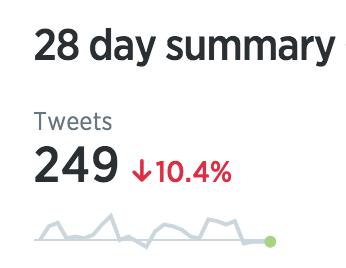

` vagrant up``Cmd+R `\***\*\_\_\*\***\_\_

> Now creativity can happen, because play is possible when we are separate from everyday life. So, you've arranged to take no calls, you've closed your door, you've sat down somewhere comfortable, take a couple of deep breaths and if you're anything like me, after you've pondered some problem that you want to turn into an opportunity for about 90 seconds, you find yourself thinking "Oh I forgot I've got to call Jim… oh, and I must tell Tina that I need the report /../ Because, as we all know, it's easier to do trivial things that are urgent than it is to do important things that are not urgent, like thinking. And it's also easier to do little things we know we can do, than to start on big things that we're not so sure about. /../ So when I say create an oasis of quiet know that when you have, your mind will pretty soon start racing again. But you're not going to take that very seriously, you just sit there (for a bit) tolerating the racing and the slight anxiety that comes with that, and after a time your mind will quiet down again.

\_\_
