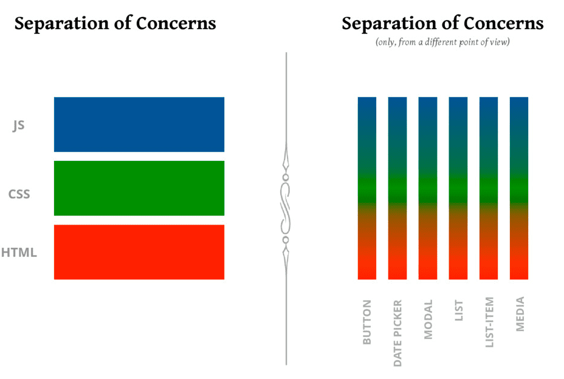

You know about spaghetti code. Code so confusing it looks like a bowl of spaghetti.

But have you heard of ravioli and lasagna code?

I don't know why we name bad practices after delicious Italian foods, but a recent conversation about [splitting up a monolith](https://swizec.com/blog/what-microservices-are-for/) inspired me to add another – **minestrone software**.

https://twitter.com/Swizec/status/1527695994028032001

Here's how different Italian foods capture bad software practices. Growing up next to Northern Italy, I have cooked all of these from scratch which makes me an expert 👨‍🍳

## Spaghetti code

[Spaghetti code](https://en.wikipedia.org/wiki/Spaghetti_code) is the easiest to spot. When you have to jump around to understand how something works, that's spaghetti code.

Commonly produced when you take clean code rules too seriously.

https://twitter.com/Swizec/status/1459269595403939840

I [asked twitter for examples](https://twitter.com/Swizec/status/1528418796255334400). Here's my favorite

https://twitter.com/ericniebler/status/1528425762340016128

From an [article about why GOTO is bad](https://vorpus.org/blog/notes-on-structured-concurrency-or-go-statement-considered-harmful/) – because it jumps around. Arrows show the flow of execution in that code.

You can achieve similar results with function calls.

Like this terrifying suggestion:

https://twitter.com/beaussan/status/1528423998396190729

You can do that with React hooks. But let's not ...

## Ravioli code

[Ravioli code](https://en.wikipedia.org/wiki/Spaghetti_code#Ravioli_code) happens when your code makes sense in isolation, but the system as a whole is confusing. Think emergent behaviors.

We can use Conway's Game of Life as an analogy. A code example would be too long.

[](https://en.wikipedia.org/wiki/Conway%27s_Game_of_Life)

3 rules govern the next state of each cell:

1.  Any live cell with two or three live neighbours survives.
2.  Any dead cell with three live neighbours becomes a live cell.
3.  All other live cells die in the next generation. Similarly, all other dead cells stay dead.

You can think of each cell as a well-defined class. Follows sensible rules and makes sense in isolation.

Put them all together and you get ... an infinitely looping glider gun? Even a breeder that creates guns?? 🤨


Yeah, confusing.

## Lasagna code

[Lasagna code](https://en.wikipedia.org/wiki/Spaghetti_code#Lasagna_code) happens when you structure your code in layers and forget to create abstractions. Common in module-view-controller architectures, React components, and typical approaches to GraphQL and RESTful API design.

Here's an example I've seen time and again.

### Storage layer

The storage layer keeps your data. A filesystem or database. Secretly it also holds your domain model, but we rarely talk about that.

    Article {
    	id: uuid
    	title: text
    	content: text
    	created_at: timestamp
    	author_id: fkey(User)
    }

Articles have `title`, `content`, are `created_at` a time, and belong to an author.

### Service layer

The service layer builds on top of your storage layer and adds the business logic. This is where task-based functions go.

```javascript
function getLatestArticlesByAuthor(author_id, count) {
  return query(
    `select * from Articles 
		 where author_id=${author_id} 
		 order by created_at
		 limit ${count}`
  )
}
```

Returns the latest `count` articles from an author. Production code would add error handling and more complex business logic.

### Controller layer

The controller layer translates API requests to service layer function calls. Modern frameworks hide all the complexity of parsing requests and constructing responses.

You write the glue:

```javascript
exports.latestArticles = async (req, res) => {
  const { author_id } = req.params

  const articles = ArticleService.getLatestArticlesByAuthor(author_id, 10)

  return res.send(200).json(articles)
}
```

We snuck in some business logic! We're saying that "latest" means 10. Does that go in the controller? 🤔

### API layer

The API layer specifies what your communication between client and server looks like. The shape of requests and responses. For RESTful APIs you put this in an [OpenAPI spec](https://www.openapis.org), for GraphQL this whole layer is "POST a query".

```javascript
{
	"/articles/:author_id/latest": {
		get: {
			description: "Returns latest articles by author"
			parameters: {
				author_id: {
					in: "path",
					required: true,
					schema: {
						type: "integer"
					}
				}
			},
			responses: {
				200: {
					description: "OK"
					content: {
						"application/json": {
							schema: {
								type: "array",
								items: {
									type: "object",
									properties: {
										id: { type: "string", format: "uuid" },
										title: { type: "string" },
										content: { type: "string" },
										created_at: { type: "string", format: "date-time" },
										author_id: { type: "integer" }
									}
								}
							}
						}
					}
				}
			}
		}
	}
}
```

Yes, that's a lot of work to say _"You'll get the full unchanged Article object from the database"_. It's more useful in production code.

### Client render layer

On the client you then have to render these objects.

```javascript
const LatestArticles = ({ articles, author }) => {
  const sorted = articles.sort(
    (a, b) => new Date(b.created_at) - new Date(a.created_at)
  )

  return (
    <div>
      <h2>Latest from {author.name}</h2>
      {sorted.map((article) => (
        <ArticleListing {...article} />
      ))}
    </div>
  )
}
```

Sort articles by `created_at` and render an `<ArticleListing>` component for each. We pass the whole article object as individual props.

```javascript
const ArticleListing = ({ id, created_at, title, content }) => {
  return (
    <div>
      <h3>{title}</h3>
      <label className="created_at">Created at: {created_at}</label>
      <p>{content.substr(100)}</p>
    </div>
  )
}
```

Each article listing shows a `title`, the `created_at` timestamp, and the first 100 characters of the `content` as a lazy summary.

### Client style layer

We want the `created_at` label to have a specific style and have chosen to use CSS because styling inside JavaScript is dirty or whatever. There are people who think like that 🤷‍♂️

```css
label.created_at {
  font-size: 0.6em;
  font-style: italic;
}
```

### The Lasagna collapses

Okay dear reader, we want to distinguish between when an article was created and when it was published. How many layers do you have to change?

I count ... all except the controller. All this work to create well-structured layers and just one has a meaningful abstraction 🙃

See also: [A feature based approach to React development](https://ryanlanciaux.com/blog/2017/08/20/a-feature-based-approach-to-react-development/)

[](https://ryanlanciaux.com/blog/2017/08/20/a-feature-based-approach-to-react-development/)

## Minestrone software

Minestrone software happens when you have [unclear domains](https://en.wikipedia.org/wiki/Domain-driven_design).

You won't see this in tutorials because it requires a sizeable software project. You may never find a project big enough for minestrone to be a problem.

### How you cook mom's minestrone:

1.  take big pot
2.  see what's in fridge
3.  throw in a few things that look good
4.  add water
5.  boil for a while
6.  taste minestrone
7.  add more ingredients to taste
8.  wait more
9.  adjust spices (salt and such) to taste

Then you eat that big pot of minestrone all week. There is no other food in the house. If you don't like the minestrone you are given, feel free to add more ingredients.

### How you make minestrone software

Replace the pot with software or company and ingredients with features 👉 Minestrone software!

Why make a new module for a new function when there's already a fine module right there? It's even imported and everything! How bad can adding more be.

Why make a new database table when an extra column will do? Who cares if your tables now mean multiple things.

Why make a new (micro)service when you have all this working boilerplate in The Big One? Adding a little extra won't hurt ...

### How you recognize minestrone software

Fast forward a few years, a few iterations, a few teams, a few team members, and you're us. Figuring out how to split a monolith into microservices, struggling to structure yourself into functional teams, stepping on each other's toes, and can't even agree on the meaning of your database tables.

Overlapping team responsibilities is a symptom of minestrone software. Or when you need multiple teams to build 1 feature.

At smaller scale, you've got minestrone when you can't decide what file a function goes into. That means your files (or modules) aren't well-defined. Or even when you're not sure which function or component to add to.

**Unclear business domains** mean you're not sure where code goes, who owns what, what new teams you need, or which microservice makes sense.

Writing well-structured software without a good domain model is impossible. No matter how clean your code.

https://twitter.com/Swizec/status/1456032036972605454

Your software is one big minestrone. The secret ingredient is love.

Cheers,<br/>
~Swizec

PS: anyone who tells you there is a recipe for minestrone is lying and has never been to Italy. Every mom and grandma makes it different
