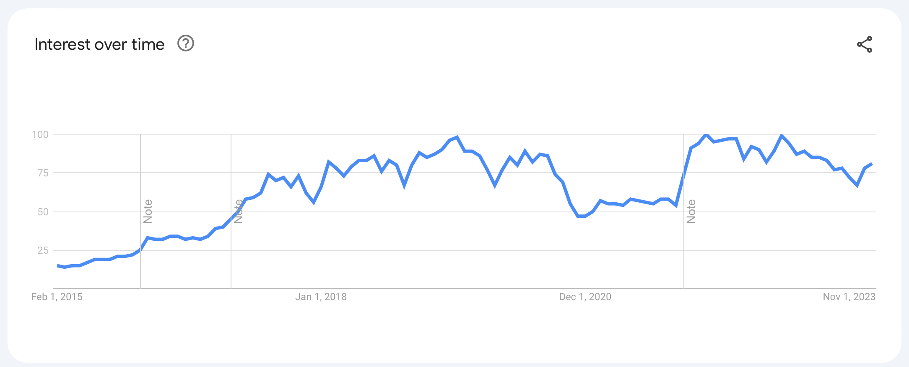

Imagine you've invented a new way of making ice cream.

It's the perfect ice cream. Creamy, delicious, soft enough to scoop, melts on your tongue but doesn't drip down your hands, easy to turn into various flavors, somehow it doesn't even have a bazillion calories. The perfect ice cream.

You make a batch and head down to the local beach for testing.

Customers _love it_.

Vanilla sells out in minutes. Chocolate takes longer, but you're out within the hour. Pistachio's not popular and takes almost 2 hours to sell out.

Encouraged, you borrow some money for ingredients and come back next week with more ice cream.

Vanilla's hot again and disappears in 2 hours. You tweaked the chocolate recipe and run out in 3 hours. You hear every kid within earshot telling their friends how much they love your chocolate ice cream. Instead of pistachio, you try strawberry. It worked! Strawberry's gone in an hour.

You keep coming back every week with more and more ice cream. You test different flavors, tweak popular recipes, and make sure every customer walks away with a big smile on their face.

The first batch of ice cream sold out almost without trying. You had to shout "ICE CREAM" a few times to sell the second batch. By the third batch, you needed a big sign that says ice cream.

You sell even more when you start playing loud music to create a cool vibe and by now everyone on the beach can see your very large Ice Cream sign. You put little "Best Ice Cream in the World" signs on the road leading up to the beach.

Sales explode when you hire a few local kids to run around selling ice cream directly to people lounging on the beach.

Everyone loves your ice cream and business is booming. People start coming to _this_ beach just for your ice cream. You think about opening more locations. A worldwide beach ice cream empire. You've cracked the code!

## A vibe shift

Then one day the beach closes and you still have ice cream left over. Hm that's odd, you think. The next day, even more goes in the trash. What is going on?

You ask employees, if they've heard any complaints. Nope everyone loves your ice cream. People keep coming back.

Next week you run a promotion and sell _almost_ all your ice cream. You decide to run regular promotions.

You try new flavors, hire sign spinners, run radio ads, give free ice cream to every influencer in town, ... but the ice cream's not selling. A few people ask for coffee. Why would an ice cream stand have coffee, ...

A few months ago, you couldn't make ice cream fast enough. Now you're throwing ice cream away no matter what you try.

Summer's gone kiddo. There's almost nobody at the beach. The few dog walkers you see want to warm up with hot drinks. Few people want ice cream on a dreary winter day with grey skies and howling winds.

But a nice cup of tea while you look for seals? Now we're talking!

## You can't beat the market

The market determines your fate. Either you have something people want, or you don't. **You can’t sell ice cream on the beach in winter**.

If people want what you're selling, you can optimize and promote and growth hack and make product fly off the shelves faster and faster.

If people don't want your thing, it's like feeding peas to a toddler. They'll put it in their mouth because you made a cool airplane noise, but I hope there's a good bib to catch all the green goop that comes out.

You can't beat the market.

When the market is big and growing, it makes everything feel easy. Your growth hacks work, conversion optimizations hit, user activation works like a charm, and feedback is easy to get. If you don't move fast enough to capture demand, someone else will.

When the market is small or shrinking, that puts an upper limit on the absolute potential of your business. A ceiling you won't be able to break unless you make new products for new markets. Or re-target existing products to appeal to new markets.

In business speak this is called **TAM** – total addressable market.

As a startup engineer, you have little control over this strategy. But you have to think about it when choosing startups to work with. Your career depends on it.

### TAM is not fixed

It is normal for companies to start with a small TAM, a niche, and use that as a testing ground to perfect the product before expanding their addressable market.

A small clearly defined market makes things easier early in the business. You have less competition to worry about, can do more focused and cheaper marketing, and it's easier to identify customers you can talk to. Your product even makes customers happier because you're building solutions that fit their use-case exactly.

As you grow, that small niche becomes a constraint.

When you've tapped out your niche, you can stay small or find new customers by increasing your addressable market. This is how Taylor Swift went from country superstar to pop culture icon with 1989, her first official pop album.

But you can also benefit from the market itself growing.

### A growing market helps

When I first started writing React materials in 2015, React was an exciting new JavaScript library that many people wanted to learn. Doubling revenue every year was _so easy_ I thought I must be a business genius.

In reality, the React market itself was growing faster than 2x per year and I wasn't even keeping up. The growth in default demand made it easy for anyone with a boat in the water to see number go up behavior.

Using google trends as a proxy, you can see that React rapidly grew in popularity between 2015 and 2019 then bounced off a growth ceiling, collapsed during the pandemic, and reached the ceiling again in recent years.

No amount of effort will let you beat this trend unless you're directly stealing market-share from competitors with a better product, better marketing, or both.
