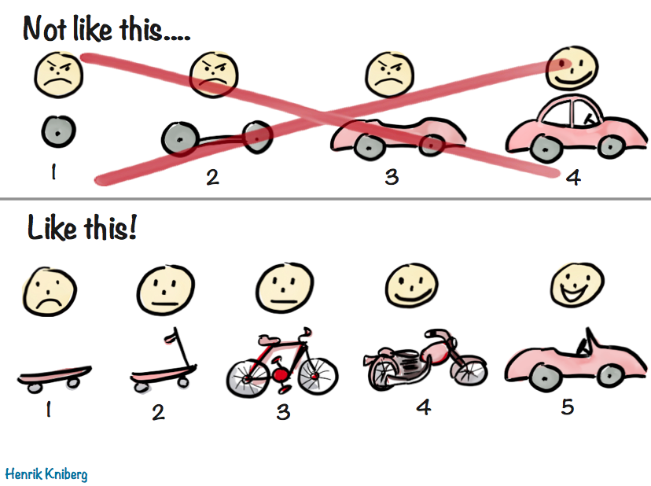

In the last few months every engineer I hired stumbled in exactly the same way: Project management. They learned quickly, but that first big project has become a right of passage.

We're talking about strong engineers great at writing code and thinking through problems. Everyone with at least 5 years of experience. I would trust them to design and own almost any system.

## How we work

We like to give engineers lots of agency and autonomy.

We find problems for you to solve, define loose criteria, help with prioritization, and hold a quality bar. You manage your projects, drive things to completion, and own systems in production. You might get a few stakeholders to work with because they'll know best if your software solves their problems.

Levels and years of experience are more [about the scope and problem fuzziness](https://swizec.com/blog/engineering-levels-arent-about-skill-anymore/) than skills. For example: We wouldn't limit a junior to polishing UI, we'd give them a small feature instead of a large system. At a high level [you may be expected to change how the company operates](https://swizec.com/blog/code-is-the-easy-part-or-how-we-refactored-half-the-business-to-fix-a-janky-script/).

This works great.

Managers think high level strategy, engineers execute and get shit done. There is little to no micromanagement because we trust you'll figure it out or ask for help.

Your job is to [accelerate the company](https://swizec.com/blog/the-3-curves-that-make-a-scalable-business/), my job is to accelerate you. I take on a lot of the shit work that doesn't demo well :)

## The right of passage

When you join the team, you get a tiny task.

We want you to ship to production on your first day. This shows you the whole development lifecycle, you get to press the deploy button, and we confirm you've got a working environment.

You then get a chunkier feature that we've been thinking about for a while. Something self-contained that you can complete in a day or two. You see more of the system, drive user impact, and it's all pretty smooth.

Then you get _a project_. This is where things go silly.

### Project management for engineers

First, engineers are surprised. What do you mean I get a problem definition and no pre-chewed tasks??

This can be daunting. I think it's the most important skill an engineer can have – breaking down complex problems based on Goals To Achieve not a list of tasks to complete. You are [selling your brain not your hands](https://swizec.com/blog/theres-two-types-of-engineers/). This is the value! The juicy good stuff.

If I had tasks to complete I'd throw them to AI. I need _you_ to own the problem and figure out the tasks.

At this point I like to have a conversation where we go through the project and get a crisp definition of done. **When you're done, what can the users do that they couldn't do before? What exactly is the value?** No mushy "make this better" projects. It took me months of wearing the product owner hat to figure this one out, I'm learning.

The better we can both agree on a clear outcome the better these projects go. It's okay to adjust as we ship and learn more.

### Just do the thing?

With a clear outcome, engineers like to jump into the code. This is a task! I understand tasks!

Break the project down into one task called Do The Thing and ship a whopping monster pull request [that nobody can review](https://swizec.com/blog/theory-of-constraints-ai-and-code-review/). Super common now that you can throw things at AI and hope for the best. AI even pretends to create and follow a plan!

Then you get stuck in code review hell for 2 weeks and nothing ships. Large pull requests get dozens of comments, need lots of back-n-forth, and the ground you're working on keeps shifting.

### No big tasks!

Ideally we catch this in the project breakdown phase and can gently guide you to write a few more tasks than

- Step 1: Do the thing
- Step 2: ???
- Step 3: Ship!

We ask engineers to create [stacked PRs for large changes](https://swizec.com/blog/in-praise-of-the-stacked-pull-request/). This feels slower but lets us review piece by piece and things can move smoother. Slow is smooth and smooth is fast.

### Horizontal slices bad

New engineers show the same tendency both when writing tasks and when stacking their PRs:

- Step 1: Models
- Step 2: API
- Step 3: UI
- Step 4: Test
- Step 5: Ship

No. You're shipping broken software that nobody needs. What good does is it to ship your models to prod? They don't do anything on their own. And nobody cares about your API. What if 3 days later you realize the API doesn't fit with the UI you need? How are we going to get early feedback to adjust our approach if nobody can use the code you wrote?

Skateboards! Not wheels.

AI generated plans also look like this. They're always bad by default but can be made good, if you know what to ask for: **vertical slices**.

### Vertical slices!

Instead you want to break the project down like this:

- Step 1: User can do teeny tiny almost useful thing
- Step 2: The teeny tiny thing does more
- Step 3: You can now do even more
- Step 4: Wow this is pretty damn useful
- Step 5: Omg you've solved my problem

Crucially, you can ship every change straight to prod, show to users, and start getting feedback at Step 1.

We've had cases where we talked to stakeholders for weeks, discussed ideas and challenges, agreed on a plan, and everyone thought it was a superb approach that's gonna solve everything.

Ship step 1 and they went _"Wait this makes no sense. Why are you doing it this way? Let's do $CompletelyDifferentThing instead"_

Users and stakeholders have no idea what they need until you put working software in their hands. Much better to scrap your plan after 1 day than after 3 weeks of work.

But everyone gets it wrong at first. I don't know why.

Cheers, 
\~Swizec
