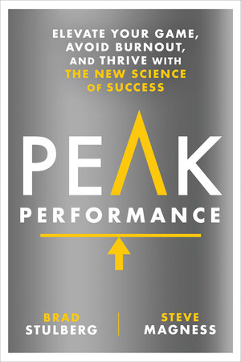
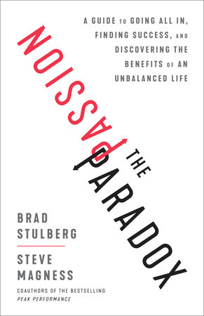

Hey,

if you look at a holiday break and think _"Wow, perfect time for a side project!"_ this email is for you.

Inspired by a reader's reply to [When it's okay to work overtime](https://swizec.com/blog/when-its-okay-to-work-overtime/). Isabel said that they love getting a chance to work on an exciting project, but that you have to be careful. Burnout lurks right around the corner.

Isabel is right. You _can_ burn out even when you're excited. Stay up until 3am one night with an exciting project, zero energy the next day for that production issue. We're not 25 anymore 😅

If you _are_ 25, use it. Use that energy now! It doesn't last forever. trust me

Isabel shared [Stacking the Dominos](https://chrisguillebeau.com/consider-the-dominoes). Great read, very short :)

And they cautioned to be careful: don't expect too much of yourself. Challenge and push, but let yourself win once in a while. It feels good.

I agree with Isabel.

In fact, there is literature that agrees with Isabel. In one of my favorite books about burnout, [Peak Performance](https://www.penguinrandomhouse.com/books/593398/peak-performance-by-brad-stulberg-and-steve-magness/), the authors talk about burning out when training to run a 4 minute mile. A feat achieved "by over 1400 people".

After much research, they argue that burnout doesn't come from working or doing too much. It comes from _grinding_.

Working for long periods with no reward. Or improvement. Or seeing the results of your labor. Chasing rewards that are too small for your level, or goals so far out of reach you can't get there.

Or as happens with startups, when you have a great team working on the wrong idea that nobody wants.

The sweet spot is to do work that's challenging but achievable, as Mihaly Csikszentmihalyi the discoverer of [Flow](https://en.wikipedia.org/wiki/Mihaly_Csikszentmihalyi#Flow) would say.

Because **you can't grow without pressure and adversity**. Periods of pushing hard followed by periods of rest lead to optimal growth. Step out of your comfort zone to grow, then recover to lock in the growth and create a new baseline.

And if you're super passionate, hold yourself back a little. The authors of Peak Performance say in [The Passion Paradox](https://www.penguinrandomhouse.com/books/592250/the-passion-paradox-by-brad-stulberg-and-steve-magness/).

Passion can mask the burnout. You don't feel like you're grinding, but there's a physical limit. You need the rest. And the reward.

Hemingway had a great take on this when he said that the hardest part about writing is filling the time until tomorrow when you're allowed to write again. Because if you don't, you'll wreck the creative battery for a week or more.

Or as the internet would say: treat yo self, enjoy the holidays 🎄

Cheers, 
~Swizec

PS: we also talked about Peak Performance a few years ago in [React Podcast 67: Swizec Teller on Hustle and Focus](https://spec.fm/podcasts/reactpodcast/80520991). This was before I read The Passion Paradox

PPS: you might enjoy [Why Programmers Work at Night](https://leanpub.com/nightowls), my book on flow and developer productivity
