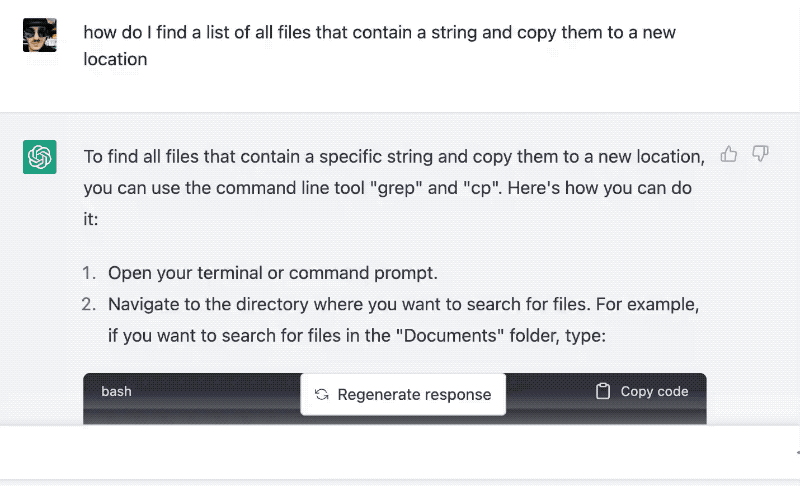

You may have noticed it's getting hard to find good programming help online. I've had several engineers say _"After 2 hours of Googling I finally looked at the docs and solved my problem in 5 minutes"_

Another option is to ask the nearest expert on your team.

Experts solve the problem faster than Google or know the exact phrases to search that you didn't think of. Happens to me all the time in new fields 😇

But not everyone has access to an expert. Until now



Yes it's not perfect, keep reading :)

## Why Googling for code sucks

I think Google is struggling because of competing priorities. They try to cater to both the novice and the expert thus failing at both. Search results that are too complex for the novice, yet too naive for the expert.

Add the flood of non-expert content, the SEO wars, the community sites that block scraping, Gen Z putting lots of technical content in video, casual content going into podcasts ... Google is doing their best. I'm sure it could be worse.

But!

The rise of the professional devrel means official docs are _fantastic_ these days. Well written, carefully thought out, easy enough to navigate, and with a good split between tutorials, high-level overviews, and API specs.

Unfortunately 20 years of Googling has trained programmers not to look at docs. We expect them to suck and they look long and difficult. Maybe there's a random blogpost that answers our question exactly 🤞

Narrator: there isn't.

A few weeks ago in a chatroom I frequent someone asked: _"Hey what's a good way to learn OpenAI?"_

Swiz: Have you tried the docs?

Them: Oh yeah good idea!

2 hours pass

Wow the docs are wonderful! I learned all the details I needed _and_ gained an understanding of what's going on.


## How the SEO tutorial game works

This is the SEO game bloggers (yes like I once did) play:

> Maybe there's a random blogpost that answers our question exactly 🤞
>
> Narrator: there isn't.

Figure out what people are searching for. Answer those questions _exactly_. Write the best resource online _for that specific question_. Make a video, if you can.

Do this a few hundred times and poppa Google will shower you in sweet sweet organic traffic.

You write hundreds of almost-the-same articles answering slight variations of similar questions, programmers come to your site, get the answer, and never look back. Few of these will convert to a mailing list or buy a product. They just want to solve $CurrentProblem and don't really want to become experts.

Like when I search how to do something with the terminal. Yeah I _could_ become an expert in Bash and piping commands together. But I don't wanna 😇

## How ChatGPT beats the SEO tutorial

After 20 years of the SEO game, the internet is flooded with those low effort formulaic SEO tutorials. They're like recipe sites but less professional.

Enter ChatGPT – an affordable "expert" that can answer _your_ question on-demand. Create a custom tutorial just for you.

This weekend I had to copy a bunch of articles from my website repository to a new experiment I'm building with the ChatGPT API. Trying to build a Swiz QnA bot, stay tuned.

I didn't feel like figuring out the details so I asked ChatGPT on a whim. _"how do I find a list of all files that contain a string and copy them to a new location"_

https://twitter.com/Swizec/status/1639813343350513666

🤯

ChatGPT not only gave me working code – `cp $(grep -rl "string" .) new_folder/` – it wrote an entire tutorial for me! Explained how it works, taught me something new.

I tried the code and realized that all my files are named `index.mdx`. When copied to a new folder they become 1 file. Oops.

So I asked _"how do I also rename each file based on the folder it was in"_ and got an updated tutorial. Again with working code and useful explanations 🤩

```bash
for file in $(grep -rl "string" .);
do
	cp "$file" "new_folder/$(dirname "$file" | tr / _)_$(basename "$file")";
done
```

Could I cobble that together? Yes, eventually. Do I understand how it works? Yes and that's important.

The beauty of this interaction is that followup question. Good luck doing that with a random tutorial.

## ChatGPT doesn't always work and that's okay

High on my success, I then asked ChatGPT how to parse an `.mdx` file into sections based on subheadings using TypeScript.

It hallucinated a bunch of APIs that don't exist, wrote code that won't compile, and invented 2 imaginary libraries. 🤣

And you know what? That reminds me of what user generated content was like 20 years ago when I started programming for the web.

Who cares if the tutorial is wrong, find another one that covers that hole! There's plenty out there.

Who cares if ChatGPT gets it wrong, ask a followup question!

20 years ago greybeards complained about kids these days and how we rely too much on unverified online content instead of listening to experts. Wikipedia was ruining schools and getting banned, senior software engineers scoffed at us for Googling our questions, and _we didn't care_.

Okay grandpa, you go back to your dusty books and memorizing whole API specs, just get out of my way as I leverage this internet thing to race past you at breakneck speed.

## Leverage the new tools

ChatGPT (and friends) is doing the same today.

Yes it's often wrong. Yes you need to understand what you're doing. Yes you have to ask the right questions. Yes you should verify the output for yourself.

And you know what? That's _good_. It helps you learn.

[Understanding beats knowledge](https://swizec.com/blog/why-understanding-beats-knowledge/) as I like to say. 20 years ago we outsourced knowledge to the internet. Now we're outsourcing the research and synthesis part 😍

This _will_ change things.

Cheers,<br/>
~Swizec

PS: in college we "joked" that the internet is part of our [noosphere](https://en.wikipedia.org/wiki/Noosphere) because unlike our elders, we stopped knowing things and instead learned how to find the right details online when needed. New LLM-based assistants are making that even easier.
