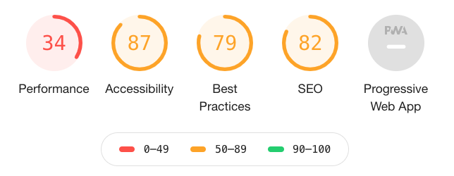

wanna hear something cool?

You can 2x your Lighthouse performance score just by changing how you embed 8 gifs on a gigantic 6000 word page with 130 requests and 16megs of data.

## How I found out

On the internet, ain't nobody got time to read 3 paragraphs of emotion setting. You'd find it boring.

So we use gifs.

But looking for gifs breaks your writing flow. You leave the editor, go on giphy, search for the emotion, dig through the search results, copy paste the link, go back to your editor ...

Wait what was I saying? 🤔

Happens every time. Slows you down. Wasted effort.

What if you could find the perfect gif without leaving your editor? Write a search right in your markdown?

``

Becomes

Been using that with [TechLetter.App](https://techletter.app) for over a year now and it is wonderful. Saves so much time and effort. 👌

This weekend I turned it into my first Gatsby plugin – [gatsby-remark-giphy](https://github.com/Swizec/gatsby-remark-giphy).

Now you can use it too ❤️

## 3 ways to embed a gif

[gatsby-remark-giphy](https://github.com/Swizec/gatsby-remark-giphy) supports 3 ways to embed a gif

- plain ``
- using HTML5 video
- as an iframe

Configure via `gatsby-config.js` and the plugin changes how it transforms markdown nodes.

Here's what happens.

At build time, gatsby-remark-giphy visits each markdown image node whose URL starts with `giphy:`, pings the [Giphy API](https://developers.giphy.com/), and runs 1 of 3 functions:

- `embedGif`
- `embedVideo`
- `embedIframe`

### embedGif

&t=seti&l=typescript&ds=true&wc=true&wa=true&pv=48px&ph=32px&ln=false&code=function%20embedGif(imageNode%2C%20giphy%3A%20GIFObject)%20%7B%0A%20%20%20%20const%20search%20%3D%20imageNode.url.replace(%2F%5Egiphy%3A%2F%2C%20%22%22)%3B%0A%0A%20%20%20%20imageNode.alt%20%3D%20search%3B%0A%20%20%20%20imageNode.url%20%3D%20giphy.images.downsized_large.url%3B%0A%20%20%20%20imageNode.title%20%3D%20imageNode.title%20%7C%7C%20search%3B%0A%0A%20%20%20%20return%20imageNode%3B%0A%7D>)

To embed a gif, we maintain the markdown-ness of this node. Change the URL to the search result and add a title. Further markdown transformers will turn it into a regular image.

Something like this:

&t=seti&l=html&ds=true&wc=true&wa=true&pv=48px&ph=32px&ln=false&code=%3Cimg%20src%3D%22https%3A%2F%2Fmedia.giphy.com%2Fmedia%2F5VKbvrjxpVJCM%2Fgiphy.gif%22%20alt%3D%22search%22%20%2F%3E>)

This is the slowest.

You're loading the gif as soon as the page renders. Whether it's visible or not. And you have to wait for the whole gif to download before it plays.

### embedVideo

&t=seti&l=typescript&ds=true&wc=true&wa=true&pv=48px&ph=32px&ln=false&code=function%20embedVideo(imageNode%2C%20giphy%3A%20GIFObject%2C%20embedWidth)%20%7B%0A%20%20%20%20const%20srcHTML%20%3D%20%60%3Csource%20src%3D%24%7Bgiphy.images.looping.mp4%7D%20type%3D%22video%2Fmp4%22%20%2F%3E%60%3B%0A%0A%20%20%20%20imageNode.type%20%3D%20%22html%22%3B%0A%20%20%20%20imageNode.children%20%3D%20undefined%3B%0A%20%20%20%20imageNode.value%20%3D%20%60%3Cvideo%20style%3D%22margin%3A%20auto%20auto%3B%20display%3A%20block%3B%20max-width%3A%20%24%7BembedWidth%7D%22%20autoplay%20loop%20muted%20playsinline%20loading%3D%22lazy%22%3E%0A%20%20%20%20%20%20%20%20%20%20%20%20%24%7BsrcHTML%7D%0A%20%20%20%20%20%20%20%20%3C%2Fvideo%3E%60%3B%0A%0A%20%20%20%20return%20imageNode%3B%0A%7D>)

Here we change the node into HTML and tell markdown exactly what to do. The gif becomes an HTML5 video element playing an mp4.

Adding `autoplay loop muted playsinline` makes it behave like a gif. But with one crucial difference 👉 mp4 is optimized for streaming.

That means your browser can play the video _while it's downloading_. **And** the filesize is smaller.

2.29MB gif vs. 1.09MB mp4 for our surprise example. 🤯

This is the fastest.

But this result is suspicious, we'll get to that.

### embedIframe

&t=seti&wt=none&l=typescript&ds=true&dsyoff=20px&dsblur=68px&wc=true&wa=true&pv=48px&ph=32px&ln=false&fl=1&fm=Hack&fs=14px&lh=133%25&si=false&es=2x&wm=false&code=function%2520embedIframe(imageNode%252C%2520giphy%253A%2520GIFObject%252C%2520embedWidth)%2520%257B%250A%2520%2520%2520%2520const%2520responsivePadding%2520%253D%2520Math.round(%250A%2520%2520%2520%2520%2520%2520%2520%2520(Number(giphy.images.original.height)%2520%252F%250A%2520%2520%2520%2520%2520%2520%2520%2520%2520%2520%2520%2520Number(giphy.images.original.width))%2520*%250A%2520%2520%2520%2520%2520%2520%2520%2520%2520%2520%2520%2520Number(embedWidth.replace(%2522%2525%2522%252C%2520%2522%2522))%250A%2520%2520%2520%2520)%253B%250A%250A%2520%2520%2520%2520imageNode.type%2520%253D%2520%2522html%2522%253B%250A%2520%2520%2520%2520imageNode.children%2520%253D%2520undefined%253B%250A%2520%2520%2520%2520imageNode.value%2520%253D%2520%2560%253Cdiv%2520style%253D%2522width%253A%2524%257BembedWidth%257D%253Bheight%253A0%253Bpadding-bottom%253A%2524%257BresponsivePadding%257D%2525%253Bposition%253Arelative%253Bmargin%253A%25200%2520auto%2522%253E%253Ciframe%2520src%253D%2522%2524%257Bgiphy.embed_url%257D%2522%2520width%253D%2522100%2525%2522%2520height%253D%2522100%2525%2522%2520style%253D%2522position%253Aabsolute%2522%2520frameborder%253D%25220%2522%2520class%253D%2522giphy-embed%2522%2520allowfullscreen%2520loading%253D%2522lazy%2522%253E%253C%252Fiframe%253E%253C%252Fdiv%253E%2560%253B%250A%250A%2520%2520%2520%2520return%2520imageNode%253B%250A%257D%250A>)

Similarly to the video embed, we change the node to HTML and tell markdown exactly what to do.

Create an iframe Giphy embed in this case. I borrowed the code from [gatsby-remark-embedder](https://github.com/MichaelDeBoey/gatsby-remark-embedder) and added `loading="lazy"` to speed things up.

The result is an iframe with some annoying Giphy branding on mouseover and a nice Lighthouse boost.

What's interesting is that Giphy's iframe embeds a `webp` version of the gif that's just 880KB for our surprise example. 🤨

So iframe should be fastest, right?

## loading="lazy"

`loading="lazy"` is a [new native implementation of lazy loading](https://addyosmani.com/blog/lazy-loading/). Mark something as lazy and the browser avoids loading it until it's visible.

I think it's only supported on Chrome right now, but that's where we measure Lighthouse scores isn't it? Also what Google cares about when determining page speed for that sweet sweet SEO boost 😛

Lazy loading will almost always give you a speed boost and improve user experience.

Where my results get tricky is that the `<video>` element _does not support loading=lazy_. And yet it still gave me a Lighthouse performance boost. From 44 to 63 ...

Maybe it's a Lighthouse bug? 🤔

Either way, `<video>` is much better than `` and I don't like the overlays and extra tracking that comes with `<iframe>`.

Cheers,  
~Swizec

PS: I benchmarked using the [ServerlessReact.Dev](https://serverlessreact.dev) landing page, changing how 8 gifs are embedded and nothing else.
