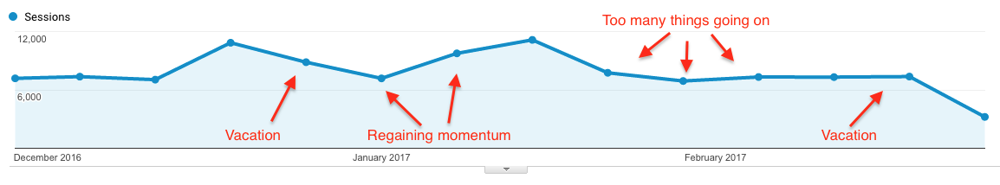

Vacation kills momentum.

I&#x27;ve experienced this momentum killing effect twice this year. The first was after I came back from the [epic Grand Canyon roadtrip](https://swizec.com/blog/60-seconds-2000-miles/swizec/7334). The second is right now, coming back from a company retreat in Cabo.

Don&#x27;t get me wrong, I love vacation. I _need_ vacation. Coming back from vacation and restarting the pre-vacation momentum is the death. Newton&#x27;s first law: An object at rest stays at rest, and an object in motion stays in motion with the same speed and in the same direction unless acted upon by an unbalanced force.

You can think of daily productive habits as momentum. If you go to work for 8 hours every day, doing so becomes reflexive. Momentum. If you go to the gym every day after work, you&#x27;ll keep doing it unless you make an active decision not to. Momentum.

If you write an article or make a video every day, you can keep doing it. Sometimes it’s easier, sometimes it’s harder, but it&#x27;s easy to put _something_ out there. Even if you write every other day, you can keep doing it almost without thinking. Momentum.

And then vacation stops all that.

The unbalanced force of vacation throws you out of whack. Maybe you can keep up some daily exercise, but it&#x27;s not quite the same as going to the gym. Maybe you can keep writing a little bit…

But the pool and jacuzzi and cocktails and friends and nightclubs and lounge chairs and books are soooooooo inviting, and you realize just how tired you&#x27;ve been all these weeks. You deserve a little break, don&#x27;t you? God damn it, you&#x27;ve earned it!

So you don&#x27;t. And then you&#x27;re fucked.

Do you reeeaaaaally want to get back to all of that work you&#x27;ve been doing before? Like _really_ really? You loved it, and you loved the results for sure, but you can&#x27;t deny how much easier life would be if you, you know, _didn&#x27;t_. You just saw how easy it was. Relaxing and nice and nothing bad happened.

Or did it?

In my case, not writing has a direct effect on traffic. The classic content treadmill problem.

At the end of December, I went on a roadtrip, and traffic went down. Then in January, it took a few weeks for the traffic to build back up. Then I fell off the wagon and started posting irregularly again, and traffic fell down to maintenance levels.

The week off didn&#x27;t have as much of an effect as it did in December, but we&#x27;ll see what happens. Stitching together a newsletter for Friday is going to be hard. ?

Fingers crossed this short rumination starts the momentum. Here&#x27;s a video of some snorkeling fishes.