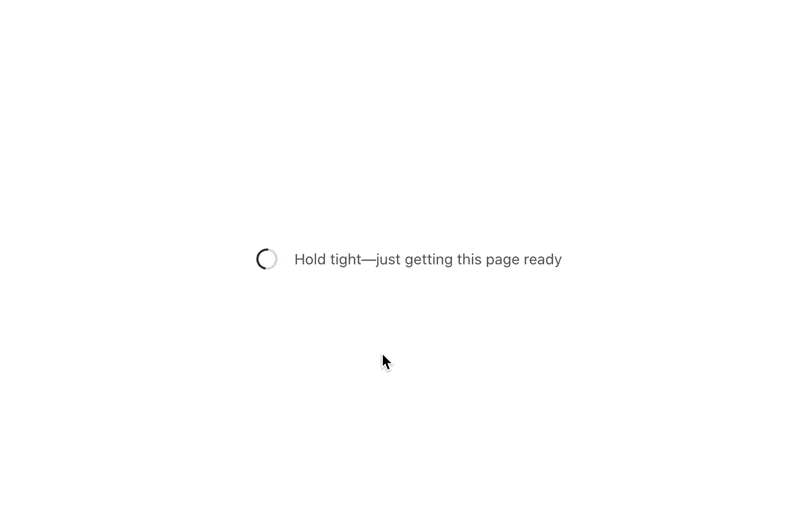

Remember when we could travel? Those were the days

You roll up to the airport, "breeze" through security, walk endless corridors designed to keep you busy[^1], see beautiful handbags and makeup you'd never buy, grab a bottle of overpriced water, a sandwich for the plane, and sit down in your oh so very comfortable chair.

On your left is a stressed out business person frantically finishing a presentation, on your right a college kid going on vacation chill as heck not a care in the world.

You're stuck in the middle seat. Forgot to buy early ... again.

But hey! [_Two_ arm rests](https://youtu.be/fSgJv55x6-4). 🤘

You take out your laptop and get to work. Airplanes are a fun time to focus. Nothing else you can do.

Unit testing was invented on an airplane, did you know? [\[2\]](https://www.zdnet.com/article/kent-beck-we-thought-we-were-just-programming-on-an-airplane/)

You get the wifi package and open a website.



Heck yeah! Super fast all the metrics look good! Time to first byte, amazing, time to interactive, fantastic.

Time to useful ... it's not on Lighthouse, who cares. 😇

Airplane wifi is a beast to deal with [name|my friend]. Great bandwidth, terrible latency, poor reliability.

I clocked a flight once at 50MB/s with fast.com ... 70% drop rate. Guess what 70% of connections never succeeding did to my browsing experience?


Your typical webapp makes hundreds of requests for every page load. That's how you get them metrics Google cares about. Snappy first load, quick to interactive, tiny payloads.

On an airplane all that turns to jank. Nothing works.

Same is true for LTE when you're walking, elevators, moving to the edge of your wi-fi range, highway tunnels, and downtown San Francisco where cell coverage is surprisingly bad for a place that thinks of itself as the center of tech.

But there's a way to fix this in _your_ app.

## The JAMStack helps

The goal with JAMStack apps is that _your first page load is useful_. Static HTML with all the data baked in at deploy time.

You build a React app. Same as always.

Fetch some data, talk to an API, render a UI. Like this:

```javascript
const ContentList = () => {
	const content = fetch(content_url)

	return (
		<ul>
			{content.map(c =>
				<li>{c.name}</li>
			)}
		<ul>
	)
}
```

That's pseudocode but you get the idea. Load data, render data.

What happens next is my favorite part.

You deploy the app and it becomes a static piece of HTML. A normal file like in the old days. Served by ultra fast servers, images on a CDN, all the good stuff.

When users hit your page, they get this:

```html
<html>
  <body>
    <ul>
      <li>awesome content</li>
      <li>more awesomeness</li>
      <li>wow this is amazing</li>
      <li>oh gosh not a single API request</li>
      <li>hot damn</li>
    </ul>
  </body>
</html>
```

It's all there. No loading spinners, no API requests, not even any JavaScript. Great time to first byte, fantastic time to interactive, exceptional time to useful.

😍

And then [name|my friend], then it _turns into a React app_. After that initial load of useful content, the JavaScript flies in, hydrates your app and it becomes a typical React app. With all the features and flexibility that you're used to.

That's what [The JAMStack Workshop](https://gum.co/PdwnF) on November 9th is about. Check it out

Cheers,<br/>
~Swizec

[^1] funfact: the walk to baggage claim is long and convoluted on purpose. Makes the wait feel shorter because you're walking instead of waiting.
