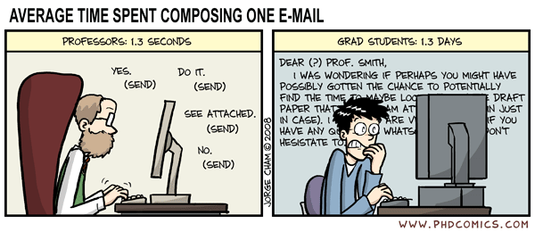

Ever feel like between all the meetings and slacks and emails and pings and pongs and this question and that question and quick request here and quick request there you barely have time to think, let alone the deep focused work?

Me too!

Here's a tool that I've found can help – The Wally Reflector.

You ask anyone with a great idea to take the first step and usually you'll never hear from them again. Oh well, guess it wasn't important enough to use _their_ time.

## Why you need The Wally Reflector

As you grow in your role, you get to a point where the number of incoming "quick requests" outpaces your ability to keep up.

People think they're just asking for a quick 10 minutes of your time, what's the big deal. But they don't see the other 20 people doing the same thing. If you devote 200min+ (3h) of every day to fulfilling others' requests, when will you have time to do your own work?

The problem grows only worse the higher in the org chart (formal or informal) you get.

Someone like a VPofEng may have 100 people asking "quick questions" all the time. Without the Wally Reflector, there's literally not enough time in the day to even have all these conversations, let alone do anything about 'em.

That's when this happens:

## The _positive_ Wally Reflector

On my team we like to use The Wally Reflector for code improvements. The kind that fit into an hour of your time and aren't big sweeping changes that need a real project.

Someone says _"Hey we should change so and so to follow the foobar pattern"_

**Great idea! Love it. Make it so.**

And then usually nothing happens. _But sometimes it does_.

Those moments are like magic. The engineer with an idea feels validated and empowered to make changes they think are important. Next time they might not even ask! They'll just do the important thing 😍

You're saying _"It's your ship, this is your call. You're the expert in this area, not me. If you think it's important, make it happen."_

That's how you empower people. Validate their ideas, grant your permission, and move out of the way.

Cheers, 
~Swizec

PS: the secret ingredient is building enough slack into the roadmap so people have time for these things
