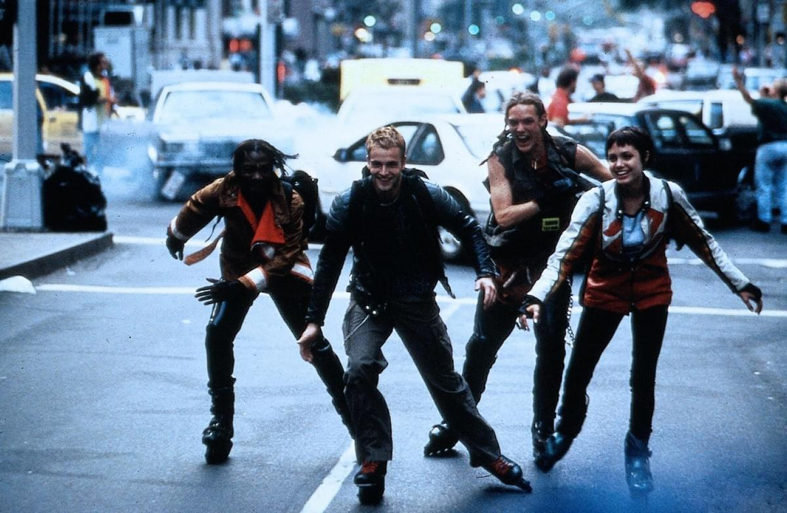

\[caption id=&quot;&quot; align=&quot;alignnone&quot; width=&quot;720&quot;] Hackers\[/caption]

> &quot;Wow, you don&#x27;t really talk like an engineer.&quot;

As part of my resolve to regain [the social skills I&#x27;ve lost](http://swizec.com/blog/how-i-accidentally-lost-my-social-skills/swizec/6434) while hiding in the cave of working from home I started talking to women more. Mostly because they&#x27;re far more receptive to random guys saying _&quot;Hi&quot;_ than men are. Men are actually kind of awkward when it comes to random social connections ... Just a little something I learned during my [pay a random compliment every day experiment](http://swizec.com/blog/can-you-pay-one-compliment-to-one-stranger-every-day/swizec/4449). Women in their 20&#x27;s are the easiest people to talk to, if you&#x27;re a random person they&#x27;ve never met. It freaks teenagers out, and people older than 30-35 just think you&#x27;re trying to sell something. Guys in their 20&#x27;s are just far out. Most are too full of themselves to hold an interesting conversation with a stranger. Hell, just look at this blog, I also am full of myself and I happen to be a 20-something guy. Coincidence? I think not. But I digress. Engineers aren&#x27;t making a good name for themselves socially. And that bugs me. On Friday I was out with a cool barista I&#x27;d met a few days earlier. Over the five hours our conversation touched many topics, but one thing stuck out to me.

> &quot;You don&#x27;t really talk like an engineer.&quot;

As a barista next door to Palantir she meets a lot of engineers every day. As a person living in The Bay Area she is surrounded by them. When pressed she would admit only that _&quot;Engineers really talk about work a lot&quot;._ She isn&#x27;t even the first person to tell me this. It seems to come up pretty much every time I have ever talked to a lady for a few hours. _\*shrug\*_ Another clue comes from a few days ago. A coworker went to visit one of the startups that uses our product about some thing or another. Coming back he sounded not unlike [Jonathan Harker](http://en.wikipedia.org/wiki/Jonathan_Harker "Jonathan Harker") does when describing [Count Dracula](http://en.wikipedia.org/wiki/Count_Dracula "Count Dracula") for the first time. _&quot;Euch, engineers are so ... weird. They give you such an uneasy feeling. It&#x27;s just so ...&quot;_ All the while making disgusted faces and wiping himself clean like something icky was stuck to his shirt. _&quot;I was so happy when the CEO came. Finally! Somebody normal to talk to! Then it was okay, he made me feel comfortable again.&quot;_ That&#x27;s a very violent emotion to instill in a person. What ever could those engineers have done to cause this? We&#x27;ll probably never know, but engineers the world over are known as those awkward introverts that skulk around dark hallways listening to thumping music and breaking into The Gibson. Okay, sure, hackers/engineers/programmers have progressed from the antiestablishmentarians of 1993, but they still haven&#x27;t been fully accepted into society. While geeks might be cool right now, a geek does not an engineer make. Most geeks today are but a shadow of nerdy engineers. Their social skills are better too. I know _why_ engineers are terrible with people. I too have gone through high school where out of 1200 pupils only 10 were girls. I&#x27;ve gone through CS college where a class of 300 had 20 girls, none of which wanted to talk to me. That&#x27;s a lie, in freshman year I was friends with 3 of them for like the first few months. But as CS people are wont to do, we all forgot about each other by senior year and instead of everyone in class becoming friends, we became individuals that sort of exist in the same room every now and then. By the time they get out of college many true engineers just don&#x27;t care that much about humans anymore. Or maybe they don&#x27;t know how to go about it. Outside a tight circle of friends, humans are just too much hard work. Computers are simple. But how do you teach an engineer social skills? How do you even make them care? I wish I knew.

