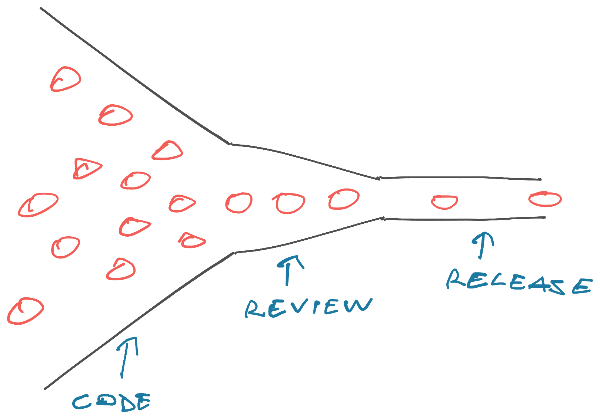
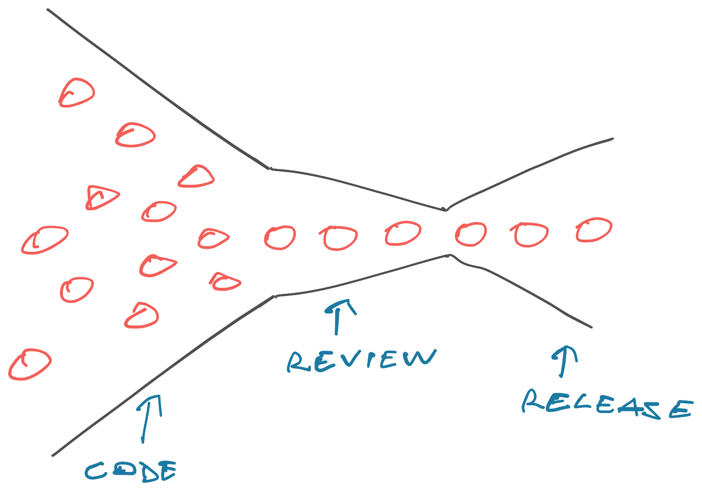
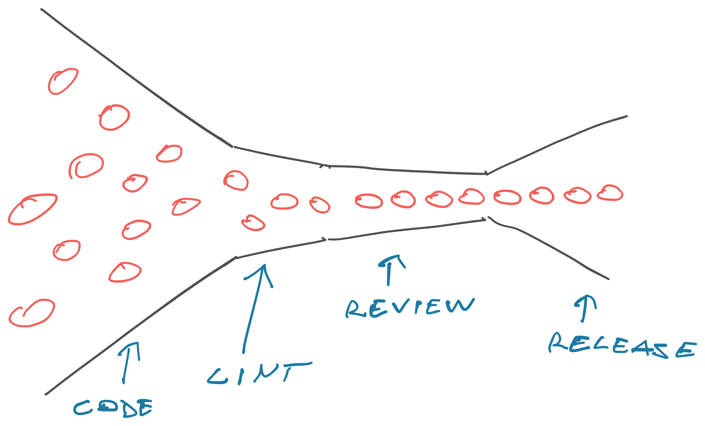
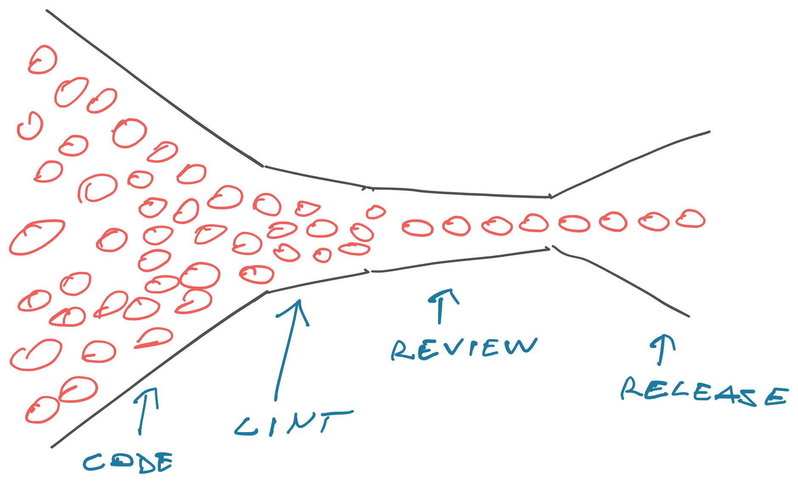

No matter how much code you create, it's zero value until you ship. Writing code, building features, moving tickets, they're all vanity metrics. None of it matters until users can do something they couldn't do before.

With AI you can produce more code faster than ever before. And it doesn't matter. I bet you're still shipping at about the same speed as before aren't you?

We can see this in the data! You can feel it by looking around. Everyone talks about _using_ AI, burning tokens, and doing work, but you rarely see people talk about getting more done at a company level.

## Evidence on AI productivity

[AI productivity gains are marginal at best](https://budgetmodel.wharton.upenn.edu/p/2025-09-08-the-projected-impact-of-generative-ai-on-future-productivity-growth/). Studies show [4% average bump across 1300 firms in Europe](https://www.bis.org/publ/work1325.htm), [0.8% higher output across 6000 executives surveyed globally](https://www.nber.org/papers/w34836), [0.4% to 1.3% higher economic output across rich countries](https://www.oecd.org/en/publications/macroeconomic-productivity-gains-from-artificial-intelligence-in-g7-economies_a5319ab5-en.html), and so on.

Even though _individual_ productivity is up with [folks spending 3h/week less on email](https://arxiv.org/html/2504.11436v1), [writing code 50% faster](https://www.bis.org/publ/work1208.htm), [finishing 26% more coding tasks](https://pubsonline.informs.org/doi/10.1287/mnsc.2025.00535), [closing 15% more support requests](https://academic.oup.com/qje/article/140/2/889/7990658), and [doing biz consulting 25% faster](https://www.hbs.edu/faculty/Pages/item.aspx?num=64700).

All this hype and churn and not much to show for it all. What gives \[name|]?

I think it's the [theory of constraints](https://swizec.com/blog/build-better-software-with-the-theory-of-constraints/). Just because individual pieces move faster doesn't mean the whole system can get more done.

## Theory of constraints

Theory of constraints is the managementy version of [Amdahl's law](https://en.wikipedia.org/wiki/Amdahl's_law). In a series of books through the 80's and 90's, Goldratt proposed that _"Your factory can't move faster than its slowest part"_.

Sounds obvious right?

And I bet your company is not optimized for this insight at all :) Lemme know if this sounds familiar:

You're producing more code than ever, you're drowning in pull requests and code review, your eyes glaze over long-ass documents and code comments and PR descriptions full of words that say nothing, you wait hours and days for people to look at your code, you have long async conversations in the comments smeared across days, and by the time you finally merged your code, you've produced 10 more PRs and got tagged on 20 others?

You ship maybe 1 to 2 changes per day. Am I close?

Here's what happens.

## Review is the bottleneck

Writing code used to be hard and releasing even harder. You need a lot of review to make sure that one quarterly release is good.

A bunch of engineers write code. Their code gets reviewed, tested, and approved. This slows you down but that's okay – you can work on the next feature while your current work gets reviewed. You don't expect to ship until The Next Deploy.

Modern DevOps and continuous integration changed the calculus. Releases became fast, measured in minutes. Instead of trying to catch mistakes, [we make them easy to find and fix](https://swizec.com/blog/make-mistakes-easy-to-fix/).

A bunch of engineers write code. You then review, test, and approve. Ship to prod as soon as you get a chance.

To make reviews faster, we add linters and automated test suites. Shift left to try and catch mistakes before wasting time on review. Best is when your editor can show squiggly lines before you even make a commit!

A quick linting step makes review faster and more valuable!

Reviews focus on higher level issues and waste less time on code consistency and obvious bad patterns. Slowing down the influx of PRs makes code review faster, which directly leads to more releases.

Then you add AI.

You produce lots of code, the code passes linters and all your tests, now code review is swamped. Shipping speed has not increased. You are drowning in [work in progress, which kills your progress](https://swizec.com/blog/workinprogress-kills-your-progress/).

## Why even code review?

Evidence for code review is mixed. I think it's largely a head-fake to trick senior engineers into mentoring juniors and it's a way to force domain modeling conversations.

Code review [does not catch bugs](https://www.microsoft.com/en-us/research/wp-content/uploads/2015/05/PID3556473.pdf?utm_source=chatgpt.com) or [security issues](https://arxiv.org/abs/2102.06909) and [only indirectly leads to better code](https://arxiv.org/abs/1912.10098) (but 95% better). Want to catch bugs? _Test your code_.

You should think of code review as a socio-technical practice that [improves the long-term health of your software](https://research.tudelft.nl/en/publications/modern-code-reviews-in-open-source-projects-which-problems-do-the/), [increases everyone's familiarity with the code](https://www.microsoft.com/en-us/research/publication/convergent-software-peer-review-practices/), and [reduces post-release defects](https://posl.ait.kyushu-u.ac.jp/~kamei/publications/McIntosh_MSR2014.pdf). This happens indirectly because better more familiar code is easier to work with. We [know this empirically](https://swizec.com/blog/empirical-evidence-for-code-modularity/).

If you need SOC2 compliance, the standard mandates at least 2 humans have to see every line of code that hits production. Code review :)

## Anatomy of a good code review

I treat pull requests as a quality gate.

1. PRs are a convenient place to run all your tests and linters and ensure everything passes before you can merge
2. Ask for videos and screenshots of working features in every pull request, which forces everyone to test their code. I find a lot of issues while recording these videos.
3. Run a preview deploy so you can try and validate the UX before merging. You have to hold working software in your hands to know if it's good.
4. Do [codebase gardening](https://blog.codinghorror.com/tending-your-software-garden/) by nudging folks into better patterns and look for common problems or challenges that we can fix at a platform or system level. You're looking for [desire paths in your architecture](https://swizec.com/blog/architecture-is-like-a-path-in-the-woods/). We always find reusable atoms when folks in different parts of the codebase solve similar problems in a similar way.
5. Look for domain model violations where people ask for opposing functionality and engineers lack the context to push back

Code review is not the place to nitpick code style and it's best to [discuss architecture before you write the code](https://swizec.com/blog/people-detangle-a-ball-of-mud/).

Use code review to force testing, encourage shared standards, disseminate knowledge, and look for missing tools. Have context of the goal before you review, avoid long async debates and get in a room together if there's much to discuss. Aim to [approve with comment](https://swizec.com/blog/approve-with-comment/) and **don't be a blocker. Teach others.**

## How do we fix the code review bottleneck?

Goldratt says that when you find the bottleneck, you have to subdue the rest of your process to the bottleneck. Spend less time generating code and more time reviewing the code you already have. Yes that means everyone on the team. Work [one PR at a time](https://swizec.com/blog/workinprogress-kills-your-progress/) and get projects to _done_ done.

Amdahl's Law states that speeding up the nonparallelizable portion of your code is the single highest leverage programming activity you can do. **Make the bottleneck fast, everything gets fast**.

Many online say "Don't look at the code". I think that's wrong. Yes we don't review our compiled code so why review generated code?

Generated code remains a mix of artisanal crafting and prompt->code transformation. **If we stop looking at code, we're gonna have to start reviewing our prompts and design docs**. The problem just moves up a layer. And people _used to_ review compiled code until compilers got good.

At large companies, staff+ engineers already spend most of their time reviewing design and architecture docs instead of the code.

### What about automated code review?

My thought when starting this article was to automate more of the code review. Use LLMs as fancy linters that can give feedback at a similar level I would give, but I think that loses something. _Teaching_ between mentor and protege is a personal affair, offloading that to a machine feels almost offensive.

Code review is the highest leverage activity you can do as a senior+ engineer. You can steer the entire codebase, shape how people build software for the rest of their lives, and find opportunities for improved tooling and abstractions.

Many of my most impactful projects came from reading lots of code and noticing patterns. Oh this common operation isn't easy enough, oh that abstraction I built is mostly a problem, oh this domain concept is starting to diverge in meanings, oh ...

Code review works when everyone's an active participant. Don't treat this as a rubber stamp, it's some of the highest impact work you can do.

**Don't be a blocker. Teach others. Explain your reasoning so your ideas can spread**. There's nothing more rewarding than watching somebody else write the exact comment you would to a new member of the team.

Cheers, 
\~Swizec

PS: I'm still gonna try to see if an LLM can do a good first pass so I'm not always leaving the same comments. There's a very obvious learning period when someone joins and learns The House Style
