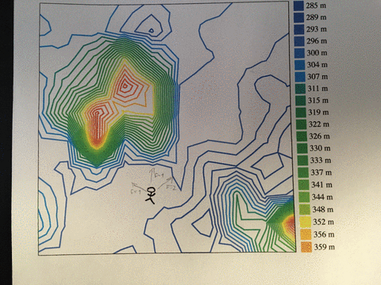

This sums up every self-help and business book, blog post, podcast, and talk I’ve ever seen/read/whatever:

- pick a direction
- listen to users/customers/people-you-care-about
- adjust course
- do the work
- repeat until success

Anything more is just tactics or advice on the level of _&quot;These are the lottery numbers that worked for me&quot;_.

https://twitter.com/wallingf/status/760484001492590592

Let me explain it to you like you&#x27;re ~~five~~ a computer. Time for [stochastic search algorithms](https://en.wikipedia.org/wiki/Stochastic_optimization)! \\o/ My favorite and nerdiest way to think about life.

Let&#x27;s say you&#x27;re you, and you want to have the best life you can. You don&#x27;t know what you&#x27;re looking for, and you don&#x27;t know how to get there. You think you&#x27;ll recognize &quot;best life&quot; once you&#x27;re there. [Psychology says that you won&#x27;t](https://en.wikipedia.org/wiki/Hedonic_treadmill).

Your life is an optimization problem. You pick a [fitness function](https://en.wikipedia.org/wiki/Fitness_function) and search for the combination of inputs that returns the highest result – the global maximum.

Your fitness function can be anything from _&quot;How much \$\$ I&#x27;m making&quot;_ to _&quot;How happy do I feel on average&quot;_. Often, it&#x27;s a combination of things. People often have a function called &quot;career&quot;, another called &quot;family&quot;, and still another called &quot;health&quot;.

YMMV

## Pick a direction

In the beginning, you know nothing about the world, the problem you&#x27;re solving, or the destination. Any direction will do as long as you&#x27;re not standing still.

## Listen to people you care about

Use your fitness function to see if your direction is correct.

A good proxy is talking to the people you care about. Users and customers will tell you if you&#x27;re making things better or worse and what they want or need. Your friends, your family, and your gut will tell you if you&#x27;re becoming a better person.

Trust your gut.

## Adjust course

If people keep asking you to do X, and you&#x27;re doing Y, try X. Your fitness function might improve quicker.

Probes in random directions are a good way to find promising new directions.

## Do the work

Keep going.

If you don&#x27;t do the work, you don&#x27;t get the results. **This is the most important step**.

You start with huge steps, then make your steps smaller and smaller as you approach the optimum. Otherwise, you might overshoot the peak.

## Repeat until success

This is an iterative algorithm. The more iterations you perform, the closer to optimum you&#x27;ll get.

When you find [_an_ optimum](https://en.wikipedia.org/wiki/Maxima_and_minima), and there are many, you can shake things up and try finding a better optimum.

Starting again from [a random location](https://en.wikipedia.org/wiki/Random_forest), [trying random things](https://en.wikipedia.org/wiki/Monte_Carlo_method), or [taking a few large steps](https://en.wikipedia.org/wiki/Simulated_annealing) should knock you out of a local optimum and get you back on the path towards the global optimum.

How fast you get to optimum, and how high it is, depends on factors largely outside your control: luck in picking your initial direction, fortune of circumstance and ability, &quot;life events&quot;, and macroeconomic trends.

Good luck.
