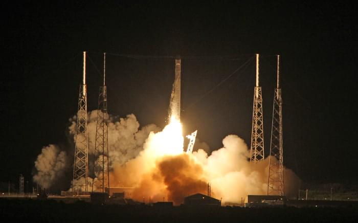

**\_\_**\_**\_**\_\_\*\*\*\*

###### Related articles

- [SpaceX spaceship chasing space station in orbit](http://www.foxnews.com/scitech/2012/05/23/spacex-commercial-spaceship-chasing-space-station-in-orbit/?intcmp=features) (foxnews.com)
- [SpaceX capsule completes first tests before ISS docking](http://www.space-travel.com/reports/SpaceX_capsule_completes_first_tests_before_ISS_docking_999.html) (space-travel.com)
- [SpaceX Launches Falcon 9 Dragon on Historic Mission](http://www.space-travel.com/reports/SpaceX_Launches_Falcon_9_Dragon_on_Historic_Mission_999.html) (space-travel.com)
- [SpaceX in final countdown for second ISS Dragon attempt](http://www.slashgear.com/spacex-in-final-countdown-for-second-iss-dragon-attempt-22229300/) (slashgear.com)
- [SpaceX Dragon successfully launches: New age of private spaceflight](http://www.slashgear.com/spacex-dragon-successfully-launches-new-age-of-private-spaceflight-22229304/) (slashgear.com)

