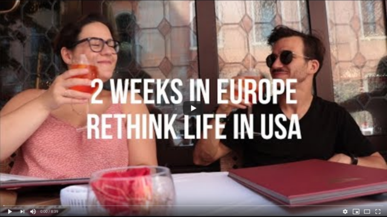
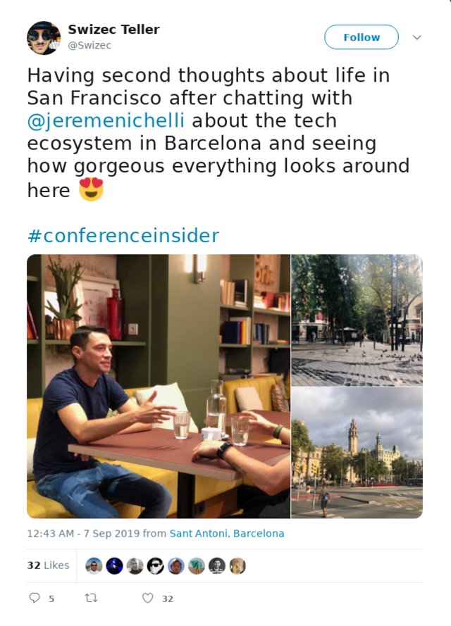
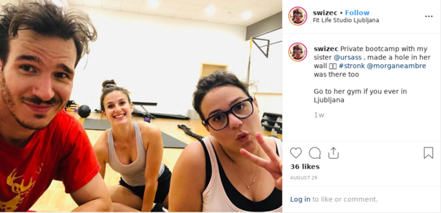
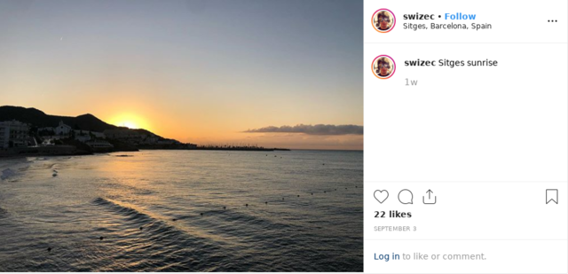
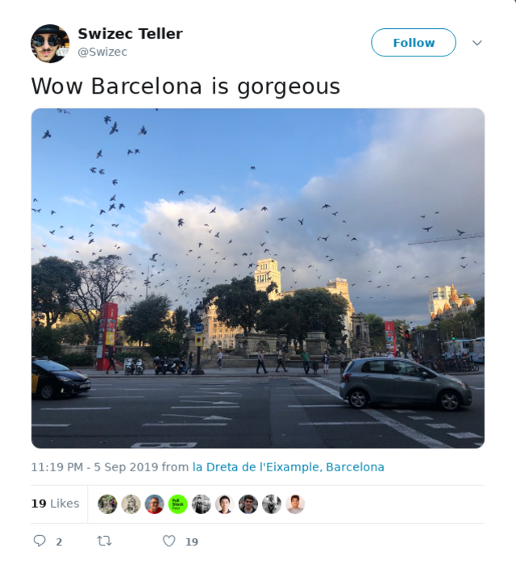
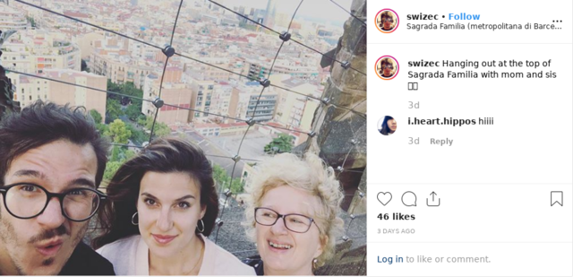

You don&#x27;t move to San Francisco to be happy. You move there to make it.

San Francisco is a special kind of city. Devoured by tech, riddled with issues, and absolutely awash in money. People often ask me what it&#x27;s like and after 5 years the best I can say is that it&#x27;s a lot like a cyberpunk movie.

Ruled by The Elites, supported by The Masses. If you&#x27;re in tech, you&#x27;re above society.

Rent becomes affordable, people are nice, petty crime does not concern you. You might wake up to a broken car window or a stolen spark plug, see some graffiti you don&#x27;t like, step over poop on your way to work, and wonder about needles on the floor, but your disposable income cushions any real adversity.

Streets feel safe despite the crime rate.

You walk by a drug addict injecting in broad daylight and you know they mean you no harm. You see a crazy screaming in the street and shrug your shoulders. A drug deal happens in front of your eyes and to them you are invisible just as they are invisible to you.

## The layers of society don&#x27;t mix.

You might get yelled at by a homeless person tweaking out. If you respond, have a reaction, half the time they apologize and move on. Only if you ignore them do they keep screaming.

_Hey you, elite, I&#x27;m here, do you see me, do you see what happens when you stumble?_

San Francisco lights a career fire under your ass like no other place in the world. Maybe Asia and parts of Africa.

You are surrounded on all sides by people who are crushing it. Absolutely killing it.

Every week it seems a new friend (in SF meaning a person you&#x27;ve seen before) becomes a millionaire, lands that VC deal, grabs a $200k consulting gig, or $400k job. The pressure is real.

The expectation of normal is greatness. You have to sprint just to keep up.

Those who aren&#x27;t crushing it slip quietly into the night. Without a word. Without a sound. Their void replaced by 3 new voices trying hard to make it.

## Burnout culture is real.

If you aren&#x27;t working, what&#x27;s the point? Why do you exist?

Rest is that thing you do between periods of work so you have time to think about work. People walk the streets with their nose in their phone. Protocols have developed so we don&#x27;t bump into each other while looking down.

You must be available on Slack or Email at all times. While you&#x27;re walking to work, while you&#x27;re walking from work, while you&#x27;re thinking about work, and while you&#x27;re working your work. No other state exists.

Working is more important than doing. Everyone must know you&#x27;re busy. Even weekends become a competition to see who crams the most into a day.

## Performance theatre is all.

You aren&#x27;t working if nobody knows you&#x27;re working.

A founder once told me very proudly that she maintains a strict 9 to 6 culture for her employees. Less time at the office means they&#x27;re always focused, she said.

She&#x27;s worried investors would find out and pull the plug. How dare you not work until 8pm at least!?

For herself, she works 12 hour days 7 days a week. Never not thinking about her company, her industry, her goals. She&#x27;s here to make it, all else be damned.

Conversation about how much sleep everyone gets is rampant in San Francisco. Saying you don&#x27;t have enough time is commonplace. Discussing overwhelm a daily topic.

You meet someone new and ask these 3 questions:

- Where do you work?
- What&#x27;s your team?
- Do you feel tired?

Replace first question with _&quot;You still at that company?&quot;_ when meeting a friend you haven&#x27;t seen awhile.

Because if you don&#x27;t sprint, you fall behind. And if you fall behind, you&#x27;re a loser.

# Europe feels different.

People seem happy here. Content. They go about their lives with a spring in their step. They sit around coffee shop terraces in the afternoon. They walk to work in the morning without catching up on email or slack.

## Work happens at work.

People in Europe complain a lot. About the economy, about taxes, about immigrants, about the politics, and even the refugees from Syria.

Complaining helps them vent. Much better than keeping it all inside and forcing yourself to be happy and positive and excited and crushing it like Americans always do. Saves a lot on therapy.

European cities feel relaxing in a way no other place in the world can be. Even a beach resort.

In Europe homeless&#x27; tents don&#x27;t line the streets, there&#x27;s no poop to step over, no drug addicts injecting on the sidewalk, no people loitering with poopy pants and nothing to do. Sometimes there&#x27;s refugee tents.

_Wow I get it now! I get why the French are so against the refugee crisis! Holy shit the highway into Paris looks like downtown San Francisco there&#x27;s tents everywhere!&quot;_ ~ My Girlfriend

## Nobody feels invisible.

Everybody is kind of equal in Europe. You don&#x27;t have friends with 10 digit bank accounts or 6 figure salaries. They might have a nicer car, bigger apartment, or more kids, but it all feels very achievable.

Keep walking and you too will get there some day. If you stumble, you won&#x27;t go homeless, become bankrupt from a cold, or have to live in a tent. Just dust yourself off and keep going.

## Walking. Not sprinting.

In Europe cities are designed for walking, not cars. Sidewalks are wide and spacious, pedestrian zones feel endless, outdoor seating lines the streets outside every restaurant, bar, and coffee shop.

Most local businesses feel indie. Chains are rare. This creates a feeling of uniqueness and charm, a joy of exploration unlike anything you&#x27;ll find in America.

American cities remind me most of Fahrenheit. Freeways right downtown, pedestrians relegated to the narrowest sliver of real estate. A corporate wasteland where cars zoom around, street corners look the same, and people only ask &quot;How are you&quot; when they don&#x27;t care.

It&#x27;s weird.