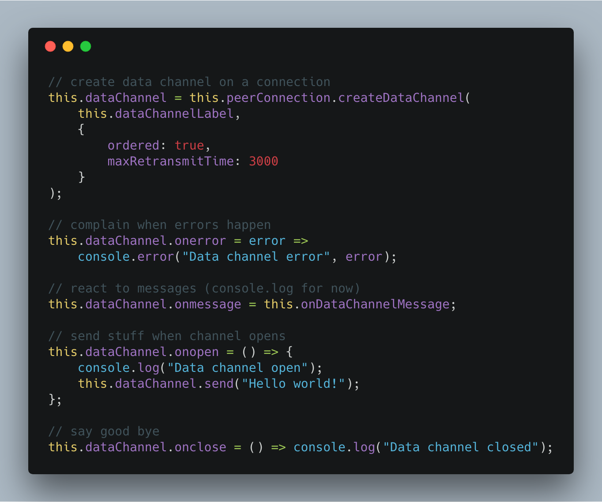
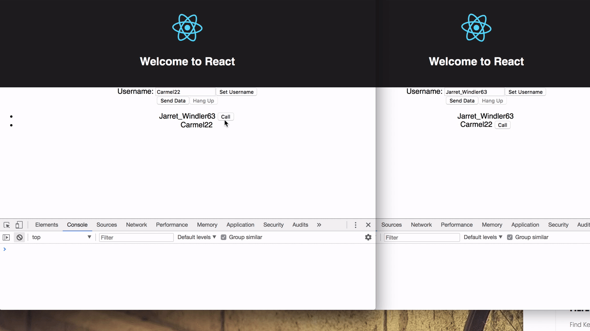

https://www.youtube.com/watch?v=eU8vJusvsFc_This is a Livecoding Recap – an almost-weekly post about interesting things discovered while livecoding. Usually shorter than 500 words. Often with pictures. Livecoding happens almost **every Sunday at 2pm PDT** on multiple channels. You should [subscribe to My Youtube channel](https://www.youtube.com/user/theswizec) to catch me live._

It didn&#x27;t work. We don&#x27;t have a mesh network yet. But we&#x27;re so close that I can almost smell it.

The ultimate goal is to build a JavaScript library that can connect arbitrary browsers through a mesh network using a sort of blockchain as the algorithm to ensure distributed data correctness. Why? Intellectual curiosity.

This slide from my WeAreDevelopers talk 👇

Previously we&#x27;ve figured out [how to connect two browsers running on different computers with a video connection](https://swizec.com/blog/learning-webrtc-peer-peer-communication-connecting-browsers-different-devices/swizec/8383). Signaling server helps with the initial handshake, then browsers communicate directly using WebRTC. No more server.

WebRTC also supports so called data channels using [RTCDataChannel](https://developer.mozilla.org/en-US/docs/Web/API/RTCDataChannel).

It works like this:

1. Use signaling server to establish a peer connection
2. Add a data channel to said connection
3. Send from each side

Data can be anything. We&#x27;re using `"Hello World"` strings for now, serialized JSON objects later. Rumors say you could send whole files.

This all sounds very simple. Even when you look at the code that&#x27;s required.

We add a `RTCDataChannel` to our peer connection and attach a bunch of event handlers. Errors for complaining, messages for printing, and we try to send a message when the channel opens.

The cool part is that we can attach this channel _before_ a connection is fully established.

See, both clients finish with saying `Data channel open`.

But no data is sent or received, and there&#x27;s no error. 🧐

I suspect this is because while the data channel is open, the peer connection itself is not established. That pesky WebRTC lifecycle error about doing some thing or another in the wrong step.

This part used to work. Therefore, I must have broken something when deleting a bunch of code that seemed unnecessary.

We also generally spent a lot of time mucking around making this lifecycle more robust because it was hella flaky before.

Getting close!