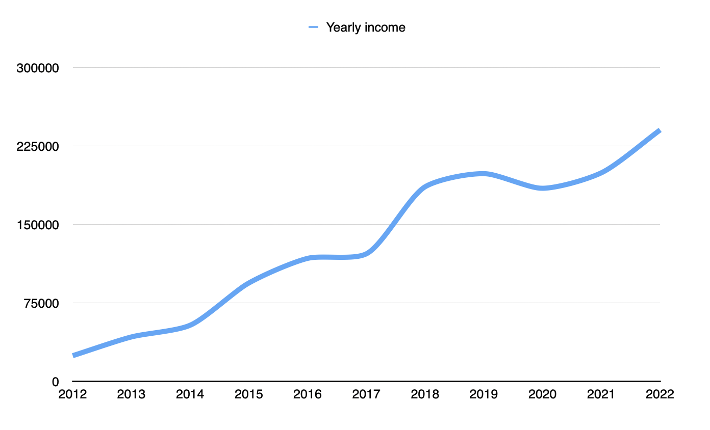
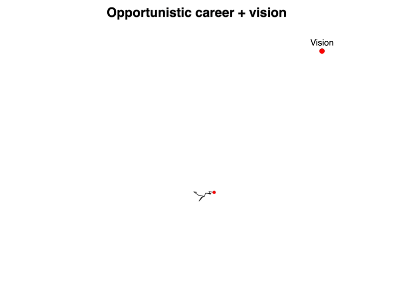
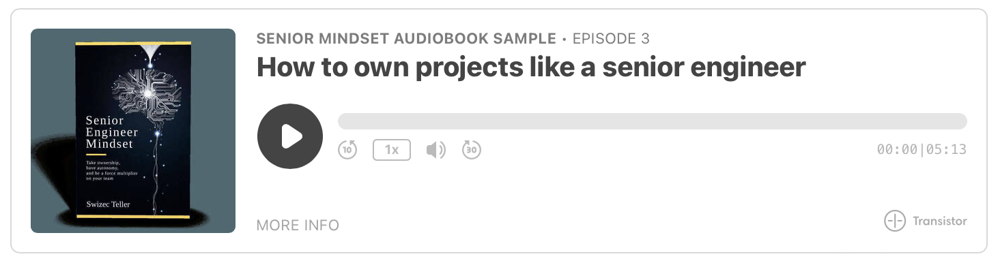

They say a bird doesn't trust the branch, she trusts her wings. I love that saying.

To me it means that no matter how much you lean on others, you _trust yourself_ when the branch breaks. Your confidence doesn't come from standing on an unbreakable branch, it comes from knowing _you_'ve got this no matter what.

A job can vanish any moment. A project can be cancelled. Teams get reshuffled. Markets change and demand for your skills shifts. The hype moves on and you're left holding the bag.

All these things are normal. I've [been around long enough](https://swizec.com/blog/25-lessons-from-25-years-of-coding/) to see at least 6 hype cycles first hand. They each felt like the end of the world.

But if you look at a graph of my career, you'd never notice. Every year brings bigger better challenges, more impactful projects, and higher incomes.

You can see the covid dip when my infoproduct business took a huge hit. That was fun 😅

So, how do you build a resilient career and trust your wings? Here's a few tips I follow.

## Start with a vision

**First**, you need a vision. What do _you_ want?

A career that follows every whim, opportunity, and disappointment doesn't get far. Keeps circling around the start point.

But add a dash of vision, a small chance to make choices towards a goal, and look what happens.

The walk goes far! 😍

It's not a straight line, life doesn't work that way, but you _get somewhere_. Where that is, you have to decide for yourself. Once you do, everything else becomes easier.

Rather than being thrown around by the storm, you can make choices based on how they fit your vision.

## Think like a business

**Second**, approach your job like a business. You're there to provide value in exchange for money.

You don't have to be a complete mercenary about it – enjoy time with your team and build the camaradeire, but never forget that work is a business transaction. You are paid for the value you bring and nothing more.

Value here means _business_ value. The business thinks like this: _"If we give $X to you, how much money falls out?"_. The ROI may be immediate, if the business is profitable, or in terms of improving fund-raising success and future profits, if you're a startup.

The company pays for that value with money [and other benefits](https://swizec.com/blog/why-take-a-bigger-role-for-no-bump-in-pay/) like opportunity, brand, fun, and interesting challenges. But it's _your_ job to make sure the ROI makes sense for _you_.

## Sell your brains, not your hands

**Third**, think about leverage. What can you bring to the table that isn't just you doing the work?

Engineers are [worth so much because we build assets](https://swizec.com/blog/why-engineers-are-worth-so-much/). Invest in the code once and it keeps doing your job for years 😍

That's leverage. You do many hours worth of work with an hour of writing code.

Being a senior engineer and an expert in your field unlocks another source of leverage: _Owning_ projects and being responsible for their delivery.

Force multiplying the team around you with experience, advice, and clearing blockers means you achieve way more than you ever could yourself.

## _Own_ your career

Pick a niche, kick ass, solve expensive problems. That approach works in any economy and every hype cycle. Trust your wings.

Cheers, 
~Swizec
