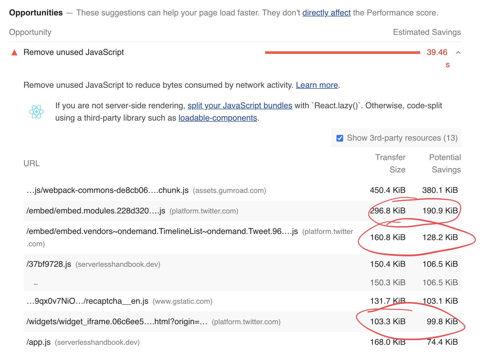
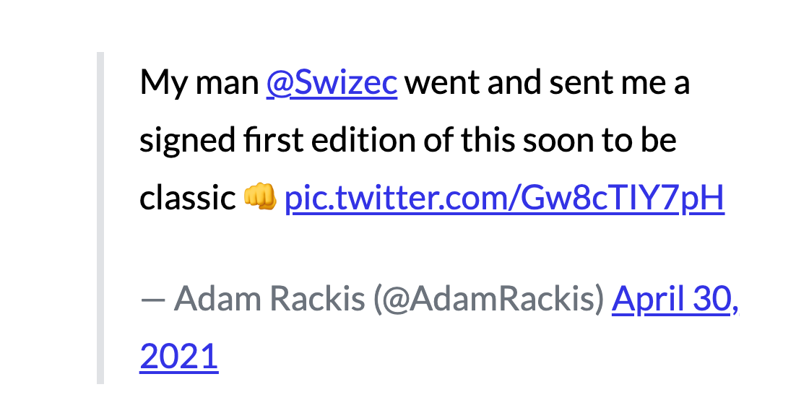
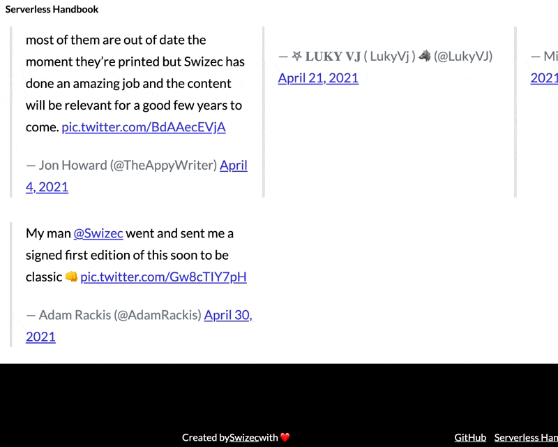
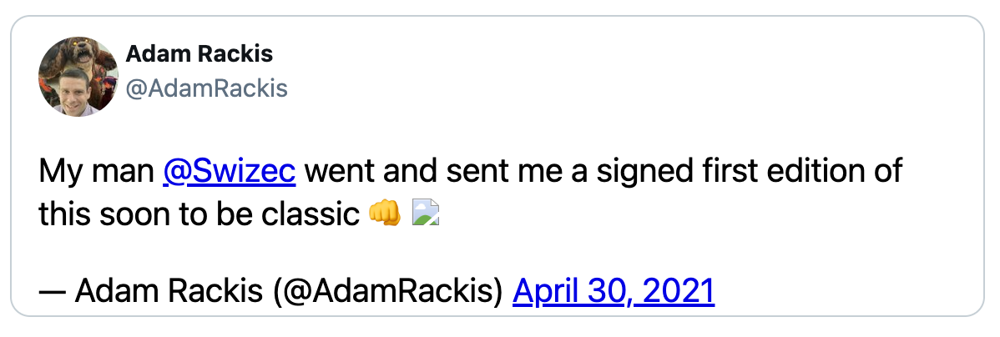

Continuing our [quest for better Lighthouse scores, more reader privacy, and less JavaScript](https://swizec.com/blog/2-quick-tips-for-250percent-better-lighthouse-scores-codewithswiz-28/), today we attacked the next biggest culprit 👉 Twitter.



560KB of JavaScript to display unchanging tweets 😱

https://www.youtube.com/watch?v=t11UusgcC68

_CodeWithSwiz is a weekly live show. Like a podcast with video and fun hacking. Focused on experiments and open source. [Join live Tuesday mornings](https://youtube.com/swizecteller)_

## How tweet embeds work

Twitter uses the [oEmbed Protocol](https://oembed.com/) to specify embeds. A request to `https://publish.twitter.com/oembed?url=<tweet_url>` returns the HTML to use and some metadata.

```javascript
{
  url: 'https://twitter.com/AdamRackis/status/1388192278884331530',
  author_name: 'Adam Rackis',
  author_url: 'https://twitter.com/AdamRackis',
  html: '<blockquote class="twitter-tweet" data-dnt="true"><p lang="en" dir="ltr">My man <a href="https://twitter.com/Swizec?ref_src=twsrc%5Etfw">@Swizec</a> went and sent me a signed first edition of this soon to be classic 👊 <a href="https://t.co/Gw8cTIY7pH">pic.twitter.com/Gw8cTIY7pH</a></p>&mdash; Adam Rackis (@AdamRackis) <a href="https://twitter.com/AdamRackis/status/1388192278884331530?ref_src=twsrc%5Etfw">April 30, 2021</a></blockquote>\n',
  width: 550,
  height: null,
  type: 'rich',
  cache_age: '3153600000',
  provider_name: 'Twitter',
  provider_url: 'https://twitter.com',
  version: '1.0'
}
```

Put that HTML on your page and it renders as a quote.



Works fine, doesn't look great.

Twitter's embed JavaScript – which you load globally – looks for `<blockquote>` elements with the `.twitter-tweet` class and turns them into iframes. Yes a whole iframe for each tweet.



Keep watching, they turn _eventually_

Slow and looks bad. Each of those tweets, an iframe, runs 20+ requests, transfers over 1.5MB of data, and runs who knows how many ad trackers 💩

## How we're fixing it

Inspiration for this hack comes from @wongmjane. Best I can tell, she didn't opensource her code. Gonna share mine when it's ready ✌️

<!-- https://twitter.com/wongmjane/status/1330273157245243394 -->

Gonna replace the twitter machinery with custom CSS+HTML. No client-side code required.

We got pretty far:



Looks like a tweet, lacks picture embeds and likes, the avatar is faked.

## How static-tweet-embed works

At the core of my approach is the [gatsby-remark-embedder](https://github.com/MichaelDeBoey/gatsby-remark-embedder) plugin. Runs embeds when you build your site, supports grabbing oembed data, has built-in caching.

_And_ you can hook into the embed process with custom plugins. 🤘

```javascript
// gatsby-config.js

// ...
{
resolve: "gatsby-remark-embedder",
options: {
	// StaticTwitterEmbed is new
  customTransformers: [YoutubeTransformer, StaticTwitterEmbed],
  services: {
    Instagram: {
      accessToken: process.env.INSTAGRAM_OEMBED_TOKEN,
    },
  },
},
```

The `StaticTwitterEmbed` plugin doesn't do much yet – detects tweets, spits out `oembed` data, returns hello world.

```javascript
/src/ESTabcdeeiimrttttw.js;

const official = require("gatsby-remark-embedder/dist/transformers/Twitter");
const {
  fetchOEmbedData,
} = require("gatsby-remark-embedder/dist/transformers/utils");

async function getHTML(url) {
  const twitterUrl = url.replace("events", "moments");

  const oembed = await fetchOEmbedData(
    `https://publish.twitter.com/oembed?url=${twitterUrl}&dnt=true&omit_script=true`
  );

  console.log(oembed);

  return `<p>Hello world</p>`;
}

module.exports = {
  getHTML,
  shouldTransform: official.shouldTransform,
};
```

Much of the code comes from the original Twitter transform. No need to rewrite `shouldTransform` (detects twitter links), or the `fetchOEmbedData` functions.

Returning `<p>hello world</p>` helps verify the plugin lives.

## Creating a static tweet

Rebuilding Gatsby for every change would be slow. We used a static HTML file instead.

```html
<div id="target"></div>

<style></style>

<script>
  const oembed = { ... }

  const html = oembed.html

  document.getElementById('target').innerHTML = html
</script>
```

First stab showed that an HTML blockquote shows up when you take it from oembed data and inject on the page. Old school vanilla JavaScript :)

After that it's a schlep.

Take a tweet iframe's URL, render in a tab, ~~steal~~ borrow CSS with your browser devtools. Add custom HTML when necessary.

We've got this for building the HTML:

```javascript
const handle = oembed.author_url.replace("https://twitter.com/", "")
// TODO: make API call
const authorImg =
  "https://pbs.twimg.com/profile_images/1183169082243375104/FwXKVe5H_x96.jpg"

const author = `<a class="author" href="${oembed.author_url}"><b>${oembed.author_name}</b>@${handle}</a>`

const tweet = oembed.html.replace(
  /pic.twitter.com\/(\w+)/,
  ''
)

const html = `<div class="static-tweet-embed">${author}${tweet}</div>`
```

Can't use React because there's no React inside `gatsby-remark-embedder`. Gotta build a string 😅

Add a bunch of borrowed CSS and you get a decent-looking embed. Main thing was to find the font styles, colors, and border.

```css
div.static-tweet-embed {
  display: flex;
  flex-direction: column;
  font-family: -apple-system, BlinkMacSystemFont, "Segoe UI", Roboto, Helvetica,
    Arial, sans-serif;
  max-width: 550px;
  width: 100;
  margin-top: 10px;
  margin-bottom: 10px;
  border: 1px solid rgb(196, 207, 214);
  border-radius: 12px;
  padding: 12px 16px 4px 16px;
}
```

## And then we got stuck

You can't guess the avatar URL from someone's username, you can't guess image embed URLs from the HTML, and you don't get info about likes and retweets.

💩

Next week, we're gonna use the Twitter API to solve that problem

Cheers,<br/>
~Swizec
