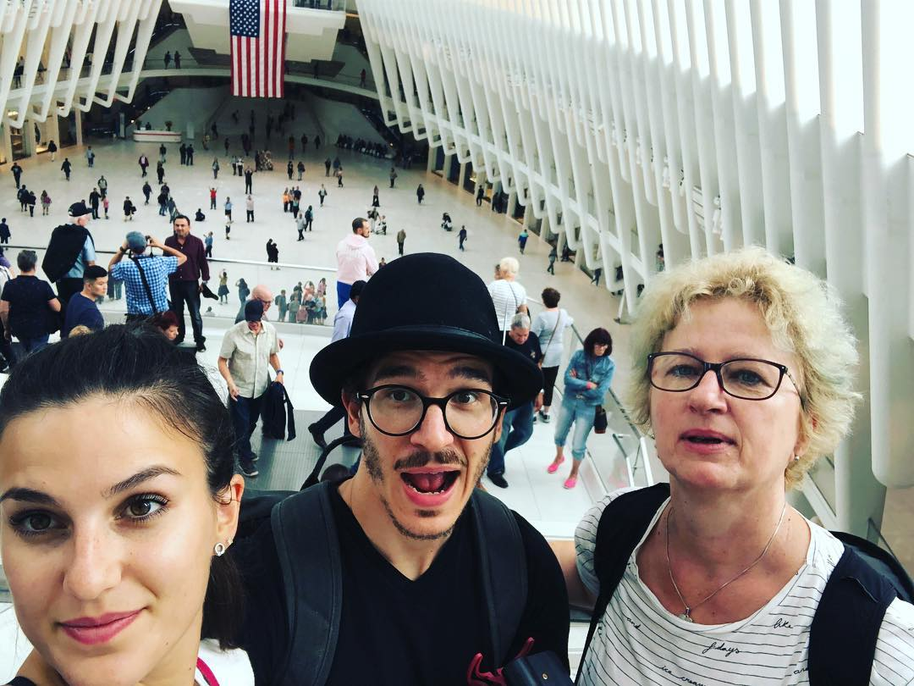

https://www.youtube.com/watch?v=zp8d88PWeSc

> Omg that vlog was SO good!!!! publish it on fb so I can share it 😄

🎉 MY MUM AND SISTER ARE IN TOWN 🎉

We met up in New York on Monday, went to the top of the World Trade Center on Tuesday (the 17th anniversary of 9/11), ate the best cookies in the world at Levain bakery on Wednesday, had some delicious amazing bagels in West Village, and came to San Francisco on Thursday.

Walked 21 kilometers the first day from Grand Central Station all the way down to World Trade Center. 18 kilometers the second day, all through Central Park, both upper sides, and around West Village.

But we were pretty tired the second day heh.

Now they're here and I'm showing them around SF and hosting them in my living room. Apartment feels very small 😅

Despite all that, I scraped together the time to make the NYC vlog. Six hours of editing in total. Best vlog I ever made. Really, watch it 👇

https://www.youtube.com/watch?v=zp8d88PWeSc
