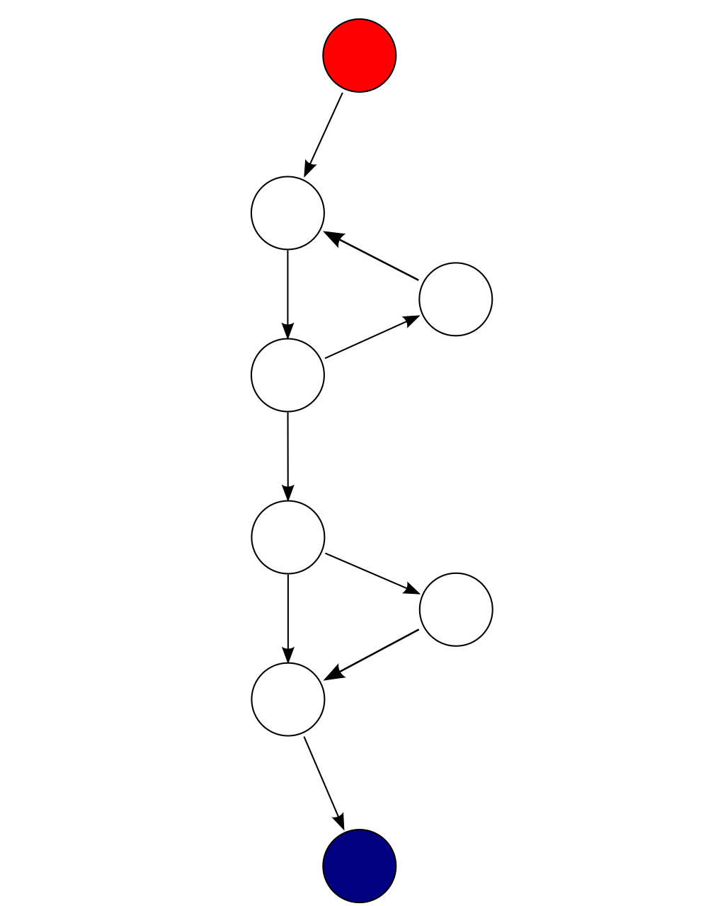
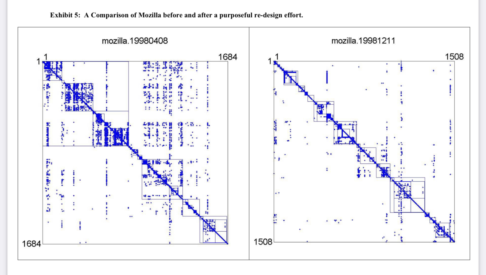
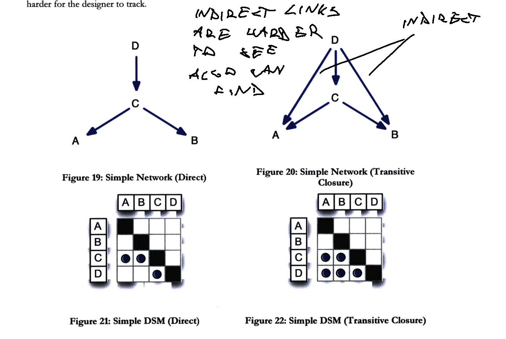
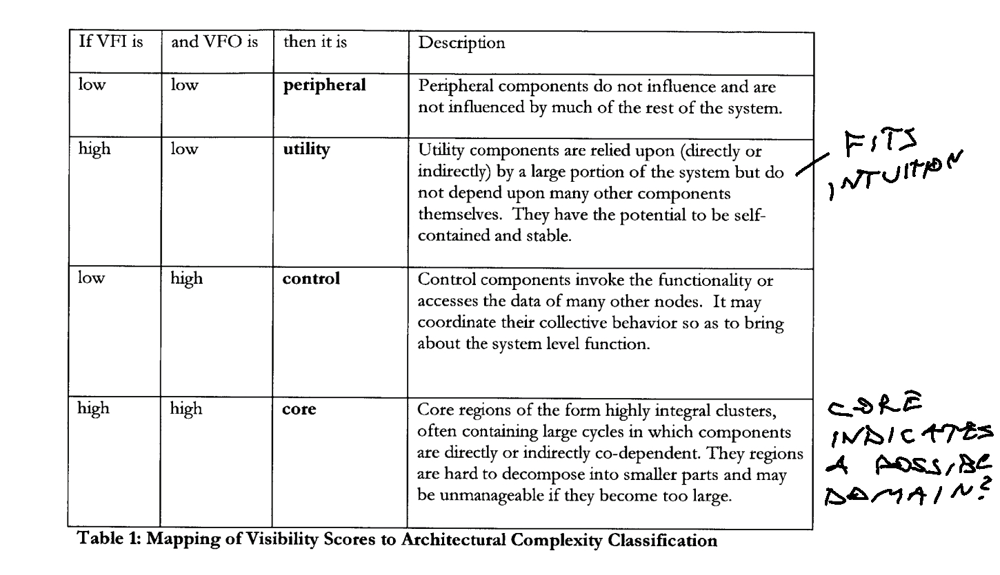

Continuing from [You can't fix the wrong abstraction](https://swizec.com/blog/you-can-t-fix-the-wrong-abstraction/), this is the 2nd in a series of articles sharing insights from [System Design and the Cost of Architectural Complexity](https://dspace.mit.edu/handle/1721.1/79551), a 2013 PhD thesis from MIT.

You can read my scribbled-over version at [/pdfs/system-design-and-the-cost-of-architectural-complexity-with-swiz-notes.pdf](https://swizec.com/pdfs/system-design-and-the-cost-of-architectural-complexity-with-swiz-notes.pdf). Now all the way through ✌️

In this article we look at the difference between complicated code and complex systems.

## Complicated vs Complex

Every engineer recognizes complexity when they see it. But the darn thing is hard to measure.

You need a quantifiable metric to do science. Out of the many attempts that have been made, few consistently correlate with engineers saying _"Yeah that looks hard"_.

Two stand out:

1.  McCabe complexity
2.  Architectural complexity

McCabe complexity, also known as [cyclomatic complexity](https://en.wikipedia.org/wiki/Cyclomatic_complexity), measures _how complicated a piece of code_ is to understand. The more control flows exist, the higher the score.

Architectural complexity measures _the complexity of a system_ or its parts. The more connections/dependencies, the higher the score.

Both metrics think of your code as a graph.

The **complicated** vs **complex** distinction is important. _Complicated_ means that there are a lot of inter-connected moving pieces, but you can tease them apart by carefully following the execution flow. _Complex_ means that your system is ruled by emergent effects that are hard or impossible to trace.

Most modern systems are both complicated _and_ complex 🙃

## McCabe complexity

[McCabe complexity](https://en.wikipedia.org/wiki/Cyclomatic_complexity) has been around since the 1970's. Considered an industry standard these days, but ignored by working programmers.

You probably learned about cyclomatic complexity through osmosis and by following advice of the Clean Code variety. Don't have too many variables in scope. Avoid large files. Use short functions. Avoid deeply nested code. One return per function. ...

All those rules aim to lower the cyclomatic complexity of your code – how complicated it is to read. You're looking for code that reads start to finish like a story with few diversions.

In theory, you measure the complicatedness of your code by turning it into a control flow diagram. Nodes are actions, arrows are control flow.



The McCabe complexity score measures how many linear paths through the graph exist. You can count those by counting decision points (yes, there's a proof).

Every "decision point" (an if condition) in your code adds `1` to the score. Code with less than `10` is considered "easy", code with `50+` is considered "untestable".

## Architectural complexity

Architectural complexity is a new metric designed to measure the complexity of _software_ as opposed to code. Based on [visibility metrics](https://www.hbs.edu/ris/Publication%20Files/05-016.pdf) developed in 2006 by MacCormack, Baldwin, and Rusnak.

This measures true complexity – the systems are so large that no one person can understand the whole thing. Bugs come not from the code being complicated, but from interactions between parts becoming unpredictable.

Managing this complexity is paramount.

MacCormack et al. used network diagrams to show how visible different parts of a system are to one another. Visible meaning that there's a dependency of some sort – function call, shared variable, imported class, ...



You're looking at a [DSM diagram](https://en.wikipedia.org/wiki/Design_structure_matrix) of Mozilla before and after a refactoring. Each dot in the matrix represents a dependency. Each row and column is a component, defined loosely.

You can see that refactoring made the code more structured. Dependencies are less spread out and modules with tight internal coupling arise as dense areas on the graph. The modules are also smaller. Huge success 💪

The diagonal comes from self-references. Every component depends at least on itself.

### Measuring architectural complexity

Sturtevant, author of System Design and the Cost of Architectural Complexity, expands visibility metrics into _architectural complexity_ by considering indirect connections: If A calls B which calls C, that means A and C are connected.

This is important because:

> Components in a position to affect many other components, or that can be affected by many other components, have high levels of architectural complexity relative to their less well-connected peers.

As part of his thesis, Sturtevant built software that can compute architectural complexity scores and draw DSM diagrams for C++ code based on files. Each file becomes a node, imports become arrows. Or rows/columns and dots in DSM.



There might be commercial or opensource tooling available to do this by now, but I haven't seen anything popular. Extracting file dependencies sounds trivial so visualizations shouldn't be _too_ hard to build 🤔

A file's architecture complexity metric is then a count of these dependencies. Sturtevant classifies files into 4 categories based on in and out dependencies: peripheral, utility, control, core.



Core files are the most complex.

## The impact of tough code vs tough systems

Here's where it gets interesting. What do _you_ think is worse? Complicated code or complex systems?

The answer seems to depend on your years of experience.

Sturtevant observed that more junior developers struggle with making changes to complicated code. It slows them down a lot. But more senior developers, it's like they don't even notice the code is complicated. _Zero_ difference in productivity.

He posits this is because senior developers "see" code as a network diagram and are able to work at a higher level of abstraction. The code as written is but an irrelevant detail, they think in algorithms and systems.

You see a block of code and think "ah yes, loop". Whether it's written like this:

```javascript
;[1, 2, 3].map((i) => console.log(i))
```

Or like this:

```javascript
for (const i of [1, 2, 3]) {
  console.log(i)
}
```

Or like this:

```javascript
let i = 0
while (i < 3) {
  console.log(i++)
}
```

An experienced engineer barely notices the difference between those. A less experienced engineer has to read carefully.

But _architectural complexity_, where files depend on each other, that slows everyone down. Even familiarity with the system doesn't help much. In fact it seems that the more experienced you are, the more time you spend in highly complex parts of the system, and the overall slower you get. 🤔

We'll talk about that next time.

## The lesson

Don't worry about complicated code. As long as its encapsulated and has no spooky side-effects, you're good.

Next article in series: [Why taming architectural complexity is paramount](https://swizec.com/blog/why-taming-architectural-complexity-is-paramount/)

Cheers,<br/>
~Swizec
