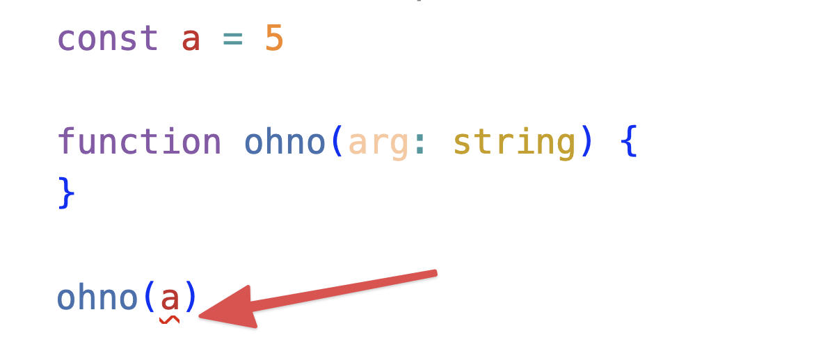
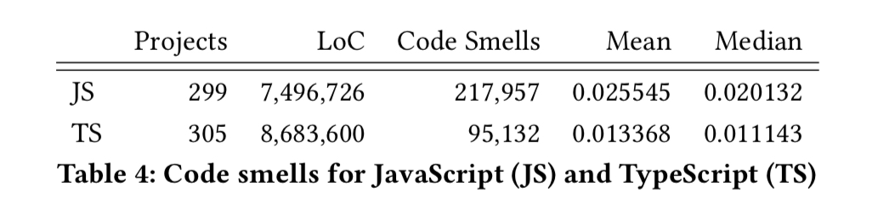
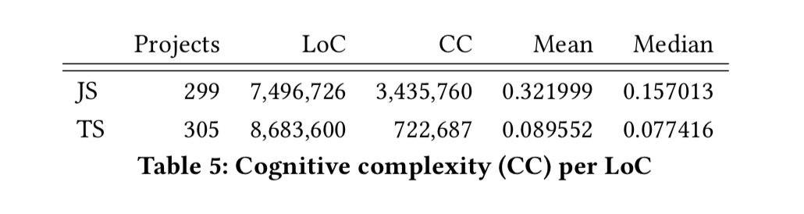
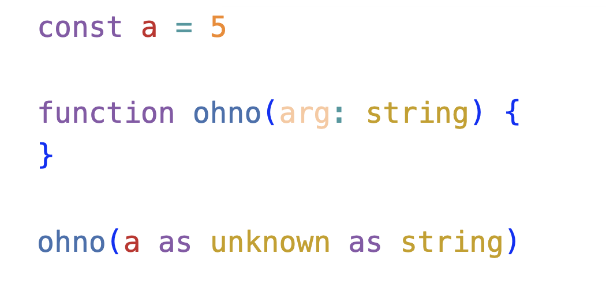

Last week we talked about how nice it is that Bun runs TypeScript directly, but that having types at run-time would be even better. A reader asked "wtf does that even mean". Great question!

> What did you mean by "No run-time support for types though"? I suppose more specifically, what exactly does node/browser support but not Bun in this case?
> ~ Michael

[Bun](https://bun.sh) is a new JavaScript runtime that aims to act as a drop-in replacement for NodeJS. My [Bun first impressions](https://swizec.com/blog/bun-first-impressions/) are that it's super fast, easy to learn, and the perfect fit for CLI scripts.

Now, what's up with those types?

TypeScript types work _the same_ in Bun and every other JavaScript runtime. Nothing's missing, but Bun has an opportunity to do more, if they ever choose to.

## TypeScript adds static types to JavaScript

TypeScript's 2 core design principles are:

1.  Add static type support to JavaScript without limiting the language
2.  No run-time overhead

That's my distillation of [TypeScript Design Goals](https://github.com/Microsoft/TypeScript/wiki/TypeScript-Design-Goals).

**Static typing** means you can have a program (the TypeScript compiler) that checks your code looks valid without running the code itself. It can make sure every function that takes a string, is always called with an argument that you pinky swear promise is going to be a string.

Your editor highlights mistakes with a squiggly line and the compiler won't let you build the code.



This makes entire classes of bugs and mistakes impossible. And there's lots of [research showing that static typing reduces bugs](https://danluu.com/empirical-pl/). Here's a paper that [quantifies detectable bugs in JavaScript](https://discovery.ucl.ac.uk/id/eprint/10064729/1/typestudy.pdf). And another more recent paper that [compares JavaScript and TypeScript projects on GitHub](https://arxiv.org/pdf/2203.11115.pdf).

TypeScript projects have fewer code smells and lower cognitive complexity 💪





## Types at run-time

TypeScript relies on what you pinky swear promise. If you say this is a string, okay it's a string.



The compiler is smart enough to say _"Hey you can't turn a number into a string! Make it unknown first"_. I hope this wouldn't pass code review 😅

But TypeScript _can't_ check the true type of a value when you run the code. It compiles away! That's why there's no overhead – no type checking at run-time.

In a program that takes no inputs this is fine. You can track the provenance of a value from start to finish, know all its transformations because functions are typed, etc. You always know the type and you can trust the type.

### Input is messy, always

Inputs mess this up.

```typescript
type User {
	id: number
	name: string
}

const user: User = await fetch('api/for/user')
```

Ok you pinky swear promised that the API returns an object with an `id` and a `name`. What if there's a bug? What if the API changes?

Your code here takes your word for it. Sure it's a user with an id and a name. I'll behave as if that's true and we'll see what happens YOLO.

Eventually you'll get an error like `can't read property 'length' of undefined` in some random place. Guess `name` can be undefined. Oops

### How run-time types could help

Bun can run TypeScript directly. That means it still knows about your type annotations while running the code. At least in theory, I don't know the details of how Bun works.

Imagine if Bun instead of ignoring your types at run-time, used them to validate your inputs! You'd write the same code as before and get a much more useful error.

Say the API returns a malformed user. You could get a helpful message like `Missing 'name' property on User at line code.ts:123`.

Or you could do polymorphism!

```typescript
type User {
	id: number
	name?: string
}

const user: User = await fetch('api/for/user')

function printUser(user: { id: number }) {
	console.log('user has id:', user.id)
}

function printUser(user: { id: number, name: string }) {
	console.log('user', user.name, 'has id:', user.id)
}
```

Same function name, different implementation based on the type. Best used sparingly, but unlocks many code patterns that are super clunky to write in JavaScript.

If you've ever seen code like this:

```javascript
catch (e) {
	if (e.code === 123) {
		//. ..
	} else if (e.code) === 223) {
		if (e.blah === 'omg') {
			if (e.pleasestop === 'whyme') {
				// ...
			} else if (e.pleasestop === 'thissucks') {
				// ...
			}
		}
	}
}
```

Yes, I've seen that in production code. You do need it. Different errors require different cleanup, different error logging, different alerts. It's a mess.

With run-time typing that could become:

```typescript
} catch (CommonError) {
} catch (OtherError) {
} catch (SuperWeirdError) {
}
```

But let's be honest that's a different language, not JavaScript with static types.

## Anyway ...

Anyway that's the difference between a runtime that runs TypeScript code and having types at run-time. We'll never get JavaScript with run-time types because that would be a new language.

But it's nice to dream.

Cheers,<br/>
~Swizec
