A few days ago I wrote about [upgrading my linux box to Ubuntu Natty Narwhal](https://swizec.com/blog/even-with-narwhals-ubuntu-is-still-a-bitch-to-install) and mentioned that I hate the new user experience the system offers.

[tl;dr --> I don't care, take me to the screenshots!](#screenshots)

I was wrong.

It. Is. Fucking. Awesome.

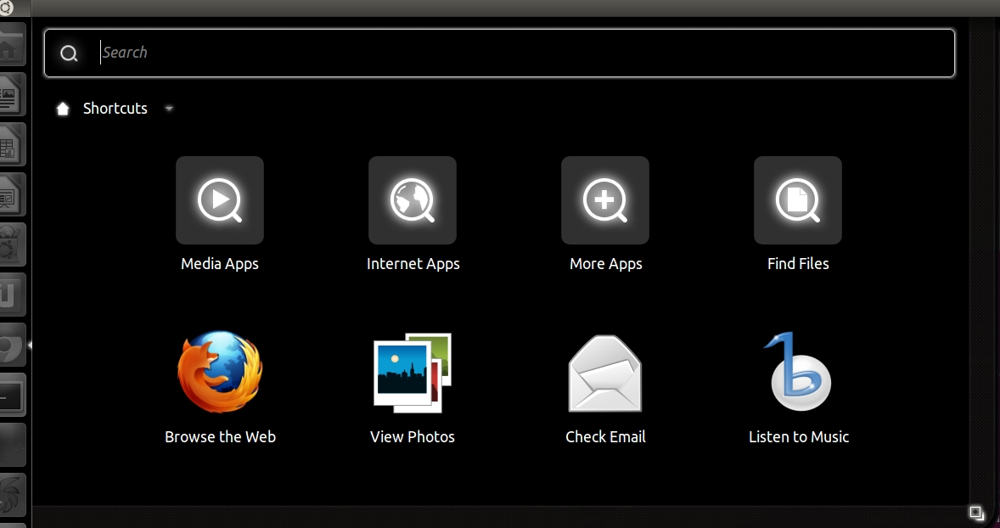

But what I wanted to talk about today was how a bunch of opensource geeks have managed to beat the paragon of usability and App Stores and all things shiny and awesome when it comes to managing apps, installing software and so on.

Lest anyone feel like donning me in feathers and tar and making me run through a desert, I do realize there's probably more to Canonical than being a bunch of opensource geeks, but that's besides the point.

There are two parts to what Ubuntu has created that makes the experience of app management so awesome. The the package manager and the cool interface.

Now [package managers](http://en.wikipedia.org/wiki/Package_management_system) are nothing new to anyone who's ever used linux before ... for some strange reason, even though [Linux](http://www.kernel.org/) has had several package managers and nobody can fathom using a distro without one for at least the past 20 years (debian's dpkg first came out in 1993) ... no other OS has _ever_ managed to use a package manager.

## Getting an App the old way

Installing an application on Windows and [MacOS](http://www.apple.com/macosx/) usually goes something like this:

1.  Hmm, I need to do something
2.  Google for it
3.  Ask for recommendations on twitter
4.  Get a bunch of things you should try
5.  Start finding homepages of this stuff
6.  Download a bunch of stuff
7.  Your most authoritative friend in the field finally chimes in and tells you what you want
8.  Find the homepage for that
9.  Download it (and/or buy it somewhere)
10. Install the damn thing
11. Get fed up
12. Do whatever it is you wanted to do tomorrow
13. Come back tomorrow, go through twitter stream to find out what the app was called
14. Launch the app
15. Be happy

Your average package manager makes the whole process a bit simpler, something like this:

1.  Hmm, I need to do something
2.  Google
3.  Asking for recommendations
4.  apt-get something
5.  Use it
6.  Get a better recommendation
7.  apt-get something-else-entirely
8.  Use that
9.  Be happy

The most notable difference is that suddenly you have this authoritative source of applications where everything is available in a single place. Sure, if you have specific needs you might still have to visit a website or two, three, four, five to get the specific version of the package you need just in case the one your distro offers is too old ... but all in all, the process is much nicer.

A lot more instant gratification. And as a geek who likes to pretend to be a normal user now and anon, instant gratification is _awesome_.

## The [App Store](http://www.apple.com/iphone/apps-for-iphone) saves the day

Recently Apple has done some improvements and became more like Linux with its variety of App Stores, the one on [iOS](http://www.apple.com/ios) works pretty well, the one on MacOS is ... well it's just a dash bit strange to be honest. It doesn't _feel right_. It isn't tightly integrated into the OS itself, it doesn't really offer anything to make me want to use it.

And it just doesn't look very apple-y either. I don't know, it lacks a certain zing to it and I rarely if ever open it to install something. It just sort of sits there existing for the sake of existence.

I think maybe what's lacking the most is the integration. When there are updates I simply don't find out about them until I randomly open the store ... and the fact it's even called a store doesn't really help my frugal sense of how software should operate at all. I feel a natural aversion to opening it before I even look at what it is because I know somebody will just try to shove stuff in my face and make me buy it.

You know, sort of like [iTunes](http://www.apple.com/itunes/).

I dislike iTunes with the passion of a thousand virgins.

Another big issue with the App Store that I have is that it only works for [Apps](http://friendfeed.com/weloveapps). What about all the other software I need on my computer? Sure, maybe I'm a bit of a pathological case being a developer and all, but still. Why do I need homebrew, fink, macports and so on? _Why!?_ I don't want all of that.

But let's look at screenshots, screenshots are good.

## The App Store in screenshots

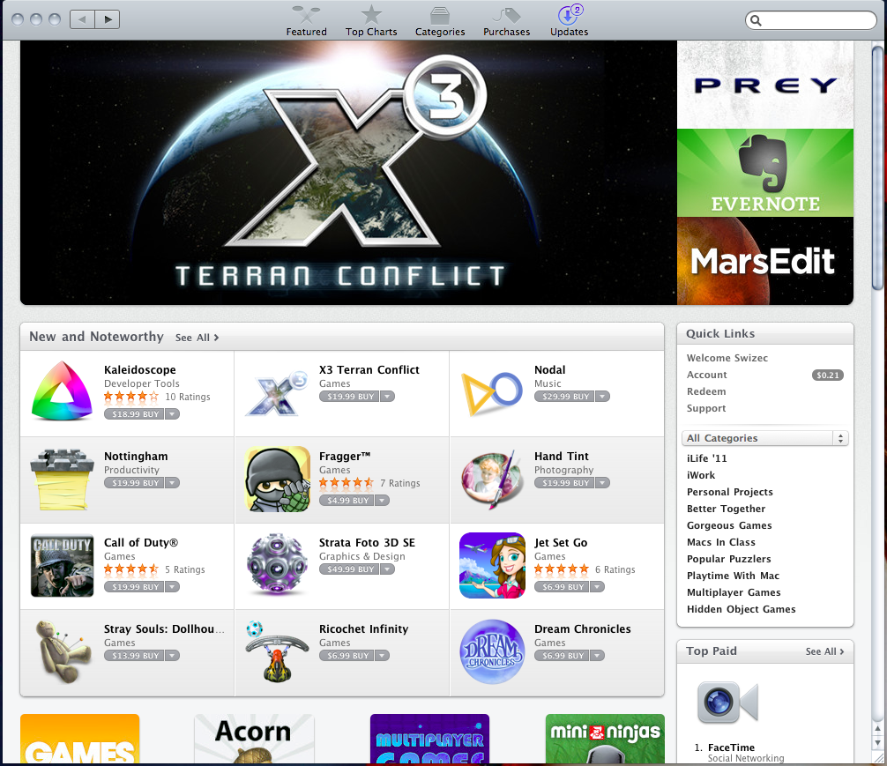

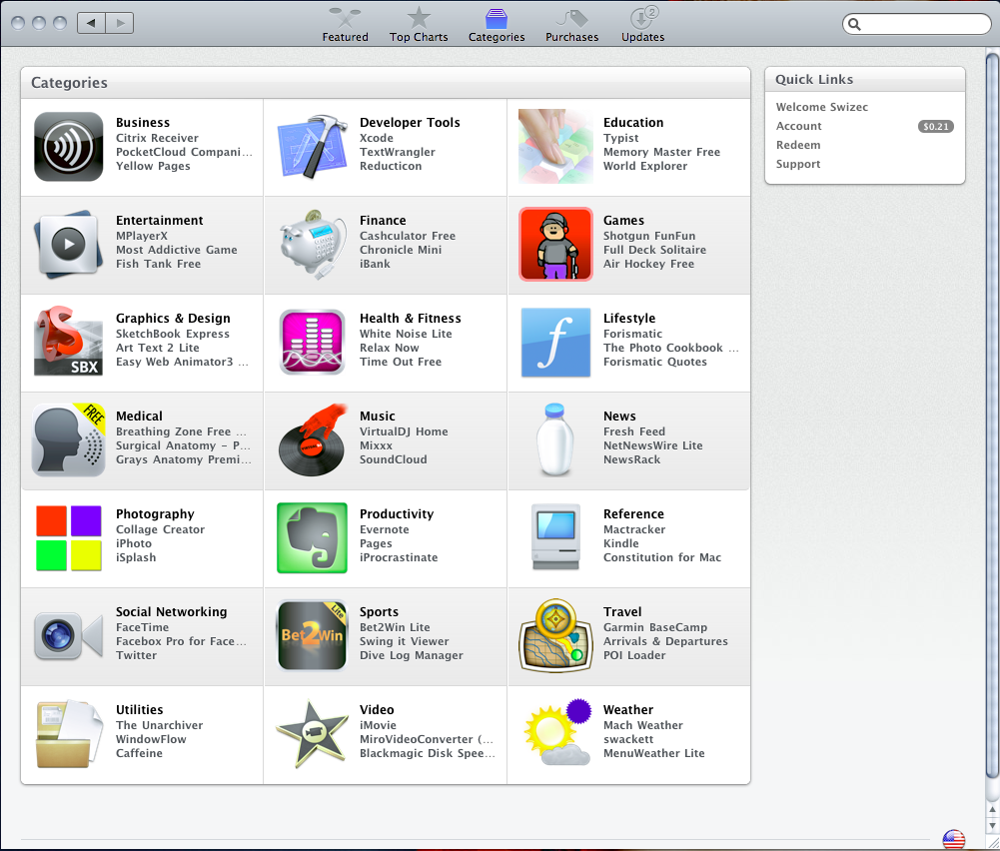

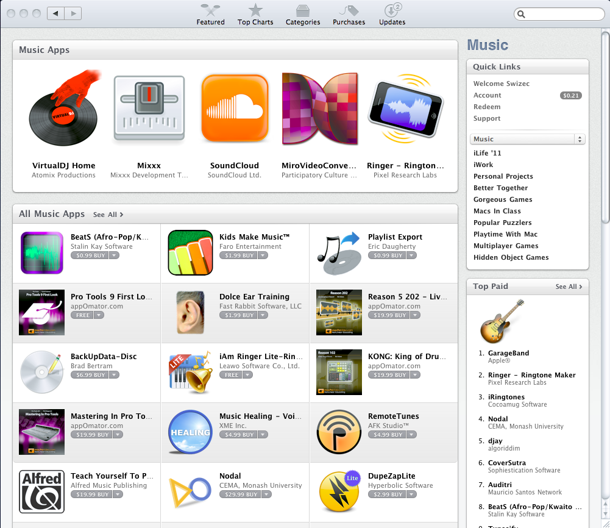

## The [Ubuntu Software Center](https://wiki.ubuntu.com/SoftwareCenter)

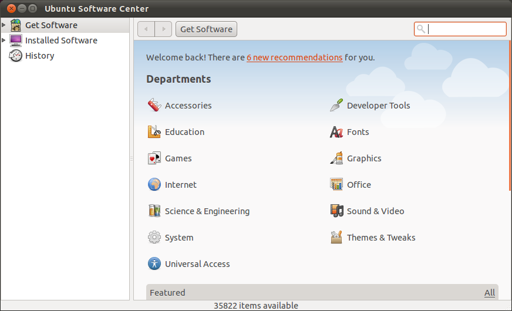

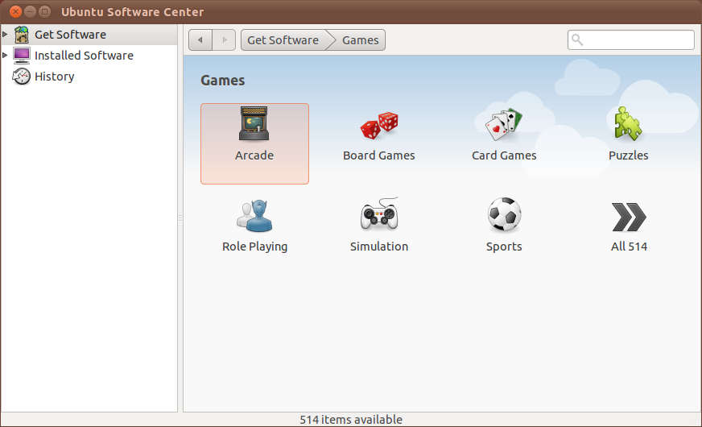

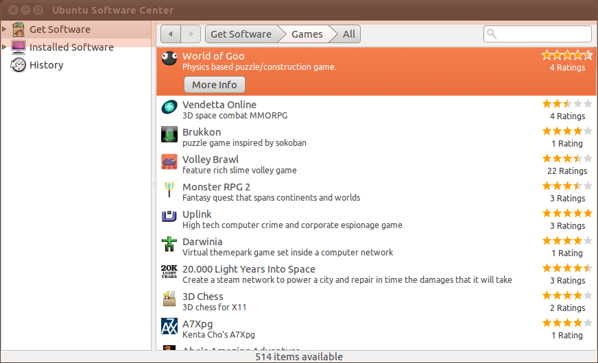

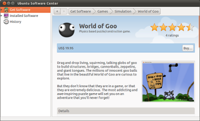

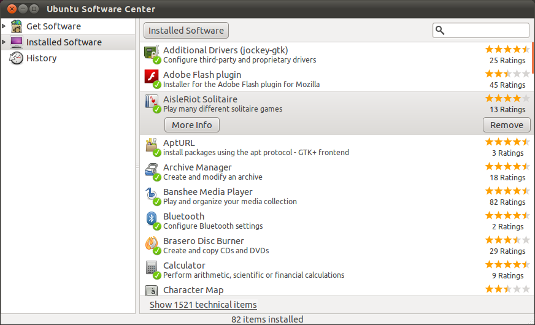

## Comparing discoverability

Let's pretend for a moment that both Apple and Ubuntu have solved the problem with package managers ... sort of. There is an almost sane way of installing new software on either OS.

What about discoverability? How do I find apps that are already installed? What about apps that I might want but have no idea on how to find?

Ubuntu's new Unity interface might finally provide an answer to _that_.

As much as crowdsourcing app suggestions is good and awesome, I think this might be better.

Let me show you some screenshots of the Ubuntu app management and usage experience:

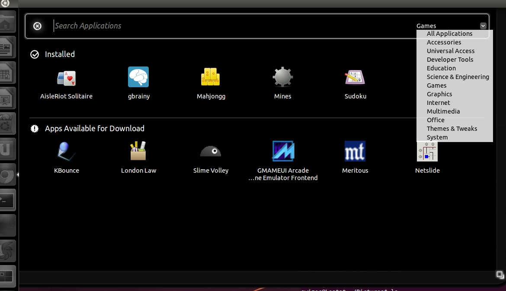

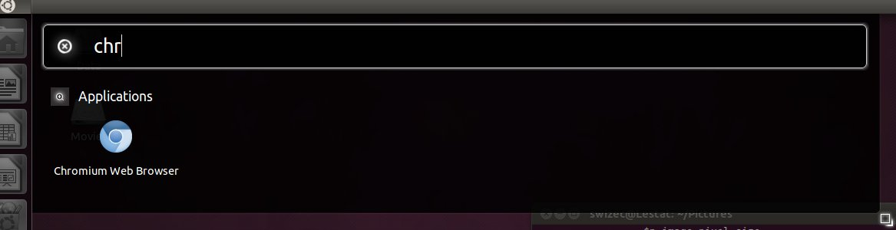

## Apple's offering somehow just doesn't come close

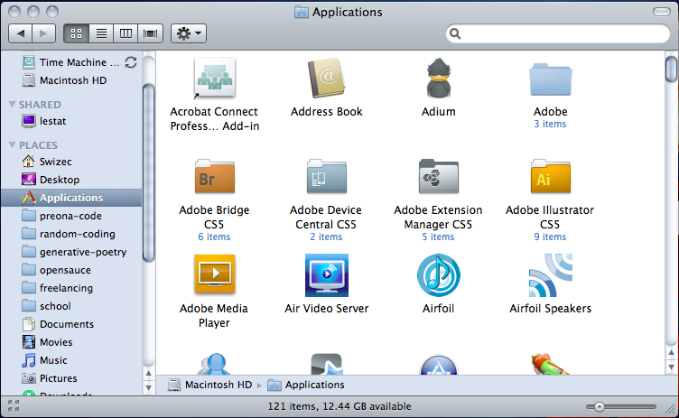

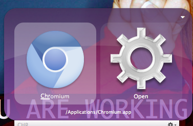

## Conclusion

All in all, I think Ubuntu has made a great leap to making the whole experience of using third party software much _much_ easier on the palate. There's still a long way to go and a bunch of geeks are already complaining that the whole interface sucks, but they keep forgetting just how much it sucks for everybody else who isn't using linux. We're just spoiled.

Of course there is still a long way to go and the new interface does have its issues. There's also a big chance that cometh MacOS 10.7 everything might change. The App Store was meant for the new version after all and the fact we're even allowed to use it already is supposed to be a grace of the Gods and so on.

We'll see, I really hope they come even close to Ubuntu Natty Narwhal because my laptop is (and always will be) running a Mac OS.