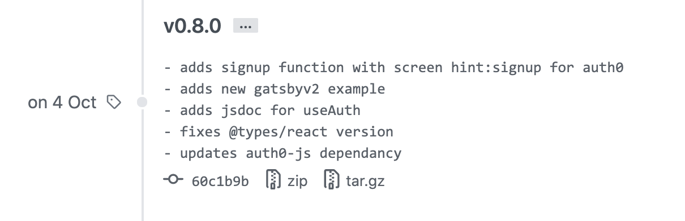
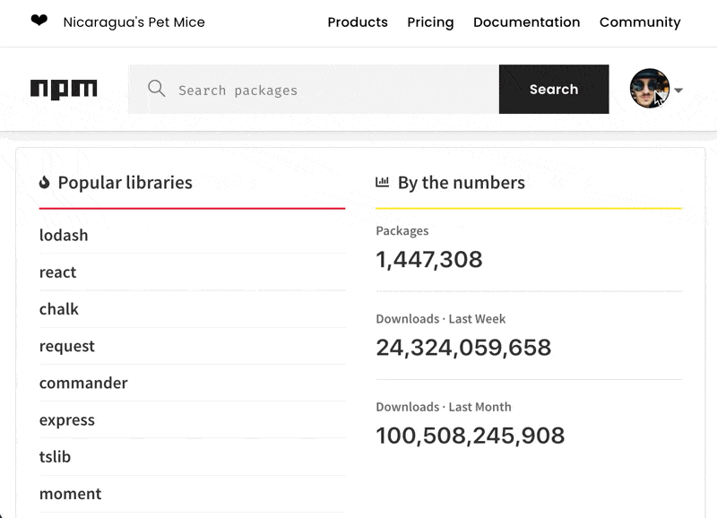
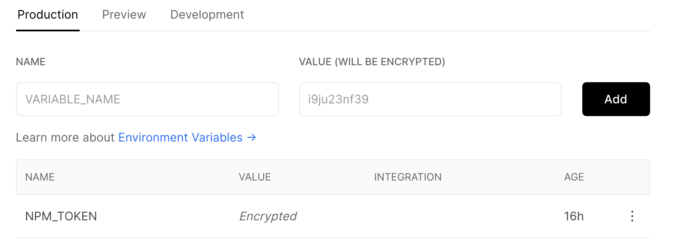

Picture this: You're using the many-small-repositories approach to work faster as a team.

You've got an admin repo, a backend repo, a mobile repo, a repo for the corp site, another for the main web app, a few experiments that died in A/B test, and let's be honest there's multiple backend repos. One per service. Web app likes to grow into multiple repos, too. One per user concern.

You get more done faster and each codebase makes sense on its own. You can even deploy separately 🤘


And then your plan falls apart 👉 shared code.

The first candidate is your design system. After that come utility functions. Then user management and shared API queries.

Best solution I've found for those are internal libraries. Libraries built for you and your team. Not meant to be shared.

If they prove out, you can open-source later. Like Facebook did with React. But that's a lot of work, trust me.

## How to create a JavaScript library or package

Don't overthink this one. A JavaScript library is a bundle of code with a `package.json` file and a name.

Easiest way to get started is to:

1 create a new directory

2.  run `npm init`
3.  follow the prompts

You'll get a basic `package.json` file:

```json
{
  "name": "example-library",
  "version": "1.0.0",
  "description": "This is an example to show a basic package.json",
  "main": "src/index.js",
  "scripts": {
    "test": "echo \"Error: no test specified\" && exit 1"
  },
  "author": "Swizec",
  "license": "MIT"
}
```

I recommend keeping your code in `src/`. Export your public interface from `src/index.js`.

Internal libraries like to skip that step and it makes them hell to use. You want to hide implementation details.

```javascript
// this leads to tears
import { FooUI } from "example-library/src/thingamabob/foo/UI";

// aim for this
import { FooUI } from "example-library";

// or this if there's many areas
import { FooUI } from "example-library/foo";
```

Another good idea is to add a compile step. Get support for TypeScript, any Babel plugins you're used to, etc.

I like to use [microbundle](https://github.com/developit/microbundle) for libraries. Quick to set up, works great, keeps code small.

## How to maintain a private library

You want to treat private libraries with the respect you'd give a public library.

Follow [semver](https://semver.org/) as best you can – major version for breaking changes, minor for new features, patch for bugfixes. You'll use different versions of the library in different projects. Upgrade as needed. Semver helps you keep track.

You don't want a situation where _every_ project is forced to upgrade when _any_ project upgrades.

Ask me how I know 😅

1.  Use `npm version major/minor/patch` to release versions. It updates package.json and adds a new tag.
2.  Use `git tag v1.1.0 v1.1.0\^\{\} -f -m "changelog"` to add a message to your tag
3.  `git push origin --tags` to update your code

Using tags for versions and the changelog creates a nice browing experience on GitHub. Tags show up as releases and you can see what each version means.

Here's useAuth for example:



Treat libraries as real projects. Have an owner. _"I owned X library used by 5 products at \\\\$Company"_ Looks great on your resumé [name|] 😉

## Git branch – the poor man's private package

Quickest way to distribute private packages is through GitHub. You're all set up already.

Your company likely uses private GitHub repositories. That means your build/CI/deploy pipeline has access. 🤘

Here's what you do:

    npm install company/repo
    # or
    yarn add company/repo

You get a package.json entry like this: `github:company/repo`

Yep! NPM and Yarn have built-in support for installing packages off GitHub repositories. Master branch by default, specify a version with a hash like this: `github:company/repo#v1.0.0`

No support for automatic semver upgrades. Pinned versions only.

## Private NPM packages

A step up from github branches are [private NPM packages](https://docs.npmjs.com/about-private-packages). You'll need a paid account to enable this option.

NPM is the default package registry which makes this option easy to configure. No configuration for personal use.

You'll need to scope your package in `package.json`:

```json
{
  "name": "@swizec/private-package"
}
```

Now you can run `npm publish` to publish as a private package. `npm install @swizec/private-package` installs it.

For team and collaborator access, you'll need to create a new token in settings. Anyone who needs access (person, server, etc) will use an `NPM_TOKEN=...` environment var.



That's all you need ✌️

### Private NPM packages with Yarn

I ran into issues using private NPM packages with Yarn. Errors out with packages it can't find.

You can fix that with a `.yarnrc` file in project root:

    # .yarnrc
    "@swizec:registry" "https://registry.npmjs.org/"

You can commit this to git. Tells Yarn to look for `@swizec`-scoped packages on the NPM registry.

### Deploy private NPM packages to Vercel or Netlify

_Any_ collaborator can get access to your private packages with a `NPM_TOKEN=...` environment variable. That includes Vercel, Netlify, and other deploy environments.



No other config necessary. Try making a new access token for each collaborator. They're free and the less reuse, the better.

## Private GitHub packages

Github now offers [private packages](https://docs.github.com/en/free-pro-team@latest/packages/publishing-and-managing-packages/about-github-packages). You get a few with a free account and you'll need a paid account for serious use.

This is a great option because your company has a paid account. Right? Most do.

Takes [more configuration](https://docs.github.com/en/free-pro-team@latest/packages/using-github-packages-with-your-projects-ecosystem/configuring-npm-for-use-with-github-packages) than the NPM approach.

You'll need to create a [personal access token](https://docs.github.com/en/free-pro-team@latest/github/authenticating-to-github/creating-a-personal-access-token) with [permission scopes for packages](https://docs.github.com/en/free-pro-team@latest/packages/publishing-and-managing-packages/about-github-packages#about-scopes-and-permissions-for-package-registries).

Then you add that token to your `~/.npmrc` file. This is the global .npmrc file, _not in the project_. Do not commit to git.

    # ~/.npmrc

    //npm.pkg.github.com/:_authToken=TOKEN

Then you tell NPM to use the GitHub registry for your package scope. In a local `.npmrc` file that's added to git.

    # .npmrc
    registry=https://registry.npmjs.org/
    @swizec:registry=https://npm.pkg.github.com/

For Yarn that would be:

    # .yarnrc
    "@swizec:registry" "https://registry.npmjs.org/"

You have to ensure your `repository` field in package.json matches your GitHub project:

```json
{
  "repository": "git://github.com/swizec/private-package.git"
}
```

_And then_, you have to add a `publishConfig` to your package.json.

```json
{
  "publishConfig": {
    "registry": "https://npm.pkg.github.com"
  }
}
```

You can now publish with `npm publish` and install with `npm install @swizec/private-package`.

## Create a private package registry

You can go super private with a custom package registry.

[Verdaccio](https://verdaccio.org/en/) looks promising as an on-premise registry host that you can run yourself. Gives you full control and whatnot.

I took one look at the Verdaccio docs, 3 looks at GitHub docs, and paid $7/mo for NPM. Ain't nobody got time for that.

Cheers,<br/>
~Swizec
