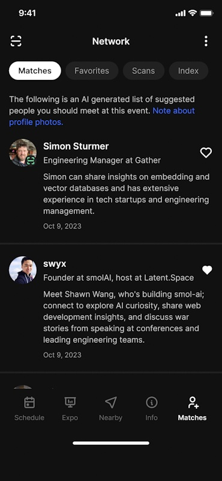
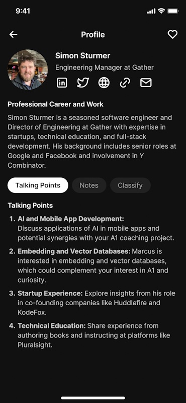
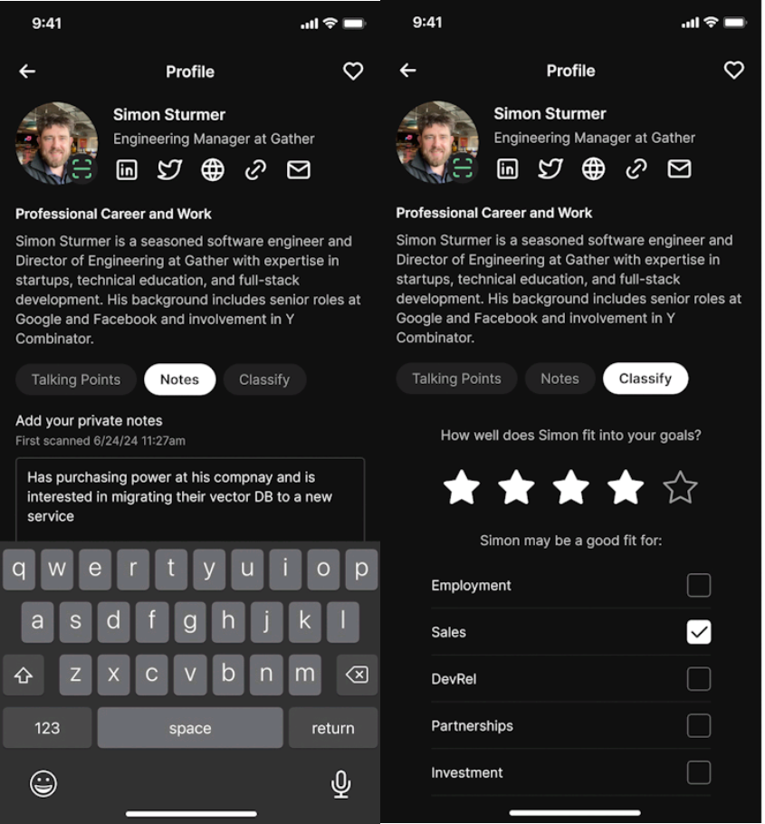

What's the worst part of going to a conference? For me it's milling around in the hallway with 500 strangers and no idea whom to talk to or what to say.

I'm an awkward nerd, you see. Put me behind a keyboard or a camera and I'm your man. Put me in a room full of people and unless there's someone I know from the internet, I can go a whole conference awkwardly sipping my drink not saying a word.

So Ben, the organizer behind [AI Engineer conferences](https://www.ai.engineer/) had an idea: What if we built an app that matches you with other attendees and gives you personalized talking points to spark a conversation?

We did! Early results look promising. I'm excited 😁

## Finding your match

You start the conference by filling out your profile. Name, what you're up to, linkedin, a few questions about why you're coming to the conference. The main questions are:

- What do you need help with?
- How can you help others?
- What are you curious about?

We then feed your answers into a `pgvector` store and use a vector similarity search to find people you should talk to.

Each match comes with a personalized blurb. When the AI makes a match, it tries to explain why _you_ should go talk to this person.

I love this because there's nothing more awkward than a friend who says _"Hey Swiz you should go talk to Simon, you have a lot in common"_. And then we stand there like errrr so what do you do Simon?

No no, the right way to make an intro is _"Hey Swiz you should talk to Simon about the vector embeddings you've been working on"_. That way we immediately know what to talk about :)

## Sparking a conversation

Click on one of your matches and you'll get an even deeper profile. Personalized to you and what you're looking for.

The AI creates a summary of the person's linkedin profile while highlighting the parts _you_ might be interested in. Shared experiences, valuable things you can learn from, and some credentials you may be impressed by.

The deeper talking points give you more avenues to explore once you meet. Simon builds mobile apps and maybe that fits the project you're working on? You're both interested in embeddings and vector databases. And you can discuss shared experiences in startups and teaching engineering topics.

This hit the perfect balance for me. We'll see how it works at the conference. I just noticed the summary called him Marcus in one of the talking points 🤣

## Staying in touch

After your nourishing conversation, you can scan each other's badges to stay in touch. You can add notes, classify the person based on your interests, and later export all the data.

This means you have the same superpowers as a sponsor. Know who you talked to, why, and what about. How else are you going to stay in touch after meeting dozens of people in 3 days? I can barely remember my own name after a conference like that.

Scanning badges is not limited to matches! You'll get the same personalized profile and talking points for anyone you meet.

No more talking to a random person then seeing them up on stage 2 hours later and going _"That's so cool! Why didn't we talk about it!?"_ 🤘

Cheers, 
\~Swizec

PS: I think the plan is to later opensource this and make it available to other conferences. I'm not the business strategist, I just write the algorithms.
