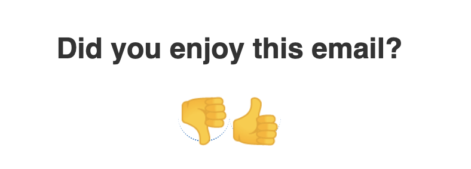
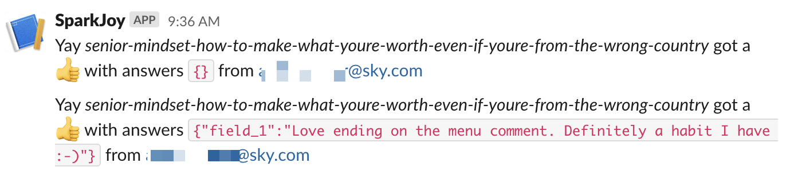
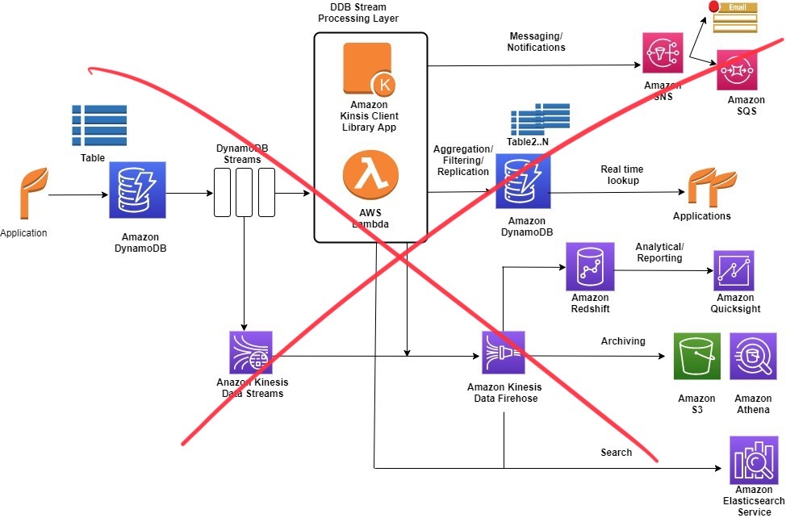
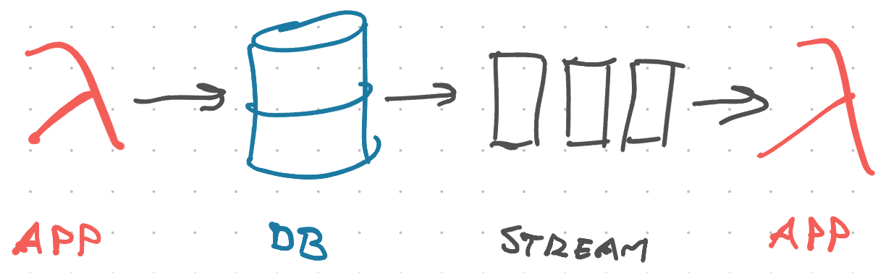
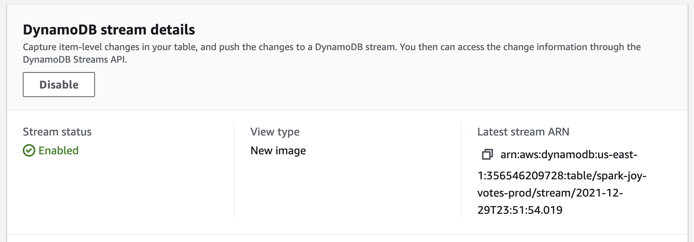
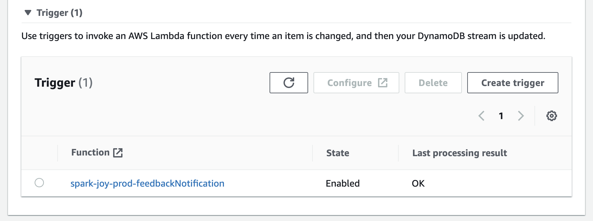

import { ContentUpgrades } from "@swizec/gatsby-theme-course-platform"

DynamoDB Streams are a convenient way to react to changes in your database. And surprisingly easy to use 🥳

I tried [DynamoDB Streams](https://aws.amazon.com/blogs/database/dynamodb-streams-use-cases-and-design-patterns/) over the holidays to fix an annoyance that's been bugging me for months – I never know when readers click 👍 👎 on my emails.



For the past ... year ... I've had a daily habit:

1.  Wake up
2.  Make tea
3.  Open AWS console
4.  Go to DynamoDB
5.  Look for `spark-joy-votes-prod` table
6.  Look up the name of my latest email
7.  Type name into DynamoDB console
8.  Run a full table scan
9.  See feedback 🤩

And miss any and all feedback on my blog, on [ServerlessHandbook.dev](https://serverlesshandbook.dev), on [ReactForDataviz.com](https://reactfordataviz.com), and on evergreen emails running inside ConvertKit automations. 💩

Now all I have to do is check the `#feedback` channel on Slack.



The code is open source. You can [see the full pull request here](https://github.com/Swizec/spark-joy/pull/51). Keep reading to see how it works.

## The architecture

Amazon's official DynamoDB Streams usage architecture diagram is ... intense.

[](https://aws.amazon.com/blogs/database/dynamodb-streams-use-cases-and-design-patterns/)

Following these diagrams must be why entire businesses exist to help companies improve their AWS bills. 💸

Here's all you need:

1.  An app that puts data into DynamoDB
2.  A DynamoDB table
3.  A stream attached to that table
4.  An app that listens to the stream

Because [Serverless fits side-projects perfectly](https://swizec.com/blog/why-serverless-fits-side-projects-perfectly/) I like to put the app portions on an AWS Lambda. Like this:



1.  A Lambda at the front handles GraphQL requests, inserts or updates data in the database
2.  DynamoDB stores the data
3.  DynamoDB Stream sends a change event to every listener (I don't know how this works underneath)
4.  Lambda listener wakes up and processes the event

In our case, it uses a [Slack Incoming Webhook](https://api.slack.com/messaging/webhooks) to send a message to a preconfigured channel.

## Create a DynamoDB Stream with Serverless Framework

Assuming you're [using `serverless.yml` to create all your resources](https://serverlesshandbook.dev/serverless-dx/), this part is easy. An extra 2 lines in your config:

```yaml
# serverless.yml
resources:
  Resources:
    JoyFeedbacksTable:
      Type: "AWS::DynamoDB::Table"
      Properties:
        # ...
        TableName: ${self:provider.environment.FEEDBACKS_TABLE}

        # these 2 lines create a stream
        StreamSpecification:
          StreamViewType: NEW_IMAGE
```

You add `StreamSpecification` and define a `StreamViewType`. Serverless Framework handles the rest.

Run `serverless deploy` and you get a stream:



The [`StreamViewType`](https://docs.aws.amazon.com/amazondynamodb/latest/APIReference/API_StreamSpecification.html) defines what goes in your stream events:

<ContentUpgrades.Serverless />

- `KEYS_ONLY`, get the key attributes of your item
- `NEW_IMAGE`, get the full value after change
- `OLD_IMAGE`, get the full value before change
- `NEW_AND_OLD_IMAGES`, get full value before _and_ after change so you can compare

`NEW_IMAGE` was best for my project. I just want to forward your feedback to Slack.

## Trigger an AWS Lambda on a DynamoDB Stream event

You can use `serverless.yml` to configure a Lambda as your stream listener. Like this:

```yaml
functions:
  feedbackNotification:
    handler: dist/feedbackNotification.handler
    events:
      - stream:
          type: dynamodb
          arn:
            Fn::GetAtt:
              - JoyFeedbacksTable
              - StreamArn
          # we update records when users add answers
          # hopefully this reduces noise
          # (it didn't fully)
          batchSize: 5
          MaximumBatchingWindowInSeconds: 60
```

This tells the Serverless Framework to:

1.  create a `feedbackNotification` lambda
2.  which runs a `handler()` function exported from `dist/feedbackNotification.js`
3.  when a `type: dynamodb` stream event happens
4.  on the `JoyFeedbacksTable` table
5.  in batches of `5` events
6.  waiting at most `60` seconds to collect a batch

I used batching to reduce noise in Slack because my application has a quirk that creates a lot of update events. More on that later :)

You can see the full list of options in [AWS's documentation for configuring DynamoDB stream listeners](https://docs.aws.amazon.com/lambda/latest/dg/with-ddb.html).

Run `serverless deploy` and your stream gains a trigger:



## Process a DynamoDB Stream with AWS Lambda

Processing the stream is a matter of writing some JavaScript. Your function is called with an array of objects and you do your thing. Because [If you can JavaScript, you can backend](https://swizec.com/blog/if-you-can-javascript-you-can-backend/) 🤘

I use [TypeScript so I don't have to worry about typos](https://swizec.com/blog/learn-typescript-in-5-minutes/) 😛

```typescript
export async function handler(event: DynamoDBStreamEvent) {
  const votes = new Map<string, Vote>()

  // collect latest instance of a vote
  // event processing happens in-order
  // https://docs.aws.amazon.com/lambda/latest/dg/with-ddb.html
  for (const record of event.Records) {
    const voteRecord = parseRecord(record)

    if (shouldNotify(voteRecord)) {
      votes.set(voteRecord.vote.voteId, voteRecord.vote)
    }
  }

  for (const [voteId, vote] of votes) {
    await sendNotification(vote)
  }
}
```

The `handler()` function

1.  accepts a `DynamoDBStreamEvent`,
2.  iterates over the list of Records,
3.  parses each record,
4.  ignores any we don't care about,
5.  creates a deduplicated Map of votes,
6.  sends a notification for each valid vote

Each event will have up to 5 records as per the `batchSize` config. Because my app is weird, we may get multiple entries for the same `voteId`. We throw away all except the latest.

### Parse a DynamoDBStream Record with the unmarshall function

DynamoDBStream data comes in a weird shape. I don't know why.

https://twitter.com/Swizec/status/1476016108305932289

You can use the [`unmarshall` function](https://docs.aws.amazon.com/AWSJavaScriptSDK/v3/latest/modules/_aws_sdk_util_dynamodb.html#unmarshall-1) from the AWS SDK to ease your pain. My parsing function looks like this:

```typescript
import { unmarshall } from "@aws-sdk/util-dynamodb"

function parseRecord(record: DynamoDBRecord): VoteRecord {
  if (!record.dynamodb?.NewImage) {
    throw new Error("Invalid DynamoDBRecord")
  }

  // parse the weird object shape
  const vote = unmarshall(
    record.dynamodb?.NewImage as {
      [key: string]: AttributeValue
    }
  )

  // my list of form answers is a JSON string
  if (typeof vote.answers === "string") {
    vote.answers = JSON.parse(vote.answers)
  }

  return {
    ...record,
    vote: vote as Vote,
  }
}
```

Check that the record has data and use `unmarshall()` to parse into a normal JavaScript object. Then parse the JSON and return a modified record object.

The type casting in `unmarshall()` is because the official type definitions in `@aws-sdk/dynamodb` don't match the open source type definitions of `@types/aws-lambda`. And `DynamoDBRecord` is defined in the opensource types, but not in the official types 💩

## Use incoming webhooks to send Slack messages from AWS Lambda

This is the DoTheWork portion of your code. Everything up to here was boilerplate.

https://twitter.com/Swizec/status/1476340971180728320

You'll need to create a Slack app and [configure incoming webhooks](https://api.slack.com/messaging/webhooks). This gives you a Webhook URL _that is a secret_.

Anyone with this URL can send messages to your Slack. Make sure it's safe :)

I stored mine in AWS Secrets Manager (manually). The code uses `@aws-sdk/client-secrets-manager` to fetch the URL from secrets any time it's needed. Like this:

```typescript
import {
  GetSecretValueCommand,
  SecretsManagerClient,
} from "@aws-sdk/client-secrets-manager"

// reads slack webhook url from secrets manager
async function getSlackUrl() {
  const client = new SecretsManagerClient({
    region: "us-east-1",
  })
  const command = new GetSecretValueCommand({
    SecretId: "sparkjoySlackWebhook",
  })

  const secret = await client.send(command)

  if (!secret.SecretString) {
    throw new Error("Failed to read Slack Webhook URL")
  }

  return JSON.parse(secret.SecretString) as { webhookUrl: string }
}
```

Instantiate a `SecretsManagerClient`, create a command, send the command to get the secret. This API feels weird to me, but an improvement on AWS SDK v2.

Sending the notification looks like this:

```typescript
import { IncomingWebhook } from "@slack/webhook"

async function sendNotification(vote: Vote): Promise<void> {
  console.log("Gonna send notification for", vote)

  const { webhookUrl } = await getSlackUrl()
  const webhook = new IncomingWebhook(webhookUrl)

  if (vote.voteType === "thumbsup") {
    await webhook.send({
      text: `Yay _${
        vote.instanceOfJoy
      }_ got a 👍 with answers \`${JSON.stringify(vote.answers)}\` from ${
        vote.voter
      }`,
    })
  } else {
    await webhook.send({
      text: `Womp _${
        vote.instanceOfJoy
      }_ got a 👎 with answers \`${JSON.stringify(vote.answers)}\` from ${
        vote.voter
      }`,
    })
  }
}
```

The console.log helps me debug any issues, then we

1.  get the webhook url
2.  instantiate a Slack client
3.  construct a message
4.  wait for `send()`

And our Slack is full of feedback 🥳


## Real-time really means real-time

DynamoDB Streams are real-time. You get a new event as soon as records change. And that's why my Slack notifications are noisy.

After you vote, there are follow-up questions. Each answer saves to the database, updates your vote, and triggers an event.

But I can't know when you're done! Will you vote and bail or answer 3 questions? Don't know can't know.

Keep that in mind when you build event-based systems ✌️

Cheers,<br/>
~Swizec

PS: if you're curious about serverless, consider grabbing a copy of [Serverless Handbook](https://serverlesshandbook.dev), it's a great resource :)
