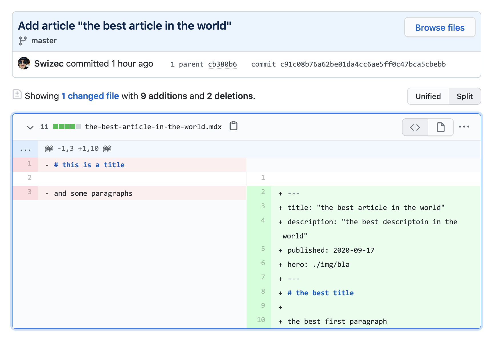

Update code with a JavaScript function? Easier than you think 😍

_CodeWithSwiz is a twice-a-week live show. Like a podcast with video and fun hacking. Focused on experiments. [Join live Wednesdays and Sundays](https://youtube.com/swizecteller)_

[https://www.youtube.com/watch?v=Ql_Ni24Aj4Y](https://www.youtube.com/watch?v=Ql_Ni24Aj4Y)

Episode 7 continues where [we left off](https://swizec.com/blog/why-nextjs-api-routes-are-fab-codewithswiz-6/) – got the server /api routes, need to write to GitHub.

You can't do this in the browser, you'd leak API tokens. Easy mistake to ignore, but GitHub tokens are serious.

GitHub tokens are keys to your kingdom. An attacker could take this and overwrite any and all code you own.

Leaking important tokens is serious enough that [AWS blocked my whole account when I shared a token](https://swizec.com/blog/what-happens-when-you-push-aws-credentials-to-github/).


## Why write to GitHub

We're exploring NextJS by building a headless CMS. Modern static site generators use markdown files to represent each article.

Add a dash of Netlify or Vercel and you get a wonderful workflow: Write markdown, commit to git, push to GitHub, trigger deploy.

And that's what our `/api` method needs to do.

```javascript
// pages/api/publishArticle.js

export default async (req, res) => {
  const status = await commitArticle(req.body)

  res.status(status).json({ success: true })
}
```

Think of the API method as your controller. Gets a request, does work, returns the result. In this case the status code we get from GitHub.

## How to use JavaScript to commit to GitHub

GitHub maintains an open source [`@octokit/rest` library](https://github.com/octokit/rest.js/). Works great, but I find the documentation difficult to untangle.

Here's what you do:

1.  auth with your GitHub token
2.  prep data to commit
3.  check for an existing file SHA hash
4.  commit your code

### 1. auth with your GitHub token

We're using [Github's personal access token](https://docs.github.com/en/github/authenticating-to-github/creating-a-personal-access-token) stored in a `.env.local` file for now. We'll add an authentication flow later.

```javascript
// pages/api/publishArticle.js
import { Octokit } from "@octokit/rest"

const octokit = new Octokit({
  auth: process.env.GITHUB_TOKEN,
})
```

This gives you an authenticated octokit library to use. Hardcoded to your user.

### 2. prep data to commit

GitHub requires that you send files encoded as Base64.

We use the [js-base64](https://www.npmjs.com/package/js-base64) library for that. Dealing with native Node buffers and encoding/decoding felt like too much.

```javascript
// pages/api/publishArticle.js

    content: Base64.encode(
        `${frontmatter(article)}\n\n${article.markdown}`
    ),
```

Calls the `frontmatter` method on our article, smashes it together with the `markdown` content, and encodes them both into Base64.

You get a string that's safe to send over the internets without losing character encodings or binary info.

PS: we share the `frontmatter` method between server and browser via a `utils` library. Both ends are JavaScript and that makes code sharing super convenient ✌️

### 3. check for an existing file SHA hash

GitHub freaks out when you commit over a file that exists. You need to say you're doing this on purpose.

For that, you'll need the current SHA blob of the file you're overwriting. Thanks to Aleš for finding the right method to use on chat during the stream.

```javascript
// pages/api/publishArticle.js

async function getSHA(path) {
  const result = await octokit.repos.getContent({
    owner: "Swizec",
    repo: "test-repo",
    path,
  })

  const sha = result?.data?.sha

  return sha
}
```

Call that method with the path to your file and it returns the correct SHA string to use. Among other info like the contents of the file, the commit it belongs to, etc.

### 4. commit your code

The final "publish an article as a single Markdown file" method looks like this:

```javascript
// pages/api/publishArticle.js

async function commitArticle(article) {
  const path = `${slug(article.title)}.mdx`
  const sha = await getSHA(path)

  const result = await octokit.repos.createOrUpdateFileContents({
    owner: "Swizec",
    repo: "test-repo",
    path,
    message: `Add article "${article.title}"`,
    content: Base64.encode(`${frontmatter(article)}\n\n${article.markdown}`),
    sha,
  })

  return result?.status || 500
}
```

Create our filename from the title, check for any existing SHA, create or update the file.

You get [a test repository](https://github.com/Swizec/test-repo) with 2 files and a couple commits



<!--  -->

Cheers,
~Swizec
