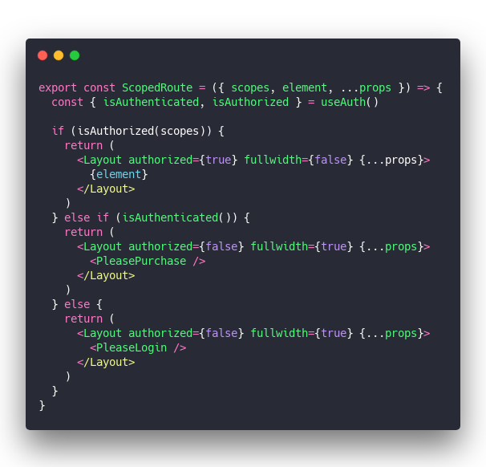

About a month ago I wrote about [Adding granular role-based access to your JAMStack app](https://swizec.com/blog/add-granular-rolebased-access-to-your-jamstack-app/). That worked okay.

Use something like [useAuth](https://github.com/Swizec/useAuth) to authenticate users, add some roles, then check those roles in your app. Often at the main `<Layout>` level.

You get an app that sometimes asks for additional permissions.

But this approach had 2 warts:

1.  Lots of people mentioned that _scopes_ in practice scale better than roles
2.  You needed this gnarly code somewhere in your app

&t=seti&l=javascript&ds=true&wc=true&wa=true&pv=48px&ph=32px&ln=false&code=const%20LockedContent%20%3D%20(props)%20%3D%3E%20%7B%0A%20%20const%20allowUnauth%20%3D%20UNAUTH_PAGES.includes(currentLocation(props))%0A%20%20const%20%7B%20isAuthorized%2C%20isAuthenticated%20%7D%20%3D%20useAuth()%0A%0A%20%20if%20(!allowUnauth%20%26%26%20!isAuthenticated())%20%7B%0A%20%20%20%20%2F%2F%20not%20even%20logged%20in%2C%20ask%20for%20login%0A%20%20%20%20return%20%3CPleaseLogin%20%2F%3E%0A%20%20%7D%20else%20%7B%0A%20%20%20%20if%20(isFindYourIdeaPage(props))%20%7B%0A%20%20%20%20%20%20if%20(isAuthorized(%22FindYourIdea%22))%20%7B%0A%20%20%20%20%20%20%20%20%2F%2F%20FindYourIdea%20page%2C%20access%20-%3E%20show%0A%20%20%20%20%20%20%20%20return%20%3CContent%20%7B...props%7D%20%2F%3E%0A%20%20%20%20%20%20%7D%20else%20%7B%0A%20%20%20%20%20%20%20%20%2F%2F%20FindYourIdea%20page%2C%20no%20access%20-%3E%20buy%0A%20%20%20%20%20%20%20%20return%20%3CPleasePurchase%20findYourIdea%20%2F%3E%0A%20%20%20%20%20%20%7D%0A%20%20%20%20%7D%20else%20if%20(isAuthorized(%22Student%22))%20%7B%0A%20%20%20%20%20%20%2F%2F%20ServerlessReactDev%20page%2C%20acces%20-%3E%20show%0A%20%20%20%20%20%20return%20%3CContent%20%7B...props%7D%20%2F%3E%0A%20%20%20%20%7D%20else%20if%20(allowUnauth)%20%7B%0A%20%20%20%20%20%20%2F%2F%20no%20auth%20required%20-%3E%20show%0A%20%20%20%20%20%20return%20%3CContent%20%7B...props%7D%20%2F%3E%0A%20%20%20%20%7D%20else%20%7B%0A%20%20%20%20%20%20%2F%2F%20ServerlessReactDev%20page%2C%20no%20access%20-%3E%20buy%0A%20%20%20%20%20%20return%20%3CPleasePurchase%20%2F%3E%0A%20%20%20%20%7D%0A%20%20%7D%0A%7D>)

## Scopes bring more elegance

Wanted to use this approach for my [React for Dataviz](https://reactfordataviz.com) course, which has 3 tiers on top of free stuff, and my head began to spin. No way this was gonna work. 😅

I set out to find a better way:

And I found one! Scopes.

A scope is no different than a role – a string attached to the user. The _semantics_ of scopes are different though.

Instead of answering _"Who is this user?"_ a scope answers _"What can this user do?"_. Small difference, big impact.

And when you move permission checking to the router-level, the result is quite elegant. I think.

Haven't tried it with NextJS, with Gatsby you'd do something like this 👇

### 1. wrap the root of your tree

Permission-checking happens as high up in your component tree as possible. For Gatsby that's the `wrapPageElement` method. I use the same method for `gatsby-ssr` and `gatsby-browser`.

&t=seti&l=javascript&ds=true&wc=true&wa=true&pv=48px&ph=32px&ln=false&code=export%20const%20wrapPageElement%20%3D%20(%7B%20element%2C%20...props%20%7D)%20%3D%3E%20(%0A%20%20%3CAuthProvider%0A%20%20%20%20navigate%3D%7Bnavigate%7D%0A%20%20%20%20auth0_domain%3D%22serverlessreactcourse.auth0.com%22%0A%20%20%20%20auth0_client_id%3D%22...%22%0A%20%20%20%20auth0_params%3D%7B%7B%0A%20%20%20%20%20%20scope%3A%20%22openid%20profile%20email%20user_metadata%22%2C%0A%20%20%20%20%7D%7D%0A%20%20%20%20customPropertyNamespace%3D%22https%3A%2F%2Fserverlessreact.dev%22%0A%20%20%3E%0A%20%20%20%20%3CMyRouter%20element%3D%7Belement%7D%20%7B...props%7D%20%7B...props.props%7D%20%2F%3E%0A%20%20%3C%2FAuthProvider%3E%0A)>)

Wrap everything in useAuth's `<AuthProvider>` then render the `<MyRouter>` component making sure to pass the element and all props.

### 2. a simple router

Next you need a router to map paths to components. Gatsby comes with [reach/router](https://reach.tech/router) built-in so that seems like a good choice.

Unfortunately I couldn't get it to work reliably. Kept matching incorrect routes. The integration isn't as tight as I hoped.

But that's okay. Turns out building your own basic router isn't so hard.

Here's mine:

&t=seti&l=javascript&ds=true&wc=true&wa=true&pv=48px&ph=32px&ln=false&code=const%20MyRouter%20%3D%20(%7B%20element%2C%20...props%20%7D)%20%3D%3E%20%7B%0A%20%20const%20scopedPages%20%3D%20Object.keys(SCOPE_PAGE_MAP)%0A%20%20const%20scopedKey%20%3D%20scopedPages.find((page)%20%3D%3E%20minimatch(props.path%2C%20page))%0A%0A%20%20if%20(scopedKey)%20%7B%0A%20%20%20%20return%20(%0A%20%20%20%20%20%20%3CScopedRoute%0A%20%20%20%20%20%20%20%20element%3D%7Belement%7D%0A%20%20%20%20%20%20%20%20scopes%3D%7BSCOPE_PAGE_MAP%5BscopedKey%5D%7D%0A%20%20%20%20%20%20%20%20%7B...props%7D%0A%20%20%20%20%20%20%2F%3E%0A%20%20%20%20)%0A%20%20%7D%20else%20%7B%0A%20%20%20%20return%20%3CDefault%20element%3D%7Belement%7D%20%7B...props%7D%20%2F%3E%0A%20%20%7D%0A%7D>)

We use a `SCOPE_PAGE_MAP` that maps glob'd locations to their scopes. Use the `minimatch` library to find a matching path.

If path is found, render `<ScopedRoute>`, otherwise render `<Default>`.

The `SCOPE_PAGE_MAP` is a long list like this:

&t=seti&l=javascript&ds=true&wc=true&wa=true&pv=48px&ph=32px&ln=false&code=const%20SCOPE_PAGE_MAP%20%3D%20%7B%0A%20%20%22%2Fintroduction%2F*%22%3A%20%5B%22RDV_Basic%22%2C%20%22RDV_Full%22%2C%20%22RDV_AllExtras%22%5D%2C%0A%20%20%22%2Fbuilding-blocks%2F*%22%3A%20%5B%22RDV_Basic%22%2C%20%22RDV_Full%22%2C%20%22RDV_AllExtras%22%5D%2C%0A%20%20%22%2Fd3-quick-intro%2F*%22%3A%20%5B%22RDV_Basic%22%2C%20%22RDV_Full%22%2C%20%22RDV_AllExtras%22%5D%2C%0A%20%20%22%2Freact-d3%2F*%22%3A%20%5B%22RDV_Basic%22%2C%20%22RDV_Full%22%2C%20%22RDV_AllExtras%22%5D%2C%0A%20%20%22%2Fanimation%2F*%22%3A%20%5B%22RDV_Full%22%2C%20%22RDV_AllExtras%22%5D%2C%0A%20%20%22%2Fball-game%2F*%22%3A%20%5B%22RDV_Full%22%2C%20%22RDV_AllExtras%22%5D%2C%0A%20%20%2F%2F%20...>)

This part is tedious. Thinking of ways to move this info into MDX frontmatter that you can query with GraphQL.

Perhaps an idea for a Gatsby plugin 🤔

### 3. Default route

Now that you're mapping routes to components, you need those components :)

The `<Default>` component/route can be simple:

&t=seti&l=javascript&ds=true&wc=true&wa=true&pv=48px&ph=32px&ln=false&code=const%20Default%20%3D%20(%7B%20element%2C%20...props%20%7D)%20%3D%3E%20(%0A%20%20%3CLayout%20authenticated%3D%7Bfalse%7D%20authorized%3D%7Bfalse%7D%20fullwidth%3D%7Btrue%7D%20%7B...props%7D%3E%0A%20%20%20%20%7Belement%7D%0A%20%20%3C%2FLayout%3E%0A)>)

Tells the layout that you're not authenticated, not authorized, and in my case to render the page fullwidth without the sidebar.

The `<Layout>` could check for this stuff with `useAuth` but it's cleaner to just tell it. _"Hey, show extra buttons for authorized users"_

### 4. scoped route

`<ScopedRoute>` is the bread and butter of this approach. And unlike my previous attempt, it's not gnarly at all ✌️

&t=seti&l=javascript&ds=true&wc=true&wa=true&pv=48px&ph=32px&ln=false&code=export%20const%20ScopedRoute%20%3D%20(%7B%20scopes%2C%20element%2C%20...props%20%7D)%20%3D%3E%20%7B%0A%20%20const%20%7B%20isAuthenticated%2C%20isAuthorized%20%7D%20%3D%20useAuth()%0A%0A%20%20if%20(isAuthorized(scopes))%20%7B%0A%20%20%20%20return%20(%0A%20%20%20%20%20%20%3CLayout%20authorized%3D%7Btrue%7D%20fullwidth%3D%7Bfalse%7D%20%7B...props%7D%3E%0A%20%20%20%20%20%20%20%20%7Belement%7D%0A%20%20%20%20%20%20%3C%2FLayout%3E%0A%20%20%20%20)%0A%20%20%7D%20else%20if%20(isAuthenticated())%20%7B%0A%20%20%20%20return%20(%0A%20%20%20%20%20%20%3CLayout%20authorized%3D%7Bfalse%7D%20fullwidth%3D%7Btrue%7D%20%7B...props%7D%3E%0A%20%20%20%20%20%20%20%20%3CPleasePurchase%20%2F%3E%0A%20%20%20%20%20%20%3C%2FLayout%3E%0A%20%20%20%20)%0A%20%20%7D%20else%20%7B%0A%20%20%20%20return%20(%0A%20%20%20%20%20%20%3CLayout%20authorized%3D%7Bfalse%7D%20fullwidth%3D%7Btrue%7D%20%7B...props%7D%3E%0A%20%20%20%20%20%20%20%20%3CPleaseLogin%20%2F%3E%0A%20%20%20%20%20%20%3C%2FLayout%3E%0A%20%20%20%20)%0A%20%20%7D%0A%7D>)

Hook into user state with `useAuth` and render different pages when they're authenticated, authorized, or unknown.

Flags in `<Layout>` change some UI features and the child element being `{element}` – the MDX content – or purchase/login specifies the core of the page.

And that's how you get elegant scope-based permissions in your JAMStack app ✌️

Happy Monday

Cheers, ~Swizec

PS: scopes get into your users [the same way roles do](https://swizec.com/blog/add-granular-rolebased-access-to-your-jamstack-app/). You add them through the Auth0 API or UI and use a bit of Auth0 JavaScript to inject it into user properties on every request.
