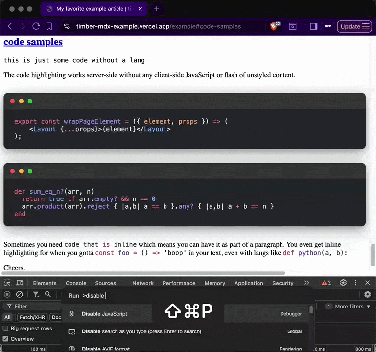

The death of engineering has been greatly exaggerated. You still need to know what you're doing.

Paternity leave and vibe coding have finally created enough time and mental space to rewrite my blog. This has been on my mind for years! Gatsby, the tech behind swizec.com, has not scaled to the size of website I've got.

My dude, it takes 45min+ to deploy a new article and my mind fills with dread every time I gotta go in there to fix bugs. As such we've been on a steady bit-rot decline for years 😔

## Fixing swizec.com

BUT! I found a new framework, [TimberJS](https://timberjs.com), based on React Server Components and last night my pal Claude and I got the bulkiest content ported over. 3min deploy baby 🤩

https://twitter.com/Swizec/status/2070723594955759833

You can [check it out here](https://timber-mdx-example.vercel.app). It's in rough shape and meant as an experiment to try the framework. Focused on rendering MDX with all my custom configs that I've grown to love.

You can plop an `.mdx` file anywhere in `/pages/` and it becomes a page with file-based routing. Embeds work, you can reference images by relative or absolute path, collocate everything related to an article in the same directory, nest pages within pages to create hierarchies, use frontmatter to define meta data, and it autogenerates OpenGraph images using [satori-js](https://github.com/vercel/satori), a WASM-based library to render React as an image.

And I got code syntax highlighting to work super nice. Even highlights inline code! No client-side JavaScript or flash of unstyled content, all happens on the server. Very nice.

Super excited about this. swizec.com lost syntax highlighting when after an upgrade I couldn't get library versions to play together and _"I'll do it tomorrow"_ turned into years.

## Why vibes when you can code

The [last major rewrite of swizec.com](https://youtu.be/eorBtZn3UKw) back in 2019 was _an ordeal_. Going from Wordpress to Gatsby, dealing with all the file conversions, missing images, writing the code, and never quite finished to my liking.

Back then I even hired people to help. It wasn't enough and the project took months. You accumulate a lot of hidden complexity in over a decade of publishing online.

This time I can work in short bursts between feedings. Or with a baby in my lap. Or half-distracted while holding the baby, talking to my partner, making dinner, juggling a bottle, and watching a show in the background.

Babies are oddly boring yet give you no time to focus. Forget sitting down for 3 hours to think through a hard problem.

But you can hold a thread in your brain, write a good prompt, then babysit Claude or Codex to hit "Yes run the command" every few minutes. And provide gentle guidance when they get confused.

Write prompt, hold baby, poke the AI to keep going.

Imagine [this](https://imgur.com/gallery/hey-this-isn-t-fair-ai-is-constantly-self-training-on-how-to-make-itself-even-bigger-inconvenience-every-day-rUF5fHs) but with baby. Video too long to embed, it's funny I promise.

## "Loops"

At work [Cursor writes most of my code but I watch it like a hawk](https://swizec.com/blog/ai-now-writes-97-of-my-code-heres-what-i-learned/). Using Cursor as an IDE that writes its own code and I accept the changes.

For the blog rewrite, I wanted to try a full vibes approach. Loops or whatever the kids call it these days.

https://x.com/Swizec/status/2069487929253364165

I could not get loops to work. But I tried both ChatGPT Codex App and Claude Code Desktop. They do small loops on their own.

That was pretty good!

Codex feels slow and cumbersome, but I liked that sessions natively live between laptop and iPad so I can use both. Claude did better work faster.

Both ran "loops" in that they would try to verify their own changes before calling it done. Write code, run a dev server, use headless Chrome to navigate, sometimes reach for CLI tools, try to read documentation, and generally try to make sure they achieved your goal before waiting for another prompt.

I'm used to this with [Cursor background agents](https://swizec.com/blog/cursor-background-agents-in-slack-changed-my-workflow/) as well. My record is a feature that took Cursor 45min in the cloud to implement (it worked). The longest "loop" with Claude Code was 14 hours and that's because it waited overnight for me to click `Allow Command` 🤣

## You still need to know what you're doing

You need to know what you're doing in 2 ways:

1. You _have to_ know the shape of your solution
2. You need to sense when the AI gets stuck

https://x.com/Swizec/status/2070711726513983771

These AIs love to get stuck. Have a bad idea as the first step then spin in circles making zero progress while it burns your tokens. Or they'll make a bad assumption then twist into a pretzel trying to make it work.

Meanwhile you're over there like

A big part of that is knowing the shape of your solution. Both from a product What We Want perspective and from an engineering How It Should Work view. The bot will always give you an answer and that's a threat, _you_ have to know if it's right.

Cheers, 
\~Swizec
