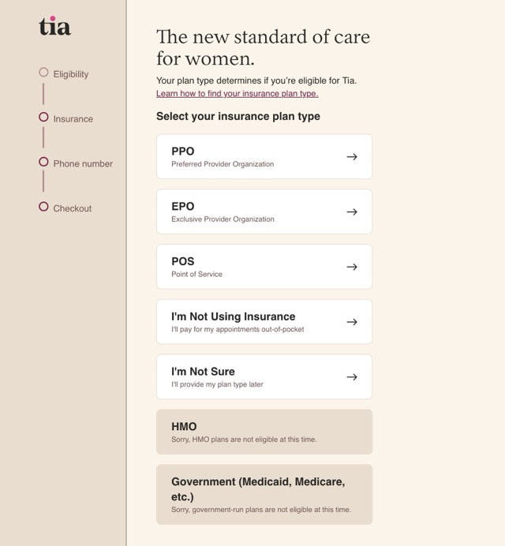

Here's war story from last summer. I've talked about it in workshops but haven't written it down before. It's for a book I'm working on.

We had a project once to rewrite the signup flow.

That area of the product hadn't been touched in 3 or 4 years because metrics said it's working and we had other things to do. We made a few CSS tweaks to kinda follow brand style updates, but mostly signup was the same pile of jQuery spaghetti it's always been.

Then we got a new product owner and he got a shiny new OKR: We're converting leads but they're the wrong leads. How can we filter people earlier in the signup process?

As a health care company we want to help everyone. But if we can't take your insurance, you'll want to go somewhere else. Users would skip through the insurance verification check during signup, get upset when they saw the price, refuse to use the service, and leave a bad review.

We needed to improve the user experience.

Our idea we had was to check insurance earlier in the signup process and put big warning signs to discourage users from skipping through.

## Get the big idea

Our product owner and designer came up with a beautiful new experience. It was fantastic.

Looked all modern and sleek, checked insurance on the first instead of third step, had several user flows based on the result of that insurance check, gently guided users towards understanding what's going on, and removed one whole step to make signup easier. Fantastic.

Everyone loved the new design.

- users would enjoy the clear information and better support for all devices,
- engineers could use our standard design system components,
- designers would stop having to make exceptions for signup,
- growth was excited to see higher quality leads come through,
- leadership couldn't wait to see improved metrics

One problem though: It couldn't be built.

## Massage the roadmap

We investigated the existing code and found that it couldn't support moving steps around. Assumptions for how signup works were baked deep in our spaghetti. Both on the client and the server.

Building the new experience from scratch would be easiest. But that's a lot of work. We estimated 3 to 4 months, if nothing goes wrong. Add typical error bars on a project that size and we're looking at 6 months easy.

Locking your team in the basement to work on a project for 6 months before a grand reveal is not good strategy. Too much can change in 6 months. And what if you're wrong about any of your assumptions?

We decided to break our brains, commit sins against engineering, and ship _both_ versions of signup together. Intertwined and overlapping.

Instead of rewriting the flow in new technologies for 3+ months then moving steps around after we've made it easy, we would _start_ with moving the insurance step to the beginning. Rip the bandaid right off.

The technical details of how we made that work will feature later in the book. At a high level we used [the strangler fig pattern](https://swizec.com/blog/how-to-rewrite-your-app-while-growing-to-a-dollar100000000-series-b/) to replace signup step-by-step and a little bending over backwards to make it all fit together.

## Data beats assumptions

Our solution did not spark joy.

It almost certainly increased the total amount of work we had to do. The engineers hated to implement something so hacky, the product owner struggled to keep conflicting versions of signup in his mind, and design was forced to create interim mockups to keep us all aligned.

But it paid off. Thanks to that shift in the roadmap, we were able to ship a critical experiment 2 months ahead of schedule and start collecting real-world user data early.

By end of quarter we didn't think this might work, we knew.

The new signup experience increased user activation and to our surprise even improved conversions. When people saw that we take insurance, they trusted us more and were likelier to sign up.

Better still: Doing the main experiment early allowed us to find friction in the original design. We started iterating before the rewrite even finished.

And we found a hidden stakeholder 2 weeks into the project. Marketing had a much deeper integration into the signup funnel than we thought. The integration was not visible in code. The only way to find out was to ship.

[Kick the can indeed](https://swizec.com/blog/writing-software-is-like-kicking-a-can/).

Cheers, 
\~Swizec
