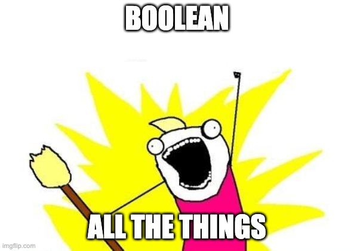
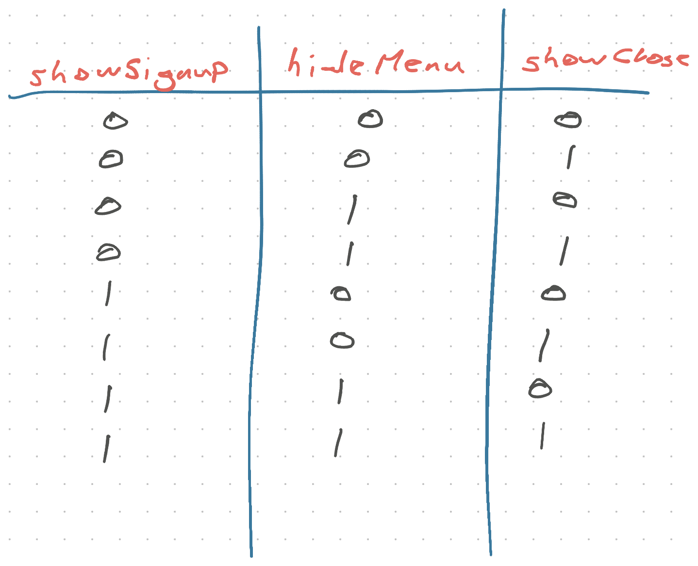
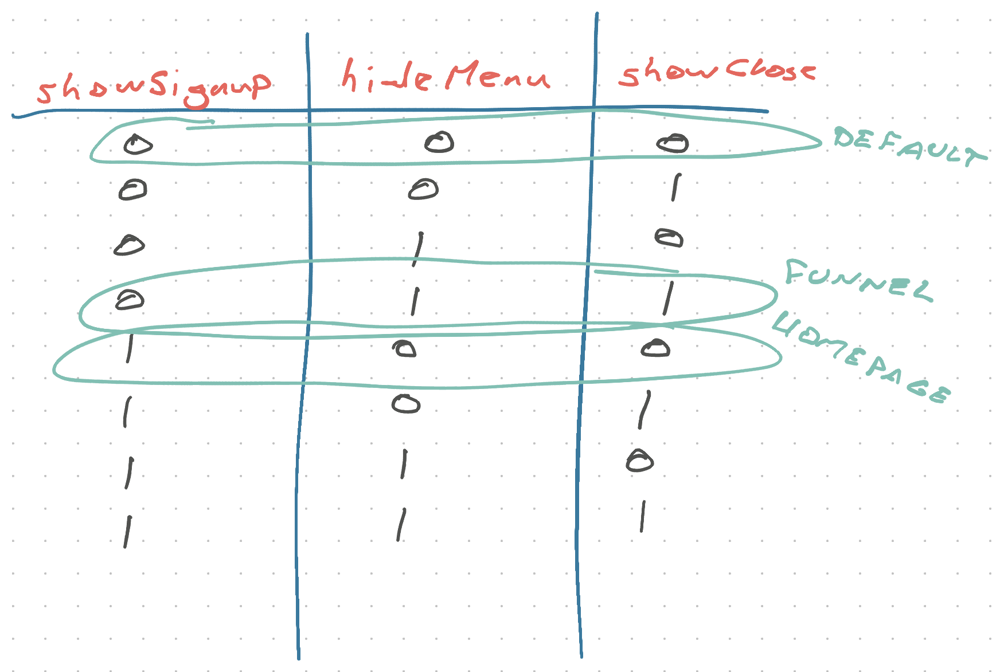

Say you're building a component that shows up in lots of places, like a header.

Look at designs and sure enough, same header on every page. Logo, few buttons, username. You create a reusable component. [DRY](https://en.wikipedia.org/wiki/Don%27t_repeat_yourself) all the way.

```typescript
const Header = () => {
  return (
    <Box>
      <Logo />
      <MenuItem />
      <MenuItem />
      <UserMessages />
      <UserProfile />
    </Box>
  )
}
```

Fantastic! You have a header that works everywhere.


## A new page appears

_"Hey, header looks weird on homepage. Where's the signup button?"_

Your designer's not happy. Header that's the same everywhere can't be same on the homepage. That's for marketing, they need signups.

obviously 🙄

You add a prop.

```typescript
const Header = (props: { showSignup: boolean }) => {
  return (
    <Box>
      <Logo />
      <MenuItem />
      <MenuItem />
      {!props.showSignup && <UserMessages />}
      {!props.showSignup && <UserProfile />}
      {props.showSignup && <SignupButton />}
    </Box>
  )
}
```

Cool, you've kept it DRY. Same header, same styling, signup yes or no.

## A funnel shows up

_"Hey, users are getting distracted out of this purchase funnel. Header too busy"_

Your universal header is costing you money. When users are on the path to paying, you want _nothing_ to stand in their way.

Another boolean!

_"Oh and let's pretend this is a fullscreen modal, add a close button. Keep the logo"_

Two booleans!



```typescript
const Header = (props: {
  showSignup: boolean
  hideMenu: boolean
  showClose: boolean
}) => {
  return (
    <Box>
      <Logo />
      {!props.hideMenu && <MenuItem />}
      {!props.hideMenu && <MenuItem />}
      {!props.showSignup && <UserMessages />}
      {!props.showSignup && <UserProfile />}
      {props.showSignup && <SignupButton />}
      {props.showClose && <CloseButton />}
    </Box>
  )
}
```

Well that's not confusing at all. With 3 booleans, your header has 8 possible incantations.



Add one more ask from design and you're up to 16.

😅

## You've created a mess

Your beautiful universal header component is hard to use. Complexity is exploding, the code is getting hairy, and you're the only person on your team who knows how to hold it.

For everyone else it's frustrating as heck. Get it right for this screen, breaks on that screen.

Debugging feels like whack-a-mole.

And I'm showing you a simple example. In production code these booleans start interacting. If `hideMenu and showSignup` then do X, otherwise if not `showClose` do Y.

Nobody wants to touch your component ever again. It's too tricky.

## Variants to the rescue

How many of those 8 incantations are valid?

I count 3.



Then why allow the other 5? If 5 out of 8 ways to use your component are bugs, something's wrong.

Here's what you do 👉 turn those flags into a variant prop. Use TypeScript and you even get autocomplete 😍

```typescript
const Header = (props: { variant: "homepage" | "funnel" }) => {
  let hideMenu, showClose, showSignup

  switch (variant) {
    case "homepage":
      showSignup = true
    case "funnel":
      hideMenu = true
      showClose = true
  }

  return (
    <Box>
      <Logo />
      {!hideMenu && <MenuItem />}
      {!hideMenu && <MenuItem />}
      {!showSignup && <UserMessages />}
      {!showSignup && <UserProfile />}
      {showSignup && <SignupButton />}
      {showClose && <CloseButton />}
    </Box>
  )
}
```

Now the rest of your team can use your header with ease: `<Header variant="..." />`. And thanks to TypeScript their IDE tells them what's available.

AND we found a bug in my pseudocode. You don't want user menus showing up in funnel headers 😅

Cheers,<br/>
~Swizec

PS: quick tip for shorter emails 👉 break your wrist

[https://twitter.com/Swizec/status/1365789410306891777](https://twitter.com/Swizec/status/1365789410306891777)
