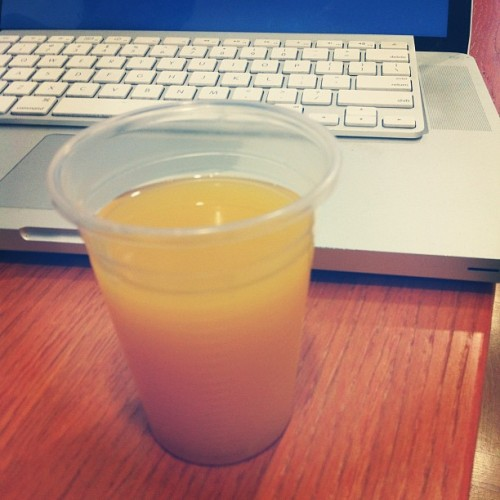

****\_\_

###### Related articles

- [Croatian wonderkid Alen Halilovic produces one of the worst dives EVER](http://www.101greatgoals.com/blog/croatian-wonderkid-alen-halilovic-produces-one-of-the-worst-dives-ever/)
- [Croatia, next member of the European Union - Alessandro Virciglio](http://europeinside.org/2012/11/27/croatia-next-member-of-the-european-union-alessandro-virciglio/)
- [Erlang](http://the.taoofmac.com/space/dev/Erlang)
- [BigData using Erlang, C and Lisp to Fight the Tsunami of Mobile Data](http://highscalability.com/blog/2012/11/26/bigdata-using-erlang-c-and-lisp-to-fight-the-tsunami-of-mobi.html)

