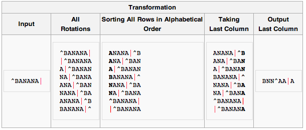
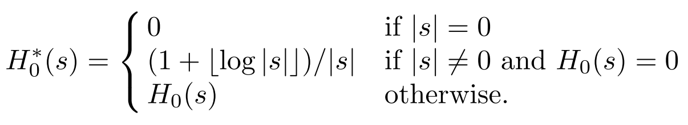
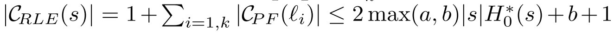
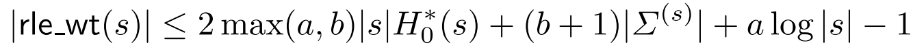
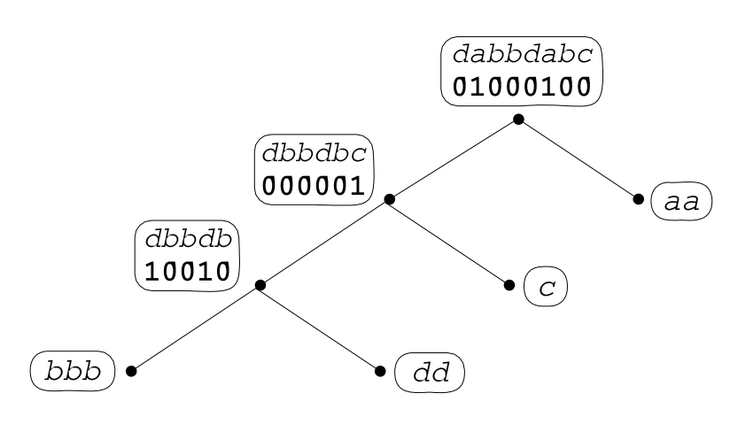
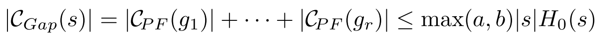
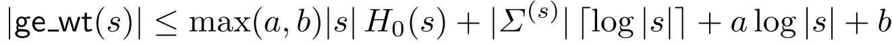

_\[This post is part of an ongoing challenge to understand 52 papers in 52 weeks. You can read previous entries, [here](http://swizec.com/blog/category/52-papers-in-52-weeks), or subscribe to be notified of new posts by [email](http://swiz.ec/52papers-list)]_ [The Myriad Virtues of Wavelet Trees](http://www.sciencedirect.com/science/article/pii/S0890540108001594) is a 2009 CS paper written by Ferragina, Giancarlo, and Manzini. The holiday cheer the past few days made this one hard to understand and write about ... something about focus. It talks about using Wavelet Trees as a stand-alone [compression algorithm](http://en.wikipedia.org/wiki/Data_compression "Data compression") and as on top of some popular string encodings like run-length encoding, [move-to-front transform](http://en.wikipedia.org/wiki/Move-to-front_transform "Move-to-front transform") and the [Burrows-Wheeler transform](http://en.wikipedia.org/wiki/Burrows%E2%80%93Wheeler_transform "Burrows–Wheeler transform"). The results are pretty cool, but not revolutionary. The authors just improved some additive terms in lower and upper bounds of achievable compression.

## Background knowledge

\***\*\*\***` 0``25``bananaaa``1,1,13,1,1,1,0,0 `\***\*\*\***

## What we're looking to achieve

\_**\_\_\_\_\_**

## Achieving 0-th order entropy

\***\*\*\*\*\*\*\***\_\_\***\*\*\*\*\*\*\***\*\*\*\***\_\_****\_\_**

## RLE wavelet trees and bwt

It turns out that using RLE Wavelet Trees as a post-processor for the Burrows-Wheeler transform, we can achieve that mythical _Hk_\* compression. But it doesn't work at all with GE Wavelet Trees. The key is to remember that 'bwt' is a tool for achieving _Hk_\* as long as we can achieve _H0_\* for every partition. But apparently if we slice the Wavelet Tree according to 'bwt' partitions we get something called a full Wavelet Tree, which doesn't actually improve compression. Instead we have to use pruned Wavelet Trees, which the authors don't really explain. They give a proof that adding Wavelet Trees on top of 'bwt' is beneficial, which I won't try to reproduce here since a large part of it is skipped and put in "the full version". Their final conclusion is that Wavelet Trees act as a sort of compression booster for the Burrows-Wheeler transform, but impose a run-time cost that is non-negligible. Finally, they conclude that GE Wavelet Trees don't work together with 'bwt' because global choices need to be made about things like tree shape and the role of 1's and 0's in nodes. Bummer.

## Generalised wavelet trees

Three things affect a Wavelet Tree's cost: its binary shape, the assignment of alphabet symbols to leaves, and the possibility of using non-binary compressors for nodes. To address these issues, the authors introduce so called Generalised Wavelet Trees. Let's use two compressors - _C01_ is specialised for binary strings (RLE for instance), and _CΣ_ is generic (Huffman coding for instance). We're going to assume they satisfy three properties: a) _|C01(x)| ≤ α|x|H0_(x) + β\* bits for a binary _x_, where α and β are constants. b) _|CΣ(y)| ≤ |y|H0(y) + η|y| + µ_ bits for a generic _y_, where η and µ are constants. c) the running time of _C01_ and _CΣ_ is a convex function and their working space is non-decreasing Basically we've defined the limit of the longest strings produced by our compressors and decided that we should be able to use them in practice. Now we define a leaf cover, _L_, as a subset of nodes in a tree _Wp(s)_, if every leaf has a unique ancestor in _L_. Then _WpL(s)_ is the tree with all nodes in _L_ removed. We colour _WpL_ with red and black so that leaves are black and all remaining nodes are red. Then we use the binary compressor for all binary strings in _WpL_ and red stuff, and the generic compressor for non-binary strings and black. As usual we ignore the leaves. Our new cost is the number of bits produced - _|C01(s01(u))|_ from red nodes and _|CΣ(s(u))|_ for black nodes. According to the authors, coming up with a way to decode this encoding is trivial, and the whole thing is somehow "better". I don't quite _get_ why it's better, but I'm probably missing something. There are, however, two optimisation problems with this approach: finding the minimal leaf cover that minimizes the cost function _C_(WpL(s))\*, and finding the optimal combination of Wavelet Tree shape and and assignment of binary and generic compressors to nodes to produce the shortest string possible. They've provided a sketch of the algorithm to solve these, but ultimately a sketch does not a solution make.

## Fin

So there you have it, Wavelet Trees used for compressing strings after applying the Burrows-Wheeler transform to make it easier. I'm not sure whether this is used anywhere in the real world, but it looks interesting.

