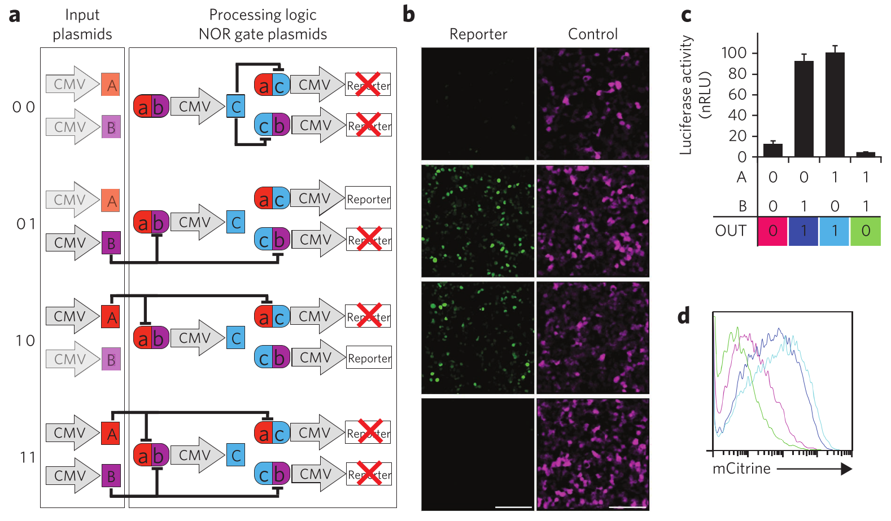

_\[This post is part of an ongoing challenge to understand 52 papers in 52 weeks. You can read previous entries, [here](http://swizec.com/blog/category/52-papers-in-52-weeks), or subscribe to be notified of new posts by [email](http://swiz.ec/52papers-list)]_ One of my friends is doing a PhD on implementing logic circuits in mammalian cells. Just thinking about it tickles my nerdy innards! After _months_ of begging, she let me read her latest paper after it was published in Nature last week. _[Designable DNA-binding domains enable construction of logic circuits in mammalian cells](http://www.nature.com/nchembio/journal/vaop/ncurrent/full/nchembio.1433.html)_ by Tina Lebar and some other people nobody cares about. One of them was my information theory professor. Small world ... I chewed my way through through this five-page paper like an excited puppy goes through a slipper and just like a puppy I was confused out of my mind most of the time. Synthetic biology is _not_ my thing.

## Introduction

I asked my friend about her research a few months ago and she explained that programmable cells can be very useful. You could for instance program a cell to deliver medicine only to specific points in the body. Or to attack only certain types of other cells and so on. This, apparently, has far reaching implications in medicine. Personally, I'm just waiting until we can build cylons. What I don't understand, and this paper doesn't explain, is _how_ all this works. The paper talks about designing different types of logic gates, assembling them into circuits, but I don't understand the basic principles. It's electron quantum tunneling through layers of silicone for normal computers, but for biological circuits it's ... magic?  The paper uses this magic to build different logic gates. NOR and NAND in particular because they are functionally complete and can be used to implement anything. You could build a whole computer just by combining NOR or [NAND gates](http://en.wikipedia.org/wiki/NAND_gate "NAND gate"). Computers used to be built like this in the 1960's (Apollo computer was just a combination of triple-input NOR gates). These days we instead try to lower the number of elements to save power because the gates themselves have become so cheap to make. But biologic chips are in their infancy and using easily replicable elements is more important. As far as I understand, this paper is the first to implement a circuit out of multiple gates. One of the problems they solved is the free diffusion in cells. They built orthogonal gates that behave correctly even when activation sequences act funny.

## Orthogonal NOR gates

## Two-input logic gates

## Function selecting circuit

\_\_

## Discussion

With this new design, synthetic biologists can improve the predictability, reliability, and standardization of biological information processing systems. With the recent advance in producing hundreds of different TALEs this makes the design much better than previous approaches. Zinc fingers and CRISPR were mentioned here, but I only vaguely understood the zinc fingers paper when I read it a year ago and I don't know what CRISPR might be. I'm guessing it's something a bit like a TALE, but different. Either way, the authors report that using their optimizations 94% of two-input logic gates can be implemented with just two layers, whereas only 50% can be implemented in two layers with traditional wired circuits. A pretty sweet result if you ask me. They also mention something about distributed systems spanning multiple cells and a bunch of other things that read almost like wishful thinking. Maybe I'd believe them if I spent the time reading referenced papers. But this has been enough synthetic biology for now. I'm always amazed by how mind-blowing this field can be.

