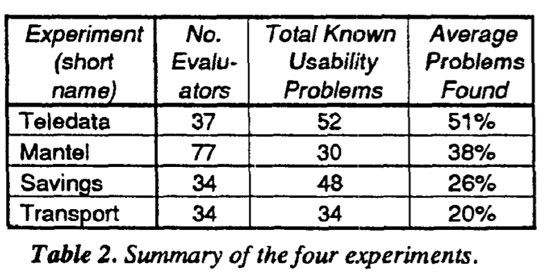
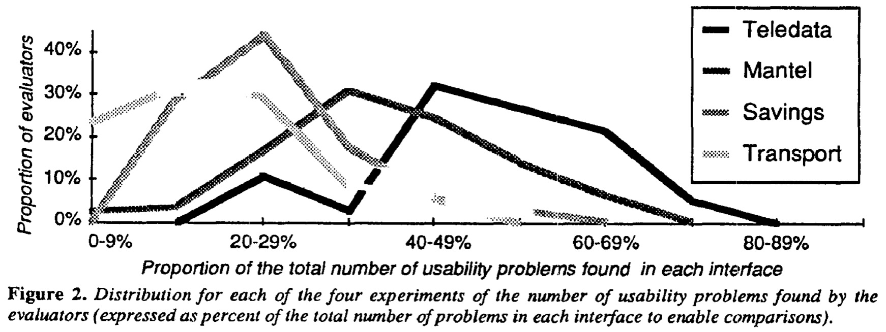
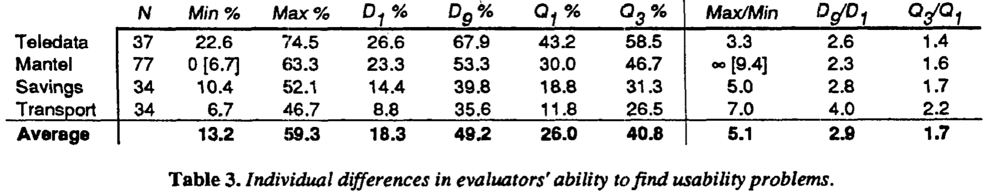
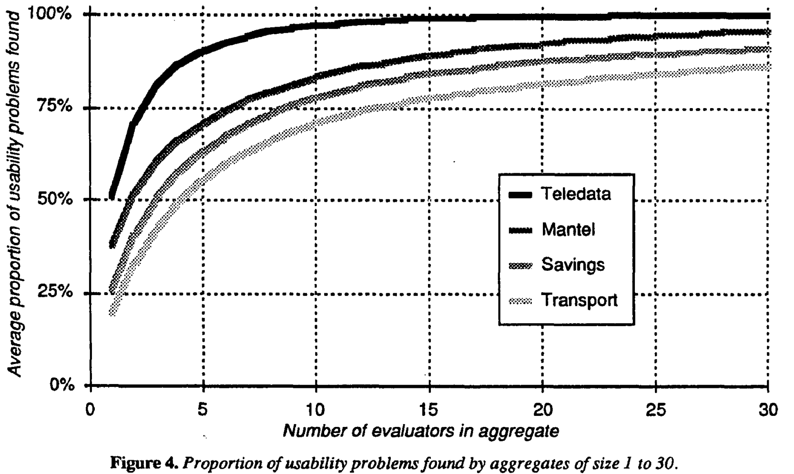

_\[This post is part of an ongoing challenge to understand 52 papers in 52 weeks. You can read previous entries, [here](http://swizec.com/blog/category/52-papers-in-52-weeks), or subscribe to be notified of new posts by [email](http://swiz.ec/52papers-list)]_ [User interfaces](http://en.wikipedia.org/wiki/User_interface "User interface") are hard. So hard in fact that a friend of mine recently spent 45 minutes on hold with the IRS only to be told _"Sorry, we're too busy. Call back later."_. He never even spoke to a real person. We've all had to suffer through crappy user interfaces. If only there was a way for people building these things to discover potential issues _before_ they hit users in the face. There are, in fact, many. But in 1990 [Jakob Nielsen](http://en.wikipedia.org/wiki/Jakob_Nielsen_%28usability_consultant%29 "Jakob Nielsen (usability consultant)") and Rolf Molich published a paper called [_Heuristic Evaluation of User Interfaces_](https://docs.google.com/viewer?url=http%3A%2F%2Fmestrado-watinha.googlecode.com%2Fsvn%2Ftrunk%2Fhci%2Fmonografia%2FartigosUtilizados%2Frevisao%2Fp249-nielsenAvaHeu.pdf) that describes a cheap way of accurately finding most if not all [usability](http://en.wikipedia.org/wiki/Usability "Usability") problems in your interface.

## Heuristic evaluation

Heuristic evaluation is essentially looking at the interface and forming an opinion about what's good or bad. Ideally you'd use a set of guidelines, but there are thousands of those, so people usually rely on experience and their own intuitions. The authors have come up with a simplified list of nine heuristics:

- simple and natural dialogue
- speak the user's language
- minimize user memory load
- be consistent
- provide feedback
- provide clearly marked exits
- provide shortcuts
- good error messages
- prevent errors

The list came about through years of teaching and consulting on user interfaces and is particularly useful because it can be taught in a single lecture.

## Empirical test of heuristic evaluation

**\*\***\*\*\*\***\*\***\_\_\_\_

## The usability problems

Some of the usability problems found include inconsistencies in how commands work with the dial-in systems. One used an end-of-command key, the other used that same key for "return to main menu". Weird considering they both use the same equipment. 95% of the subjects also found it problematic that Mantel overwrites a user's phone-number instantly and 62% found it odd that the Transport system goes from main-menus to submenus without much indication this happened. The exact problems don't matter as much as deciding whether they are actually valid. Is this something that a normal user would notice and struggle with? It seems that given enough evaluators, especially if some of them are not trained, you should be able to mostly find problems that affect real people. The same problem discovered by multiple people is likely far more serious than something that only bugs a single person. But you should keep in mind that it is impossible to find all problems for all occasions. Real users might use a system for different purposes and will hit different problems depending on what they're trying to achieve. There is also a subset of users that will always struggle with your interface no matter what you do or how easy you make it. Just as there is a subset who will figure everything out as if by magic. You can often notice this when a computer savvy person helps when something doesn't work. They touch the computer and everything acts exactly like it's supposed to, despite protestations that the exact same thing has been tried multiple times and never worked. But let's not get into the whole _"Friends don't let friends do tech support"_

## Evaluation results

\_\_\_\_

## Aggregated evaluations

\_\_

## Fin

The authors conclude their study by saying that heuristic evaluation is hard, but presents a cheap way of finding problems. Especially when you can get multiple evaluators and aggregate their results. Major advantages are: - cheap - intuitive and easy to motivate people to do - no advance planning needed - can be used early in the process Really it seems the only disadvantage might be that sometimes problems are found without any suggestions for a fix. But that's what your UX guy is for ;)

