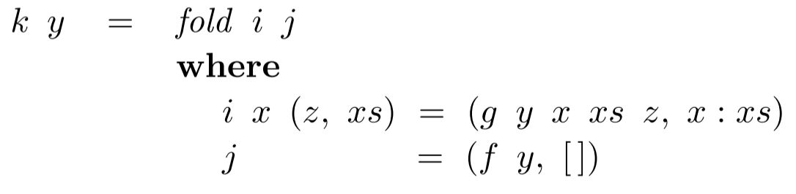

_\[This post is part of an ongoing challenge to understand 52 papers in 52 weeks. You can read previous entries, [here](http://swizec.com/blog/category/52-papers-in-52-weeks), or subscribe to be notified of new posts by [email](http://swiz.ec/52papers-list)]_ Fold or foldr is a recursion operator with magical properties commonly used in functional programming. Sometimes known as _reduce_, _inject_, or _compress_ it turns a list of values into a single value according to a combining function. Graham Hutton's 1999 [_A tutorial on the expressivenes nad universality of fold_](https://docs.google.com/viewer?url=http%3A%2F%2Fwww.cs.nott.ac.uk%2F%7Egmh%2Ffold.pdf) does a great job of explaining just how magical it is. In a language with first-order tuples and functions any function can be expressed as a _fold_, it lets you prove programs without using induction, and you can even generalise it to work on datatypes other than lists. Great magic indeed. But with great power comes great responsibility. Take heed of the lesser programmer and remember that many functions you rewrite as a _fold_, you will not be able to read in six months.

## The fold operator

**` f``v``v``:``f``[1,2,3]``1:2:3:[] `**

```haskell
Prelude> foldl (-) 0 [1,2,3] # 0-1-2-3
-6
Prelude> foldr (-) 0 [1,2,3] # 1-(2-(3-0))
2
```

\_\_

## The [universal property](http://en.wikipedia.org/wiki/Universal_property "Universal property") of fold

`g`` g``g = fold f v `**`g`\_\_**\*\*\*\*

```haskell
(+1) . sum = fold (+) 1
```

The left function is a composition of `+1` and `sum`, which sums a list then increments the result. The right function replaces every cons in a list with a `+` and the empty list with a `1`. We want to prove they will always give the same result when applied to the same list. The equation matches the right-hand side of the universal property of fold, `g = fold f v`, with `g = (+1) . sum`, `f = (+)`, and `v = 1`. With some simplification, the equation is equivalent to these:

```haskell
sum   []   + 1 = 1
sum (x:xs) + 1 = x + (sum xs + 1)
```


```javascript
var inc = function (x) { return x+1; }
var sum = function (x, xs) {
 return xs.length > 0 ? x + sum(xs[0], xs.slice(1)) : x;
}

var plus = function (a, b) { return a+b; }

// we try to prove this equivalence, this is NOT something you execute :)
function (xs) { return inc(sum(0, xs)); } == function (xs) { return xs.reduce(plus, 1); }

// and then the same proof applies
```

The **fusion property of fold** allows us to fuse the composition of an arbitrary function and _fold_ into a single _fold_. This isn't true in general, so we use the universal property to calculate the conditions.

```haskell
h . fold g w = fold f v
```

Using the same process as above, we expand this equation into two equations.

```haskell
h (fold g w   [])   = v
h (fold g w (x:xs)) = f x (h (fold g w xs))
```


```haskell
(+1) . sum = fold (+) 1
=>
(+1) . fold (+) 0 = fold (+) 1
```

\*\*\*\***` sum = fold f v``f``v `` v = 0``f `` f = (+)``sum = fold (+) 0``sum xs``y `\_\_\_\_**

```haskell
map f = fold (λx ys → f x : ys) []
```

## Increasing the power of fold with tuples

We can make _fold_ even more powerful by using it to generate tuples. Say you want a sumlength function that returns a list's length as well as its sum:

```haskell
sumlength   :: [Int] → (Int, Int)
sumlength xs = (sum xs, length xs)
```

Turning this function into a single _fold_ is more efficient because it only makes a single pass over the list.

```haskell
sumlength = fold (λn (x, y) → (n+x, 1+y)) (0, 0)
```

\_**\_` v = ([], [])``f ``dropWhile'``fst`**`dropWhile p = fst . dropWhile' p`\*\*\*\***` y``f``h y``xs``g ``h y = fst . k y`**

## Using fold to generate functions

\_**\_\_\_**`ack = fold f v`` v = (1:)``ack (x:xs) `")`w = ack xs``f`\_\_

## Fin

The paper finishes with a survey of references for even more magical things you can do with folds. Using them for datatypes other than lists, performing monadic folds, redefining fold on relations, and how helpful fold can be in automatic program transformation. But all of that are topics for another day, today let's just agree that _fold_ is awesome and we should all be using it much more.

[](http://www.zemanta.com/?px "Enhanced by Zemanta")
